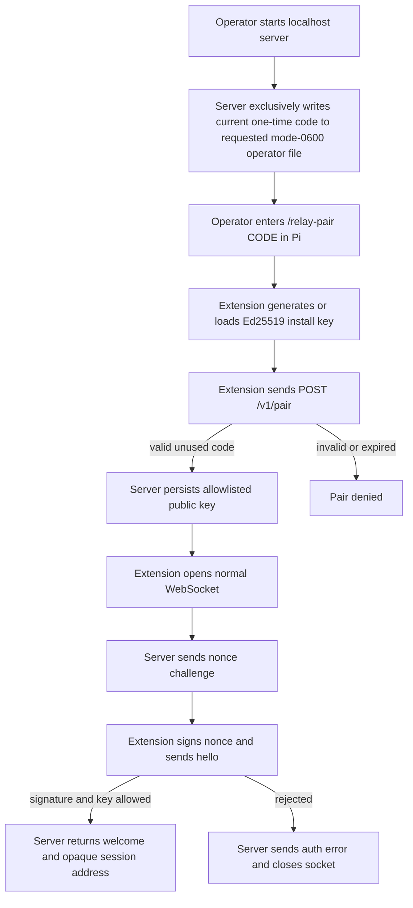

import { Aside, Tabs, TabItem } from '@astrojs/starlight/components';
import Decision from '../../../../components/Decision.astro';

<Aside type="note" title="Contract scope">
This document defines the accepted v1 external contract. It does not select Go packages, synchronization primitives, or persistence formats beyond the stated trust and durability boundaries.
</Aside>

## Contract boundary

The Pi extension exposes two model tools:

- `list_peers({ cursor? })`
- `agent_send({ to, body, re? })`

Connection and pairing are human/configuration concerns. They are not model tools. The extension maintains one persistent WebSocket to a localhost server; cross-machine deployments provide localhost reachability through VPN or SSH forwarding.

<Decision title="Keep the model tool surface to two intents" status="accepted">
Peer discovery and message sending stay explicit. Connection lifecycle remains automatic and configuration-driven.
</Decision>

<Decision title="Use online-only unicast delivery" status="accepted">
The server routes only to authenticated, currently connected Pi sessions. No offline inbox, replay, broadcast, or message persistence exists in v1.
</Decision>

## Envelope

Every WebSocket text frame is one JSON object:

```json
{
  "v": 1,
  "type": "send",
  "request_id": "01993c77-f83e-7aa1-b739-8eeea87d52e1",
  "payload": {}
}
```

- `v` is the protocol major.
- `type` comes from a closed operation set.
- `request_id` is a sender-generated UUIDv7 used only to correlate one request frame and response. A retry is another frame and therefore uses a fresh request ID. Server-pushed events may omit it.
- `payload` is an object whose schema depends on `type`.
- `message_id` identifies one logical message and supports retry deduplication and reply correlation. It is not a request ID.
- `delivery_id` identifies one server offer to a recipient and is used only for the recipient extension ACK.
- `body` is either a string or a JSON object. The recipient extension converts an object to canonical compact JSON before Pi injection.

Unknown fields are rejected at the envelope and typed-payload levels. Duplicate JSON keys are rejected at every accepted depth, including inside application-owned object bodies, before any map or typed value can erase the ambiguity. JSON is limited to 64 nested object or array containers, counting the outer envelope as depth 1; a container at depth 65 or greater is rejected as `invalid_frame`. Canonical addresses have the form `<full-cwd>@<hostname>#<uuidv7>`, but clients treat the whole value as opaque and copy it verbatim. Cwd and hostname are display metadata, never authorization inputs.

After authentication, the only accepted client-to-server `type` values are `list`, `send`, and `received`. Their payloads are closed objects: `list` is either `{}` or contains exactly one `cursor` string; `send` requires `message_id`, `to`, and `body` and permits only optional `re`; and `received` requires exactly `delivery_id` and `message_id`. Every ID is a canonical lowercase UUIDv7. `to` is a non-empty opaque UTF-8 string bounded to the largest server-issued v1 address. `body` is only a JSON string or object. Its serialized JSON value is limited to 262,144 UTF-8 bytes, counting string quotes and escapes and all object syntax. The extension counts canonical compact serialization; the server counts the strictly validated raw value after trimming only surrounding JSON whitespace. Exactly 262,144 bytes is valid and 262,145 is oversized. Separately, the 524,288-byte ceiling applies to the complete reassembled WebSocket message's UTF-8 bytes, whether it arrived in one fragment or many, before JSON decoding. Compression is disabled.

A cursor is `cur_` followed by canonical unpadded Base64url of the raw UTF-8 bytes of the last returned opaque address. A present cursor must decode to valid UTF-8 of 1 through 4,389 bytes and re-encode byte-for-byte to the submitted spelling. Its maximum is therefore exactly 5,856 ASCII characters. Empty values, padding, another alphabet or prefix, noncanonical trailing bits, invalid UTF-8, and over-limit decoded values are terminal `invalid_envelope` input. The decoded value remains whole and opaque: the relay compares it only for pagination and never parses address components or uses it as authorization identity.

A post-authentication parser starts at a message boundary and either dispatches one complete valid operation or enters a terminal protocol-error state. Binary messages, invalid UTF-8, malformed or trailing JSON, and over-limit messages use `invalid_frame`. A syntax-valid value that is not the closed operation envelope, including duplicate or unknown fields and wrong-direction types, uses `invalid_envelope`. An otherwise shaped envelope whose integer major is not `1` uses `unsupported_protocol`. These stable errors have `close: true`. Detection atomically stops normal response admission, immediately makes the exact session ineligible for routing, and cancels its send producers. Revocation then fences the session's write lease: an offer already performing its final write may finish before the fence completes, while a queued or preselected offer must revalidate as unavailable and cannot write afterward. A claimed normal response still waiting for its producer start gate is discarded; if revocation rejects a normal write, the sole writer continues to terminal work. If an already-written claimed normal response instead fails its audit after terminal admission has won, that audit failure remains fatal-owned and reported, but it does not cancel the terminal handoff. The writer releases the failed normal work, discards all other queued normal responses and their ownership slots, then attempts exactly one separately bounded protocol-error write and audit before hard close. A normal write or audit failure that wins before terminal admission retains ordinary immediate fatal termination. No normal response can enqueue after the transition, and no concurrent WebSocket writer is introduced. `request_id` is included only when the complete JSON has exactly one valid top-level request ID that can be recovered without ambiguity. Error messages and logs never include raw frame or body data; logs omit unrecognized submitted types.

Operation-level outcomes are a different state transition: a structurally valid operation reaches operation handling, a canonical result may be returned, and the parser returns to the next message boundary without closing. Tickets #36 and #13 implement live `list`/`roster` discovery. Tickets #14–#17 implement successful idle and busy string/object paths plus correlated replies through deterministic provenance and exact recipient acknowledgment. Tickets #18–#21 implement offline, ACK-timeout, recipient-session-loss, and sender-session-loss settlement. Ticket #24 denies a valid over-limit body before dedupe and recipient lookup. Ticket #25 admits bounded raw-client SEND pipelining and denies excess distinct sends without closing.

One exact authenticated sender session may own at most 128 in-flight distinct logical sends. After strict protocol and body-size validation, the sole reader observes dedupe before capacity: a pending identical retry attaches to existing work, and a retained replay or conflict reserves an immediate correlated response without consuming another send slot. Only a dedupe-new legal send attempts a nonblocking reservation. At 128, the next distinct send receives exact `{message_id,status:"denied",reason:"sender_capacity"}` and the socket stays healthy. Denial creates no dedupe record, recipient lookup, delivery ID, retained body, pending offer, timer, or recipient write; later reuse of that denied ID after capacity returns is new.

Each admitted send has one worker, so one session can own at most 128 send workers and never an unbounded per-frame goroutine or mailbox. A worker releases its slot without a public result on cancellation, disconnect, or shutdown. For a responding send, SEND capacity ends after internal settlement and only after the original and optional attached-retry responses both own bounded sequencer reservations and are published; it ends before their write and audit. Every one- or two-item batch reserves its exact slot count before response encoding. The separate 256 ownership slots—the exact maximum of two responses for each of 128 admitted logical sends—therefore bound all encoded, unanswered normal responses and serialize every response write and audit. Immediate offline, replay, conflict, body, capacity, and list results likewise reserve one slot before encoding and backpressure in the reader when sequencing is full rather than creating workers or another queue. One terminal error is encoded separately after parser rejection.

A `list` runs synchronously, one at a time, in the sole reader. It may overlap admitted sends, consumes no SEND slot, and has no server-side list queue. `received` ACK candidates likewise remain synchronous reader operations and can settle any matching held send for that session's recipient role. Terminal protocol failure takes the priority transition above rather than waiting for response FIFO capacity. Terminal failure, local fatal failure, disconnect, and shutdown cancel and join all session-owned send workers and the response sequencer before the authenticated handler returns.

<Decision title="Bound SEND dispatch and response sequencing per authenticated session" status="accepted">
Keep 128 nonblocking distinct-send reservations independent for every exact authenticated session. Reserve up to two of 256 serialized response positions before encoding or releasing each responding send, so fast settlement cannot grow encoded work outside the bound. Keep list and ACK handling synchronous in the sole reader; immediate outcomes reserve before encoding and apply bounded backpressure instead of spawning work.
</Decision>

<Decision title="Fail closed on protocol ambiguity but keep operation denials recoverable" status="accepted">
Malformed framing or envelope state makes subsequent interpretation unsafe, so one stable error ends the connection. A valid operation with a business denial remains unambiguous and leaves the authenticated session usable.
</Decision>

<Decision title="Bound the serialized body independently from its frame" status="accepted">
Ponytail: the body value is fixed to 262,144 UTF-8 bytes and the complete frame to 524,288 bytes; make either configurable only when a second deployment profile requires different values. Extension canonical encoding rejects before operation ownership, while strict server decode preserves safe correlation for a recoverable raw-client denial.
</Decision>

## Pairing and live connection flow



The pairing code and nonce are authentication material and are always redacted from logs. The server writes the current raw pairing code only when `--pairing-code-file PATH` explicitly names an exclusively created mode-`0600` direct child of the retained state directory. The cleaned absolute parent must exactly equal the active state path; external, parent-traversing, root, and `allowlist.json` forms fail before code generation and readiness. Creation and removal remain descriptor-relative to the retained state handle. If the flag is omitted, the raw code remains undisclosed; ordinary structured logs contain only `<redacted>`. A startup pairing code is exactly 32 URL-safe Base64 characters encoding 24 random bytes. It is valid only before its ten-minute `expires_at` timestamp: the exact deadline and every later instant are expired. The server persists allowlisted public keys and minimal pairing metadata, but never messages or pending sends. Pair requests are bounded to 4,096 bytes and use a closed two-string JSON object; the extension's fixed accepted code and public-key forms produce a 126-byte request. `client_public_key` is `ed25519:` followed by canonical standard Base64 for exactly 32 raw Ed25519 public-key bytes. `client_id` is `cli_` followed by exactly 16 URL-safe Base64 characters encoding 12 random bytes.

The server reserves one of 1,024 tracked slots before WebSocket upgrade. At capacity it returns bounded HTTP `503` without upgrading. Each upgraded connection receives a fresh 32-byte cryptographic nonce encoded as 43-character unpadded URL-safe Base64. Challenge write, hello read, verification, and welcome write share a five-second authentication deadline. The server's general frame ceiling remains 512 KiB, while client hello uses a narrower 16 KiB read ceiling. The extension configures its socket-wide pre-materialization transport ceiling to 512 KiB, then applies a separate 16 KiB semantic ceiling to complete challenge and welcome messages after bounded materialization. Cwd is bounded to 4,096 UTF-8 bytes and hostname to 255 UTF-8 bytes; both must be non-empty. These values are signed display metadata, not authorization identity.

The Ed25519 signature covers this exact UTF-8 transcript, in order, where each length is the decimal UTF-8 byte length and each shown `\n` is one LF byte:

```text
pi-messaging-relay-auth-v1\n
nonce:<length>:<nonce>\n
request_id:<length>:<request_id>\n
client_public_key:<length>:<client_public_key>\n
route_id:<length>:<route_id>\n
hostname:<length>:<hostname>\n
cwd:<length>:<cwd>\n
```

The signature field is excluded. Both request and route IDs are canonical lowercase UUIDv7. Authorization succeeds only when the submitted key is allowlisted and that same key verifies the complete transcript. Welcome echoes the signed metadata as `<cwd>@<hostname>#<route_id>`; the composite address is never parsed for authorization. While an authenticated entry is active, both its route UUID and complete opaque address are unique. A same-key or different-key collision closes without a welcome and cannot replace the original entry. After the original entry's disconnect cleanup, the extension may authenticate the same active Pi session route and complete address through its bounded reconnect policy.

<Decision title="Sign one deterministic domain-separated hello transcript" status="accepted">
Length-prefixed values bind the fresh nonce, request, installation key, and complete route metadata without delimiter ambiguity. Go and TypeScript produce identical bytes, and changing display metadata invalidates the signature without making that metadata an authorization identity.
</Decision>

<Decision title="Separate trust bootstrap from messaging" status="accepted">
One-time pairing uses `POST /v1/pair`. Authenticated live traffic uses WebSocket `/v1/connect`.
</Decision>

<Decision title="Use one closed stale-code rejection" status="accepted">
A well-formed incorrect, expired, or already consumed code returns HTTP `401` with `pairing_code_invalid` and adds no allowlist entry. The submitted code crosses into the request trust boundary, but the response omits it entirely and structured logs preserve only redacted authentication fields.
</Decision>

### I/O examples

<Tabs>
  <TabItem label="Pair request">
    ```http
    POST /v1/pair HTTP/1.1
    Content-Type: application/json

    {
      "pairing_code": "<REDACTED>",
      "client_public_key": "ed25519:11qYAYdk9Jgqgfdm2r7wIfdHyE5gq5sI1sS0l7l2a9E="
    }
    ```
  </TabItem>
  <TabItem label="Response 201">
    ```http
    HTTP/1.1 201 Created
    Content-Type: application/json

    {
      "client_id": "cli_01J7K8M4Y9Z3abcd"
    }
    ```
  </TabItem>
  <TabItem label="Response 401">
    ```http
    HTTP/1.1 401 Unauthorized
    Content-Type: application/json

    {
      "error": "pairing_code_invalid",
      "message": "Pairing code is invalid or expired"
    }
    ```
  </TabItem>
</Tabs>

<Tabs>
  <TabItem label="Challenge">
    ```json
    {
      "v": 1,
      "type": "challenge",
      "payload": {
        "nonce": "<REDACTED>"
      }
    }
    ```
  </TabItem>
  <TabItem label="Hello">
    ```json
    {
      "v": 1,
      "type": "hello",
      "request_id": "01993c79-8ad7-79fa-83e3-9789dcaca168",
      "payload": {
        "client_public_key": "ed25519:11qYAYdk9Jgqgfdm2r7wIfdHyE5gq5sI1sS0l7l2a9E=",
        "route_id": "01993ca1-1111-7aaa-8aaa-111111111111",
        "hostname": "workstation-a",
        "cwd": "/srv/frontend",
        "signature": "<REDACTED>"
      }
    }
    ```
  </TabItem>
  <TabItem label="Welcome">
    ```json
    {
      "v": 1,
      "type": "welcome",
      "request_id": "01993c79-8ad7-79fa-83e3-9789dcaca168",
      "payload": {
        "self_address": "/srv/frontend@workstation-a#01993ca1-1111-7aaa-8aaa-111111111111",
        "heartbeat_ms": 30000,
        "max_body_bytes": 262144
      }
    }
    ```
  </TabItem>
  <TabItem label="Auth rejected">
    ```json
    {
      "v": 1,
      "type": "error",
      "request_id": "01993c79-8ad7-79fa-83e3-9789dcaca168",
      "payload": {
        "code": "not_authorized",
        "message": "Client key is not authorized",
        "close": true
      }
    }
    ```
  </TabItem>
  <TabItem label="Invalid envelope">
    ```json
    {
      "v": 1,
      "type": "error",
      "request_id": "01993c84-5d38-7d75-8bc1-f945bfa42cdf",
      "payload": {
        "code": "invalid_envelope",
        "message": "Invalid protocol envelope",
        "close": true
      }
    }
    ```
  </TabItem>
  <TabItem label="Invalid frame without safe correlation">
    ```json
    {
      "v": 1,
      "type": "error",
      "payload": {
        "code": "invalid_frame",
        "message": "Invalid WebSocket frame",
        "close": true
      }
    }
    ```
  </TabItem>
  <TabItem label="Unsupported major">
    ```json
    {
      "v": 1,
      "type": "error",
      "request_id": "01993c84-5d38-7d75-8bc1-f945bfa42cdf",
      "payload": {
        "code": "unsupported_protocol",
        "message": "Unsupported protocol version",
        "close": true
      }
    }
    ```
  </TabItem>
</Tabs>

## Peer discovery

Every authenticated active session on the server except the caller is visible. Roster entries contain only the opaque address and express online presence only; Pi `idle/busy` state is not published. No `connection_name` configuration exists.

Discovery uses stateless live keyset pagination. A request without `cursor` starts a fresh traversal. For each request, the server reads current active addresses, omits the caller, sorts complete opaque addresses lexicographically, and considers only values strictly greater than the decoded cursor. It retains no pagination snapshot. A session that appears or disappears before the cursor can therefore be missed during one traversal; callers restart without a cursor when they need a fresh view.

A `roster` payload is the closed shape `{ peers: [{ address: string }], next_cursor?: string }`. The complete compact serialized v1 `roster` WebSocket frame—including `v`, `type`, `request_id`, and payload—must be at most 49,152 UTF-8 bytes. Page filling takes the longest consecutive prefix of eligible ordered addresses whose complete encoded frame fits: when candidates remain, that size includes `next_cursor` for the last returned address; when all candidates fit, `next_cursor` is omitted. No eligible addresses returns an empty `peers` array without `next_cursor`. This rule always permits at least one current-maximum address, including its cursor and worst-case JSON escaping.

<Decision title="Use bounded stateless cursor pages for live presence" status="accepted">
A 48 KiB roster-frame ceiling leaves tool-result wrapper headroom and avoids snapshot state. The cursor is navigation and correlation only, never proof of identity or authority.
</Decision>

<Aside type="note" title="Implementation boundary">
Tickets #36 and #13 implement this complete discovery seam: strict cursor input, live authenticated-registry reads, deterministic bounded pages, correlated `roster` responses, and the connected `list_peers` model tool. Delivery, Pi message injection, reconnect, persistence, and replay remain outside this boundary.
</Aside>

### I/O examples

<Tabs>
  <TabItem label="Pi tool first page input">
    ```json
    {}
    ```
  </TabItem>
  <TabItem label="Pi tool next page input">
    ```json
    {
      "cursor": "cur_L3Nydi9iYWNrZW5kQHdvcmtzdGF0aW9uLWIjMDE5OTNjYTItMjIyMi03YmJiLTliYmItMjIyMjIyMjIyMjIy"
    }
    ```
  </TabItem>
  <TabItem label="Pi tool page output">
    ```json
    {
      "peers": [
        {
          "address": "/srv/backend@workstation-b#01993ca2-2222-7bbb-9bbb-222222222222"
        }
      ],
      "next_cursor": "cur_L3Nydi9iYWNrZW5kQHdvcmtzdGF0aW9uLWIjMDE5OTNjYTItMjIyMi03YmJiLTliYmItMjIyMjIyMjIyMjIy"
    }
    ```
  </TabItem>
</Tabs>

<Tabs>
  <TabItem label="Wire first-page request">
    ```json
    {
      "v": 1,
      "type": "list",
      "request_id": "01993c7a-7d2c-7699-b159-851da079f09f",
      "payload": {}
    }
    ```
  </TabItem>
  <TabItem label="Wire next-page request">
    ```json
    {
      "v": 1,
      "type": "list",
      "request_id": "01993c7a-7d2c-7699-b159-851da079f09f",
      "payload": {
        "cursor": "cur_L3Nydi9iYWNrZW5kQHdvcmtzdGF0aW9uLWIjMDE5OTNjYTItMjIyMi03YmJiLTliYmItMjIyMjIyMjIyMjIy"
      }
    }
    ```
  </TabItem>
  <TabItem label="Wire page response">
    ```json
    {
      "v": 1,
      "type": "roster",
      "request_id": "01993c7a-7d2c-7699-b159-851da079f09f",
      "payload": {
        "peers": [
          {
            "address": "/srv/backend@workstation-b#01993ca2-2222-7bbb-9bbb-222222222222"
          }
        ],
        "next_cursor": "cur_L3Nydi9iYWNrZW5kQHdvcmtzdGF0aW9uLWIjMDE5OTNjYTItMjIyMi03YmJiLTliYmItMjIyMjIyMjIyMjIy"
      }
    }
    ```
  </TabItem>
  <TabItem label="Malformed cursor">
    ```json
    {
      "v": 1,
      "type": "error",
      "request_id": "01993c7a-7d2c-7699-b159-851da079f09f",
      "payload": {
        "code": "invalid_envelope",
        "message": "Invalid protocol envelope",
        "close": true
      }
    }
    ```
  </TabItem>
</Tabs>

## Message delivery and reply flow

```mermaid
sequenceDiagram
    participant SA as Sender agent
    participant SE as Sender extension
    participant R as Relay server
    participant RE as Recipient extension
    participant RP as Recipient Pi

    SA->>SE: agent_send(to, body, re?)
    SE->>R: send(request_id, message_id, to, body, re?)
    R->>RE: message(delivery_id, message_id, from, to, body, re?)
    RE->>RP: sendUserMessage(..., followUp if busy)
    RE->>R: received(delivery_id, message_id)
    R->>SE: send_result(received)
    SE->>SA: received
    Note over RP: Later turn; task completion is not guaranteed
    RP->>RE: ordinary agent_send(to=original from, re=original message_id)
    RE->>RE: generate fresh request_id and message_id
    RE->>R: send(new message_id, re=original message_id)
    R->>SE: message(new delivery_id, new message_id, re=original message_id)
    SE->>SA: sendUserMessage(rendered reply)
    SE->>R: received(new delivery_id, new message_id)
    R->>RE: independent send_result(received)
    RE->>RP: received for new message_id
```

<Decision title="Define received at the extension boundary" status="accepted">
`received` means the recipient extension received the frame and attempted `pi.sendUserMessage`. Pi 0.84.2 exposes no enqueue or persistence receipt, so this status never claims durable Pi acceptance, model read, task completion, or reply.
</Decision>

<Decision title="Preserve active work with follow-up delivery" status="accepted">
When Pi is busy, the extension always uses `deliverAs: "followUp"`. A sender cannot steer another active session in v1.
</Decision>

<Decision title="Settle an exact registry miss as offline" status="accepted">
At the one current published-session lookup, a miss immediately returns the correlated payload `{message_id,status:"timeout",reason:"offline"}`. A formerly published route and a syntactically valid opaque route never seen by this process are indistinguishable. The relay keeps no existence history, creates no delivery ID, offer, pending entry, ACK timer, recipient write, or retained message, and keeps the authenticated sender socket usable.
</Decision>

<Decision title="Settle selected recipient-session loss without replay" status="accepted">
After lookup finds an exact authenticated recipient, failure to write the offer or loss of that exact session before its matching ACK returns `{message_id,status:"timeout",reason:"recipient_disconnected"}`. The result retains the generated delivery ID only in server telemetry, releases pending ownership once, leaves the sender socket reusable, and does not replay the interrupted offer when the route authenticates again. It reports only relay-observed session or offer failure—not model read, completion, Pi queue durability, message durability, or future availability.
</Decision>

<Aside type="note" title="Implementation boundary">
Tickets #14–#21 implement successful string and object delivery, correlated replies, immediate current-registry-miss settlement, bounded missing-ACK settlement, recipient-session-loss settlement, and exact sender-session-loss cleanup through the same ordinary send path: extension-generated request and message IDs, exact opaque-address lookup, no history-derived routing, server-generated delivery IDs only after a recipient is found, raw JSON-value object forwarding, deterministic provenance rendering, current recipient-local `ctx.isIdle()` selection, exact one-argument idle injection, exact busy `{ deliverAs: "followUp" }` injection, exact recipient ACK authorization, independently correlated `received` results, exact `timeout/offline` miss results, and exact `timeout/ack_timeout` results after an offered delivery receives no exact ACK within five seconds. The reply destination and `re` value are copied from the original injected provenance; no sender field can select a generated ID, delivery mode, or steering.

A reply is never automatic and does not use a special operation. The relay does not look up message history or validate that `re` names a retained message; `re` is correlation metadata, not authorization. Each online reply gets a fresh message ID, delivery ID, request/response correlation, ACK, and result independent of the original call. The one transport retry reuses only its own new logical message ID; it never reuses the replied-to ID. Raw authenticated clients may pipeline up to 128 distinct logical sends per exact sender session; the extension intentionally remains single-flight.

The local extension accepts safe string or JSON-object bodies under its closed tool schema. Unsafe non-JSON runtime graphs, malformed `re` values, and bodies above the fixed serialized limit fail content-free before IDs or socket work. An oversized local body throws `RosterRequestError` reason `body_too_large` with `Relay agent_send body exceeds 256 KiB.` through Pi's existing tool-error path; it is not a returned denied result because no message operation exists. The sender extension accepts exactly the closed correlated result payloads `{message_id,status:"received"}`, `{message_id,status:"timeout",reason:"offline"}`, `{message_id,status:"timeout",reason:"recipient_disconnected"}`, `{message_id,status:"timeout",reason:"ack_timeout"}`, `{message_id,status:"denied",reason:"message_id_conflict"}`, `{message_id,status:"denied",reason:"body_too_large"}`, and `{message_id,status:"denied",reason:"sender_capacity"}`. Capacity denial is valid compatibility language even though this extension's local single-flight cannot normally cause it. Every other status/reason pair, including a missing or extra field or a future reason, is an invalid response that terminally closes the retained socket. The relay protocol parser remains the strict duplicate/type/depth boundary and forwards an accepted object as the same JSON value. The recipient parser accepts only a string or non-array object and passes sender, message ID, optional valid `re`, and body to the pure renderer. Renderer failure produces neither Pi injection nor ACK and force-settles the retained socket.
</Aside>

### I/O examples

<Tabs>
  <TabItem label="Pi tool input">
    ```json
    {
      "to": "/srv/backend@workstation-b#01993ca2-2222-7bbb-9bbb-222222222222",
      "body": "Review the API contract",
      "re": "01993c80-40de-79d7-9b2c-1349f88bb408"
    }
    ```
  </TabItem>
  <TabItem label="Pi tool output">
    ```json
    {
      "message_id": "01993c84-fc2b-7e1c-af99-61b8118ac6df",
      "status": "received"
    }
    ```
  </TabItem>
  <TabItem label="Offline tool output">
    ```json
    {
      "message_id": "01993c88-2bc4-7432-87e8-16ca3c324a3f",
      "status": "timeout",
      "reason": "offline"
    }
    ```
  </TabItem>
  <TabItem label="Recipient-disconnected tool output">
    ```json
    {
      "message_id": "01993c8a-4de6-7654-a9fa-38ec5d546c51",
      "status": "timeout",
      "reason": "recipient_disconnected"
    }
    ```
  </TabItem>
  <TabItem label="ACK-timeout tool output">
    ```json
    {
      "message_id": "01993c89-3cd5-7543-98f9-27db4c435b40",
      "status": "timeout",
      "reason": "ack_timeout"
    }
    ```
  </TabItem>
</Tabs>

<Tabs>
  <TabItem label="Send">
    ```json
    {
      "v": 1,
      "type": "send",
      "request_id": "01993c84-5d38-7d75-8bc1-f945bfa42cdf",
      "payload": {
        "message_id": "01993c84-fc2b-7e1c-af99-61b8118ac6df",
        "to": "/srv/backend@workstation-b#01993ca2-2222-7bbb-9bbb-222222222222",
        "re": "01993c80-40de-79d7-9b2c-1349f88bb408",
        "body": "Review the API contract"
      }
    }
    ```
  </TabItem>
  <TabItem label="Recipient push">
    ```json
    {
      "v": 1,
      "type": "message",
      "payload": {
        "delivery_id": "01993c85-d827-7cd9-966c-07aa3ee42e47",
        "message_id": "01993c84-fc2b-7e1c-af99-61b8118ac6df",
        "from": "/srv/frontend@workstation-a#01993ca1-1111-7aaa-8aaa-111111111111",
        "to": "/srv/backend@workstation-b#01993ca2-2222-7bbb-9bbb-222222222222",
        "re": "01993c80-40de-79d7-9b2c-1349f88bb408",
        "body": "Review the API contract"
      }
    }
    ```
  </TabItem>
  <TabItem label="Recipient ACK">
    ```json
    {
      "v": 1,
      "type": "received",
      "request_id": "01993c86-c35a-7739-8e18-5c3f711c178a",
      "payload": {
        "delivery_id": "01993c85-d827-7cd9-966c-07aa3ee42e47",
        "message_id": "01993c84-fc2b-7e1c-af99-61b8118ac6df"
      }
    }
    ```
  </TabItem>
  <TabItem label="Sender result">
    ```json
    {
      "v": 1,
      "type": "send_result",
      "request_id": "01993c84-5d38-7d75-8bc1-f945bfa42cdf",
      "payload": {
        "message_id": "01993c84-fc2b-7e1c-af99-61b8118ac6df",
        "status": "received"
      }
    }
    ```
  </TabItem>
  <TabItem label="Offline sender result">
    ```json
    {
      "v": 1,
      "type": "send_result",
      "request_id": "01993c88-1254-7e40-96d1-9d3ba315f711",
      "payload": {
        "message_id": "01993c88-2bc4-7432-87e8-16ca3c324a3f",
        "status": "timeout",
        "reason": "offline"
      }
    }
    ```
  </TabItem>
  <TabItem label="Recipient-disconnected sender result">
    ```json
    {
      "v": 1,
      "type": "send_result",
      "request_id": "01993c8a-3476-7012-b345-6789abcdef01",
      "payload": {
        "message_id": "01993c8a-4de6-7654-a9fa-38ec5d546c51",
        "status": "timeout",
        "reason": "recipient_disconnected"
      }
    }
    ```
  </TabItem>
  <TabItem label="ACK-timeout sender result">
    ```json
    {
      "v": 1,
      "type": "send_result",
      "request_id": "01993c89-2365-7f51-a7e2-0ca3182b3319",
      "payload": {
        "message_id": "01993c89-3cd5-7543-98f9-27db4c435b40",
        "status": "timeout",
        "reason": "ack_timeout"
      }
    }
    ```
  </TabItem>
  <TabItem label="Retry frame">
    ```json
    {
      "v": 1,
      "type": "send",
      "request_id": "01993c84-6e49-7e86-9cd2-0a56fb819de2",
      "payload": {
        "message_id": "01993c84-fc2b-7e1c-af99-61b8118ac6df",
        "to": "/srv/backend@workstation-b#01993ca2-2222-7bbb-9bbb-222222222222",
        "re": "01993c80-40de-79d7-9b2c-1349f88bb408",
        "body": "Review the API contract"
      }
    }
    ```
  </TabItem>
  <TabItem label="Conflict result">
    ```json
    {
      "v": 1,
      "type": "send_result",
      "request_id": "01993c84-7f50-7f97-acde-1b670c92aef3",
      "payload": {
        "message_id": "01993c84-fc2b-7e1c-af99-61b8118ac6df",
        "status": "denied",
        "reason": "message_id_conflict"
      }
    }
    ```
  </TabItem>
  <TabItem label="Body-size examples">
    ```text
    "abc" = 5 UTF-8 bytes including quotes
    "a\n" = 5 UTF-8 bytes including escape spelling
    {"💾":"\""} = 13 UTF-8 bytes in canonical compact form
    ```
  </TabItem>
  <TabItem label="Oversized wire result">
    ```json
    {"v":1,"type":"send_result","request_id":"01993c84-7f50-7f97-acde-1b670c92aef3","payload":{"message_id":"01993c84-fc2b-7e1c-af99-61b8118ac6df","status":"denied","reason":"body_too_large"}}
    ```
  </TabItem>
  <TabItem label="Sender-capacity result">
    ```json
    {"v":1,"type":"send_result","request_id":"01993c84-7f50-7f97-acde-1b670c92aef3","payload":{"message_id":"01993c84-fc2b-7e1c-af99-61b8118ac6df","status":"denied","reason":"sender_capacity"}}
    ```
  </TabItem>
</Tabs>

A reply uses the same ordinary `agent_send({ to, body, re })` and wire `send` operations. The receiving agent copies `to` from the original header's complete JSON-quoted `from` value and copies `re` from its `id`. The extension generates a fresh request ID and reply `message_id`; the relay generates a fresh delivery ID. The reply ACK and `send_result` settle only that reply call, independently of the original result. The model cannot supply any of those generated IDs. There is no automatic reply, special reply operation, server message-history lookup, or guarantee of completion or another reply. `re` carries correlation only and grants no routing authority.

The recipient injects one user message with this exact shape:

```text
[pi-messaging-relay] message from "<opaque-address>" (id=<message-id>, re=<original-id>):
<body>
```

The `re` segment exists only when a valid supplied UUIDv7 is present. Ticket #17 verifies that a recipient can copy the displayed `from` and `id` into a second ordinary send and receive an independently correlated result. The full opaque sender address is JSON-quoted, then any raw U+0085, U+2028, and U+2029 are emitted as exact lowercase `\\u0085`, `\\u2028`, and `\\u2029`, preserving the opaque value and one physical header line. Ordinary addresses show double quotes; embedded quote, backslash, control, and newline characters are escaped so the provenance stays on one header line. Exactly one LF separates header and body.

String bodies follow that LF unchanged, with no trim or normalization. Object bodies use a project-specific canonical compact encoder. At every object depth it sorts own enumerable string keys by ECMAScript lexical comparison of UTF-16 code units and emits entries directly in that order; integer-like keys are therefore lexical (`"10"` before `"2"`) rather than JavaScript property-enumeration order. Arrays preserve order. Null, booleans, finite numbers, and strings use deterministic `JSON.stringify` primitive representations. No whitespace is added. This algorithm is not claimed to implement RFC 8785 or JCS.

## Retry identity and retained deduplication

The extension builds one immutable send payload and starts one eight-second logical response deadline, one abort owner, and one retry trigger before its first write. At exactly four seconds from logical-operation start, it makes one internal response retry only when the first write has already completed successfully, no response settled, the same retained socket is still current/open, and no write is unresolved. An unresolved or failed first write is not retried and follows existing terminal failure or logical-deadline behavior. The retry uses the same message ID and byte-identical payload with a fresh UUIDv7 request ID. It does not reconnect, reset the trigger or logical deadline, queue behind a write, create another retry, or replay after lifecycle loss. A valid result correlated to either request ID and the shared message ID settles the model operation once; the other exact paired result may be drained without poisoning the next operation.

The relay checks the serialized body limit before duplicate identity. An oversized frame creates no dedupe record, cannot attach, conflict, or evict, and does not alter an existing record under the same ID. A later legal unknown ID is new; a later legal retained ID keeps its original replay/conflict semantics. For legal bodies, the relay keys duplicate identity by the exact authenticated sender-session authority plus message ID. The immutable fingerprint includes exact `to`, `re` absence or decoded value, and the semantic JSON body. Object whitespace, member order, and equivalent string escapes do not matter; arrays remain ordered, decoded strings and object keys compare by value, and JSON numbers compare by exact mathematical decimal value, so `1`, `1.0`, and `1e0` are equal. Destination, `re`, or semantic body changes return the request-correlated recoverable denial `{message_id,status:"denied",reason:"message_id_conflict"}` without changing the original or closing either healthy socket. The fingerprint and raw body are never logged.

An identical pending repeat attaches only its request correlation to the original work. Settlement returns the same payload for both frame request IDs but creates no second delivery ID, offer, Pi injection, ACK timer, or logical settlement event. An identical settled repeat returns the retained result immediately with its own request ID. Another authenticated sender session has a separate namespace even when it submits the same message ID.

The recipient-owned window retains only `received` and `timeout/ack_timeout`, and only while its exact recipient session remains live. Each exact recipient session retains at most 1,024 settled message IDs. Settlement insertion determines age; inserting entry 1,025 evicts the oldest still-retained insertion without refreshing age on replay. Pending entries do not consume this settled capacity. Pending records remain separately bounded by 128 distinct in-flight logical sends for each exact authenticated sender session and the 1,024-session registry ceiling. Once an evicted ID is also no longer the sender-current record described next, it is unknown and a later frame is a new logical send with a fresh delivery offer.

Recipient-owned retention still contains only `received` and `timeout/ack_timeout`. Separately, the relay retains at most one sender-owned current-logical tombstone per exact authenticated sender session. That tombstone preserves the fingerprint and any selected result—including `timeout/offline` or `timeout/recipient_disconnected`—long enough to classify the one already-emitted current-socket retry after recipient cleanup. Recipient loss removes that recipient's settled window and prevents racing insertion, but cannot remove another session's sender-current tombstone; recipient-window eviction likewise cannot evict it.

The sender-current tombstone is released only after a repeated frame is classified and its response has reserved bounded sequencer ownership, when the sole reader admits the next distinct `list` or `send` operation, on exact sender loss, or on shutdown. Under raw pipelining, only the latest distinct sender record has this extra current ownership; an earlier result not retained by its recipient window may therefore become unknown after a later distinct frame. The extension still receives its one-retry guarantee because its local single-flight emits no later distinct operation before that retry. Once neither recipient-window nor sender-current ownership remains, a future send is new. Sender loss removes all records indexed to that exact session, and shutdown clears the entire memory-only ledger. No ownership transfers to a reconnect and no old recipient offer is replayed.

<Decision title="Bound logical-message identity to exact live sessions" status="accepted">
Retain recipient-owned `received` and `ack_timeout` outcomes in a 1,024-entry oldest-settled window, plus at most one separate sender-current result per exact sender session. Exact reverse ownership indexes make sender/recipient cleanup proportional to only that session's records. This provides deterministic idempotence across recipient cleanup without persistence, replay, global-map lifecycle scans, or unbounded sender caches.
</Decision>

<Decision title="Retry once inside one logical deadline" status="accepted">
Four seconds from logical-operation start gives a missing response one current-socket retry before the fixed eight-second client deadline while preserving the relay's full five-second ACK window. Eligibility requires an already successful first write; unresolved or failed writes are never retry triggers. Ponytail: retry timing is fixed to four seconds from operation start; make it configurable only when a second measured transport deadline profile exists.
</Decision>

## Current delivery failure boundary

Seven sender result shapes are finalized. A legal dedupe-new send at an exact sender session's 128-slot boundary returns `status: "denied"` and `reason: "sender_capacity"` before destination lookup or delivery allocation. The ID is not recorded; after any admitted send settles, times out, is cancelled by recipient loss, or is abandoned with its sender session, a later use is new. Capacity is independent across authenticated sessions.

An exact recipient ACK returns the correlated `send_result` with `status: "received"`. A raw authenticated send above the body ceiling returns `status: "denied"` and `reason: "body_too_large"` before dedupe or recipient lookup; no recipient route is derived and both sessions remain healthy. The extension normally prevents that wire case by throwing a local content-free error before it creates IDs. An exact miss at the current published-session lookup immediately returns the same request and message correlation with `status: "timeout"` and `reason: "offline"`. That miss is a normal machine result, not a local exception or protocol denial, and the sender connection remains open for a later list or send. It reveals only current absence: known-offline and never-published valid opaque destinations have the same result, with no history or existence state.

After a recipient is found and its offer is successfully written, the relay starts exactly five seconds for the exact recipient session to return matching delivery and message IDs. Expiry atomically removes that pending offer before returning the correlated `send_result` with `status: "timeout"` and `reason: "ack_timeout"`. A valid ACK that wins before expiry still returns `received`; the deadline boundary chooses only one settlement. A later ACK finds no pending offer, emits no response, changes no result, and leaves the recipient connection healthy. The released slot is immediately available for another send. `ack_timeout` says only that an offer was written but no exact extension ACK arrived by the deadline; it is not a model-read, work-completion, queue-durability, or message-durability status.

<Decision title="Keep sender response time outside the full relay ACK path" status="accepted">
The extension keeps the five-second `list_peers` response deadline but uses a fixed eight-second `agent_send` response deadline. Send timing starts before the relay offer, so eight seconds covers the bounded one-second recipient write, full five-second recipient ACK interval, bounded one-second sender-result write, and scheduling allowance without reducing the recipient's five seconds. An explicit test-only `responseTimeoutMS` override still replaces either default.
</Decision>

After lookup succeeds, recipient session loss before exact ACK returns `timeout/recipient_disconnected`. This differs from `offline`, which is only a pre-allocation lookup miss, and `ack_timeout`, which is only expiry after a written offer remained unacknowledged for five seconds. Recipient cancellation removes every matching pending offer once; ACK, expiry, and disconnect ownership cannot relabel one another. Reauthentication of the same installation/address receives no old offer, stale ACKs are harmless, and only a fresh send creates a fresh offer. The sender socket remains reusable after the result. Server/global shutdown that itself claims pending work emits no recipient-disconnect result.

If the exact authenticated sender session disappears while work is pending, the relay deletes all offers owned by that sender and releases their waits immediately. It sends no result and emits no `send_settled` for an unreachable sender. A late exact ACK is harmless, recipient presence remains published, and pending work owned by other sender sessions keeps its existing ACK/deadline/recipient/shutdown outcome. For self-send, sender ownership wins over recipient cancellation because no sender remains to receive `recipient_disconnected`. Immediately before insertion, the dispatcher also verifies that the exact sender session is still published; equal address text from another session is not identity and cannot authorize old work. A failed exact check creates no offer, retained pending resources, ACK deadline, or result. This lifecycle adds no retry, replay, or persistence; its release participates in the 128-send exact-session capacity.

<Decision title="Release exact sender-owned work without inventing a result" status="accepted">
Sender disconnect is absence of a response channel, not an additional sender result. The relay removes only work whose authenticated sender identity matches, preserves existing settlement winners, and leaves recipient and unrelated sender sessions unaffected.
</Decision>

The currently enforced ceilings are:

- 256 KiB (262,144 UTF-8 bytes) for each serialized JSON body value;
- 512 KiB for each complete reassembled WebSocket message before JSON decoding;
- 64 nested object or array containers, counting the outer envelope as depth 1;
- 4,389 UTF-8 bytes for an opaque address;
- exactly five seconds for the relay's pending recipient ACK wait;
- five seconds for the extension's `list_peers` response, a retry trigger at four seconds from `agent_send` start, and eight seconds for its complete `agent_send` response;
- 1,024 retained settled message IDs per exact recipient session, evicting the oldest settled insertion;
- 128 in-flight distinct logical sends and 256 pre-encoding normal-response ownership slots per exact authenticated sender session, plus one separately bounded terminal error;
- one pending retry attachment per in-flight logical send, at most 128 per exact sender session, plus one sender-current tombstone per exact sender session;
- 1,024 tracked server connections; and
- one use and exactly ten minutes for a pairing code, with the deadline itself expired.

Retry idempotence (#22), bounded dedupe retention (#23), the distinct serialized-body limit (#24), per-sender pipelining capacity (#25), bounded automatic reconnect (#26), durable restart authorization (#27), and lifecycle no-replay acceptance (#28) are implemented. Reconnect uses nominal 500 ms exponential delay, multiplier 2, uniform ±25% jitter, a 30-second final delay cap, and ten retries per uninterrupted failure sequence. It retains the active Pi session's exact route/address identity and restores only authenticated live presence. A replacement server process using the same explicit trusted state directory reloads accepted public identities while retaining no route, request, message, delivery, pending, dedupe, body, or inbox state. The single recipient delivery-stream seam proves both reconnect and replacement startup emit no pending, settled, or historical message frames before a fresh send. Additional diagnostics (#29) remain deferred. This version adds no message persistence, offline inbox, replay, extra model tool, or new reconnect event vocabulary.

## Operational evidence

Structured logs are sufficient for v1. OpenTelemetry, traces, and metrics are not selected until an operational need appears.

Example offline server log:

```json
{
  "level": "info",
  "event": "send_settled",
  "result": "settled",
  "reason": "offline",
  "code": "offline",
  "type": "send",
  "request_id": "01993c88-1254-7e40-96d1-9d3ba315f711",
  "message_id": "01993c88-2bc4-7432-87e8-16ca3c324a3f",
  "sender_route": "/srv/frontend@workstation-a#01993ca1-1111-7aaa-8aaa-111111111111",
  "recipient_route": "/srv/absent@workstation-b#01993ca2-2222-7bbb-9bbb-222222222222",
  "status": "timeout",
  "latency_ms": 0,
  "body": "<redacted>"
}
```

The offline event has no `delivery_id` because generation occurs only after a published recipient is found. Body-limit and sender-capacity denials likewise have no delivery ID or recipient route because both precede lookup; each `operation_denied` event retains request/message IDs, authenticated sender route, `status: "denied"`, exact reason/code, and `body: "<redacted>"`. Recipient-disconnect and ACK-timeout events include the generated delivery ID, `status: "timeout"`, and exact `reason`/`code: "recipient_disconnected"` or `"ack_timeout"`; a stale ACK, deadline, cancellation, or sender abandonment produces no second settlement event. Sender-abandoned work has no `send_settled` event; the existing `session_disconnected` event supplies lifecycle evidence without body content. Authentication fields including pairing code, nonce, signature, and private key use `<redacted>` markers. Message body is user-supplied content and is fully redacted whether it is a string or object. Public keys, request/message/delivery IDs, and opaque route IDs remain visible for support correlation. Structured logs remain sufficient; sender capacity adds no traces, metrics, or extra diagnostic event.

Example sender-capacity denial log:

```json
{"level":"warn","event":"operation_denied","result":"denied","reason":"sender_capacity","code":"sender_capacity","type":"send","request_id":"01993c84-5d38-7d75-8bc1-f945bfa42cdf","message_id":"01993c84-fc2b-7e1c-af99-61b8118ac6df","sender_route":"/srv/frontend@workstation-a#01993ca1-1111-7aaa-8aaa-111111111111","status":"denied","body":"<redacted>","latency_ms":0}
```

Example oversized-body denial log:

```json
{"level":"warn","event":"operation_denied","result":"denied","reason":"body_too_large","code":"body_too_large","type":"send","request_id":"01993c84-7f50-7f97-acde-1b670c92aef3","message_id":"01993c84-fc2b-7e1c-af99-61b8118ac6df","sender_route":"/srv/frontend@workstation-a#01993ca1-1111-7aaa-8aaa-111111111111","status":"denied","body":"<redacted>","latency_ms":0}
```

Example recipient-disconnected server log:

```json
{
  "level": "info",
  "event": "send_settled",
  "result": "settled",
  "reason": "recipient_disconnected",
  "code": "recipient_disconnected",
  "type": "send",
  "request_id": "01993c8a-3476-7012-b345-6789abcdef01",
  "message_id": "01993c8a-4de6-7654-a9fa-38ec5d546c51",
  "delivery_id": "01993c8a-5ef7-7765-ba0b-49fd6e657d62",
  "sender_route": "/srv/frontend@workstation-a#01993ca1-1111-7aaa-8aaa-111111111111",
  "recipient_route": "/srv/backend@workstation-b#01993ca2-2222-7bbb-9bbb-222222222222",
  "status": "timeout",
  "latency_ms": 14,
  "body": "<redacted>"
}
```

Example ACK-timeout server log:

```json
{
  "level": "info",
  "event": "send_settled",
  "result": "settled",
  "reason": "ack_timeout",
  "code": "ack_timeout",
  "type": "send",
  "request_id": "01993c89-2365-7f51-a7e2-0ca3182b3319",
  "message_id": "01993c89-3cd5-7543-98f9-27db4c435b40",
  "delivery_id": "01993c89-4de6-7654-a9fa-38ec5d546c51",
  "sender_route": "/srv/frontend@workstation-a#01993ca1-1111-7aaa-8aaa-111111111111",
  "recipient_route": "/srv/backend@workstation-b#01993ca2-2222-7bbb-9bbb-222222222222",
  "status": "timeout",
  "latency_ms": 5000,
  "body": "<redacted>"
}
```

## Pi runtime evidence and accepted limitations

A focused Pi 0.84.2 runtime experiment verified:

- idle `pi.sendUserMessage` starts a real user turn;
- busy `deliverAs: "followUp"` preserves ordering and runs after active work;
- abort stops current work but does not discard an already queued follow-up; and
- RPC `new_session` waits for queued follow-up completion before replacing the session.

The experiment did not establish deterministic queue behavior across `ctx.reload()` or process termination. V1 accepts these as best-effort lifecycle boundaries rather than blocking the API.

<Decision title="Do not claim Pi queue durability" status="accepted">
A `received` result remains an extension-boundary acknowledgment only. Reload, crash, process termination, or later Pi failure may lose work after acknowledgment. V1 provides no replay, recovery, or Pi-persistence receipt.
</Decision>

## Implementation requirements derived from the contract

1. Keep model access limited to `list_peers` and `agent_send`.
2. Reject malformed, unauthenticated, and oversized input at the trust boundary.
3. Keep allowlisted client identity separate from ephemeral online session routing.
4. Bound currently implemented pending sends and ACK waits using the enforced ceilings.
5. Redact message bodies and all authentication material from logs.
6. Test each documented current happy path and implemented stable failure at the wire boundary.
