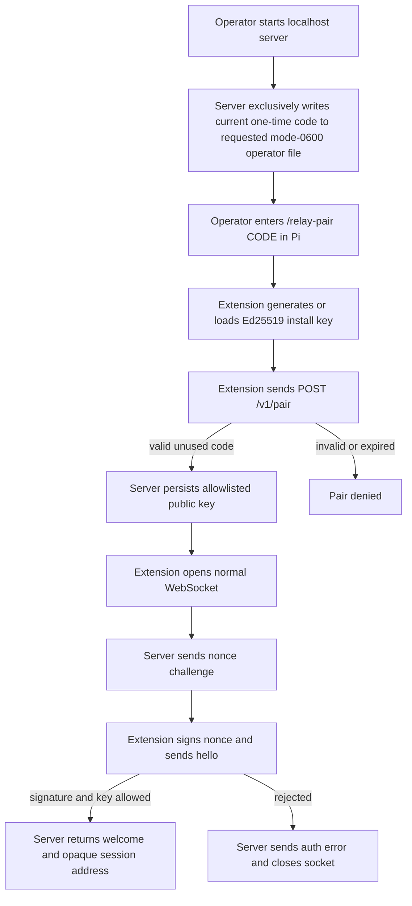
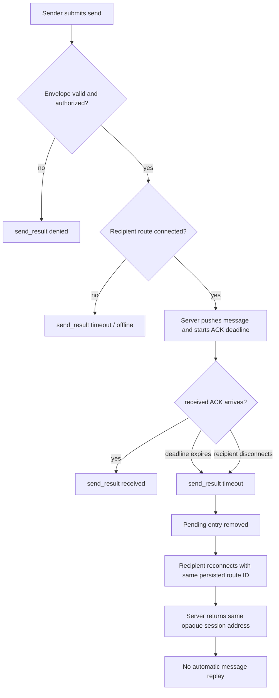

import { Aside, Tabs, TabItem } from '@astrojs/starlight/components';
import Decision from '../../../../components/Decision.astro';

<Aside type="note" title="Contract scope">
This document defines the accepted v1 external contract. It does not select Go packages, synchronization primitives, or persistence formats beyond the stated trust and durability boundaries.
</Aside>

## Contract boundary

The Pi extension exposes two model tools:

- `list_peers()`
- `agent_send({ to, body, re? })`

Connection and pairing are human/configuration concerns. They are not model tools. The extension maintains one persistent WebSocket to a localhost server; cross-machine deployments provide localhost reachability through VPN or SSH forwarding.

<Decision title="Keep the model tool surface to two intents" status="accepted">
Peer discovery and message sending stay explicit. Connection lifecycle remains automatic and configuration-driven.
</Decision>

<Decision title="Use online-only unicast delivery" status="accepted">
The server routes only to authenticated, currently connected Pi sessions. No offline inbox, replay, broadcast, or message persistence exists in v1.
</Decision>

## Envelope

Every WebSocket text frame is one JSON object:

```json
{
  "v": 1,
  "type": "send",
  "request_id": "01993c77-f83e-7aa1-b739-8eeea87d52e1",
  "payload": {}
}
```

- `v` is the protocol major.
- `type` comes from a closed operation set.
- `request_id` is a sender-generated UUIDv7 used only to correlate one request and response. Server-pushed events may omit it.
- `payload` is an object whose schema depends on `type`.
- `message_id` identifies a logical message across retry and reply correlation. It is not a request ID.
- `delivery_id` identifies one server offer to a recipient and is used only for the recipient extension ACK.
- `body` is either a string or a JSON object. The recipient extension converts an object to canonical compact JSON before Pi injection.

Unknown fields are rejected at the envelope and typed-payload levels. Duplicate JSON keys are rejected at every accepted depth, including inside application-owned object bodies, before any map or typed value can erase the ambiguity. JSON is limited to 64 nested object or array containers, counting the outer envelope as depth 1; a container at depth 65 or greater is rejected as `invalid_frame`. Canonical addresses have the form `<full-cwd>@<hostname>#<uuidv7>`, but clients treat the whole value as opaque and copy it verbatim. Cwd and hostname are display metadata, never authorization inputs.

After authentication, the only accepted client-to-server `type` values are `list`, `send`, and `received`. Their payloads are closed objects: `list` is exactly empty; `send` requires `message_id`, `to`, and `body` and permits only optional `re`; and `received` requires exactly `delivery_id` and `message_id`. Every ID is a canonical lowercase UUIDv7. `to` is a non-empty opaque UTF-8 string bounded to the largest server-issued v1 address. `body` is only a JSON string or object. The 512 KiB ceiling applies to the complete reassembled WebSocket message's UTF-8 bytes, whether it arrived in one fragment or many, before JSON decoding. Compression is disabled. Ticket #24 separately owns the 256 KiB serialized-body limit.

A post-authentication parser starts at a message boundary and either dispatches one complete valid operation or enters a terminal protocol-error state. Binary messages, invalid UTF-8, malformed or trailing JSON, and over-limit messages use `invalid_frame`. A syntax-valid value that is not the closed operation envelope, including duplicate or unknown fields and wrong-direction types, uses `invalid_envelope`. An otherwise shaped envelope whose integer major is not `1` uses `unsupported_protocol`. These stable errors have `close: true`; the server makes one bounded best-effort error write and then hard-closes promptly. `request_id` is included only when the complete JSON has exactly one valid top-level request ID that can be recovered without ambiguity. Error messages and logs never include raw frame or body data; logs omit unrecognized submitted types.

Operation-level denial is a different state transition: a structurally valid operation reaches the operation dispatcher, a canonical result may be returned, and the parser returns to the next message boundary without closing. Tickets #13, #14, and #18 own production roster, delivery, and offline outcomes, so the boundary implementation does not invent a temporary result while those handlers remain disconnected.

<Decision title="Fail closed on protocol ambiguity but keep operation denials recoverable" status="accepted">
Malformed framing or envelope state makes subsequent interpretation unsafe, so one stable error ends the connection. A valid operation with a business denial remains unambiguous and leaves the authenticated session usable.
</Decision>

## Pairing and live connection flow



The pairing code and nonce are authentication material and are always redacted from logs. The server writes the current raw pairing code only when `--pairing-code-file PATH` explicitly requests an exclusively created mode-`0600` operator file. If the flag is omitted, the raw code remains undisclosed; ordinary structured logs contain only `<redacted>`. A startup pairing code is exactly 32 URL-safe Base64 characters encoding 24 random bytes. It is valid only before its ten-minute `expires_at` timestamp: the exact deadline and every later instant are expired. The server persists allowlisted public keys and minimal pairing metadata, but never messages or pending sends. Pair requests are bounded to 4,096 bytes and use a closed two-string JSON object; the extension's fixed accepted code and public-key forms produce a 126-byte request. `client_public_key` is `ed25519:` followed by canonical standard Base64 for exactly 32 raw Ed25519 public-key bytes. `client_id` is `cli_` followed by exactly 16 URL-safe Base64 characters encoding 12 random bytes.

The server reserves one of 1,024 tracked slots before WebSocket upgrade. At capacity it returns bounded HTTP `503` without upgrading. Each upgraded connection receives a fresh 32-byte cryptographic nonce encoded as 43-character unpadded URL-safe Base64. Challenge write, hello read, verification, and welcome write share a five-second authentication deadline. The general frame ceiling remains 512 KiB, while hello uses a narrower 16 KiB read ceiling. Cwd is bounded to 4,096 UTF-8 bytes and hostname to 255 UTF-8 bytes; both must be non-empty. These values are signed display metadata, not authorization identity.

The Ed25519 signature covers this exact UTF-8 transcript, in order, where each length is the decimal UTF-8 byte length and each shown `\n` is one LF byte:

```text
pi-messaging-relay-auth-v1\n
nonce:<length>:<nonce>\n
request_id:<length>:<request_id>\n
client_public_key:<length>:<client_public_key>\n
route_id:<length>:<route_id>\n
hostname:<length>:<hostname>\n
cwd:<length>:<cwd>\n
```

The signature field is excluded. Both request and route IDs are canonical lowercase UUIDv7. Authorization succeeds only when the submitted key is allowlisted and that same key verifies the complete transcript. Welcome echoes the signed metadata as `<cwd>@<hostname>#<route_id>`; the composite address is never parsed for authorization. While an authenticated entry is active, both its route UUID and complete opaque address are unique. A same-key or different-key collision closes without a welcome and cannot replace the original entry. Route reuse after disconnect and reconnect ownership remain deferred to ticket #26.

<Decision title="Sign one deterministic domain-separated hello transcript" status="accepted">
Length-prefixed values bind the fresh nonce, request, installation key, and complete route metadata without delimiter ambiguity. Go and TypeScript produce identical bytes, and changing display metadata invalidates the signature without making that metadata an authorization identity.
</Decision>

<Decision title="Separate trust bootstrap from messaging" status="accepted">
One-time pairing uses `POST /v1/pair`. Authenticated live traffic uses WebSocket `/v1/connect`.
</Decision>

<Decision title="Use one closed stale-code rejection" status="accepted">
A well-formed incorrect, expired, or already consumed code returns HTTP `401` with `pairing_code_invalid` and adds no allowlist entry. The submitted code crosses into the request trust boundary, but the response omits it entirely and structured logs preserve only redacted authentication fields.
</Decision>

### I/O examples

<Tabs>
  <TabItem label="Pair request">
    ```http
    POST /v1/pair HTTP/1.1
    Content-Type: application/json

    {
      "pairing_code": "<REDACTED>",
      "client_public_key": "ed25519:11qYAYdk9Jgqgfdm2r7wIfdHyE5gq5sI1sS0l7l2a9E="
    }
    ```
  </TabItem>
  <TabItem label="Response 201">
    ```http
    HTTP/1.1 201 Created
    Content-Type: application/json

    {
      "client_id": "cli_01J7K8M4Y9Z3abcd"
    }
    ```
  </TabItem>
  <TabItem label="Response 401">
    ```http
    HTTP/1.1 401 Unauthorized
    Content-Type: application/json

    {
      "error": "pairing_code_invalid",
      "message": "Pairing code is invalid or expired"
    }
    ```
  </TabItem>
</Tabs>

<Tabs>
  <TabItem label="Challenge">
    ```json
    {
      "v": 1,
      "type": "challenge",
      "payload": {
        "nonce": "<REDACTED>"
      }
    }
    ```
  </TabItem>
  <TabItem label="Hello">
    ```json
    {
      "v": 1,
      "type": "hello",
      "request_id": "01993c79-8ad7-79fa-83e3-9789dcaca168",
      "payload": {
        "client_public_key": "ed25519:11qYAYdk9Jgqgfdm2r7wIfdHyE5gq5sI1sS0l7l2a9E=",
        "route_id": "01993ca1-1111-7aaa-8aaa-111111111111",
        "hostname": "workstation-a",
        "cwd": "/srv/frontend",
        "signature": "<REDACTED>"
      }
    }
    ```
  </TabItem>
  <TabItem label="Welcome">
    ```json
    {
      "v": 1,
      "type": "welcome",
      "request_id": "01993c79-8ad7-79fa-83e3-9789dcaca168",
      "payload": {
        "self_address": "/srv/frontend@workstation-a#01993ca1-1111-7aaa-8aaa-111111111111",
        "heartbeat_ms": 30000,
        "max_body_bytes": 262144
      }
    }
    ```
  </TabItem>
  <TabItem label="Auth rejected">
    ```json
    {
      "v": 1,
      "type": "error",
      "request_id": "01993c79-8ad7-79fa-83e3-9789dcaca168",
      "payload": {
        "code": "not_authorized",
        "message": "Client key is not authorized",
        "close": true
      }
    }
    ```
  </TabItem>
  <TabItem label="Invalid envelope">
    ```json
    {
      "v": 1,
      "type": "error",
      "request_id": "01993c84-5d38-7d75-8bc1-f945bfa42cdf",
      "payload": {
        "code": "invalid_envelope",
        "message": "Invalid protocol envelope",
        "close": true
      }
    }
    ```
  </TabItem>
  <TabItem label="Invalid frame without safe correlation">
    ```json
    {
      "v": 1,
      "type": "error",
      "payload": {
        "code": "invalid_frame",
        "message": "Invalid WebSocket frame",
        "close": true
      }
    }
    ```
  </TabItem>
  <TabItem label="Unsupported major">
    ```json
    {
      "v": 1,
      "type": "error",
      "request_id": "01993c84-5d38-7d75-8bc1-f945bfa42cdf",
      "payload": {
        "code": "unsupported_protocol",
        "message": "Unsupported protocol version",
        "close": true
      }
    }
    ```
  </TabItem>
</Tabs>

## Peer discovery

Every authenticated active session on the server except the caller is visible. Roster entries contain only the opaque address and express online presence only; Pi `idle/busy` state is not published. No `connection_name` configuration exists.

### I/O examples

<Tabs>
  <TabItem label="Pi tool input">
    ```json
    {}
    ```
  </TabItem>
  <TabItem label="Pi tool output">
    ```json
    {
      "peers": [
        {
          "address": "/srv/backend@workstation-b#01993ca2-2222-7bbb-9bbb-222222222222"
        }
      ]
    }
    ```
  </TabItem>
</Tabs>

<Tabs>
  <TabItem label="Wire request">
    ```json
    {
      "v": 1,
      "type": "list",
      "request_id": "01993c7a-7d2c-7699-b159-851da079f09f",
      "payload": {}
    }
    ```
  </TabItem>
  <TabItem label="Wire response">
    ```json
    {
      "v": 1,
      "type": "roster",
      "request_id": "01993c7a-7d2c-7699-b159-851da079f09f",
      "payload": {
        "peers": [
          {
            "address": "/srv/backend@workstation-b#01993ca2-2222-7bbb-9bbb-222222222222"
          }
        ]
      }
    }
    ```
  </TabItem>
  <TabItem label="Unauthenticated">
    ```json
    {
      "v": 1,
      "type": "error",
      "request_id": "01993c7a-7d2c-7699-b159-851da079f09f",
      "payload": {
        "code": "not_authorized",
        "message": "Authenticate before listing peers",
        "close": true
      }
    }
    ```
  </TabItem>
</Tabs>

## Message delivery and reply flow

```mermaid
sequenceDiagram
    participant SA as Sender agent
    participant SE as Sender extension
    participant R as Relay server
    participant RE as Recipient extension
    participant RP as Recipient Pi

    SA->>SE: agent_send(to, body, re?)
    SE->>R: send(request_id, message_id, to, body, re?)
    R->>RE: message(delivery_id, message_id, from, to, body, re?)
    RE->>RP: sendUserMessage(..., followUp if busy)
    RE->>R: received(delivery_id, message_id)
    R->>SE: send_result(received)
    SE->>SA: received
    Note over RP: Later turn; task completion is not guaranteed
    RP->>RE: agent_send(to=original from, re=original message_id)
    RE->>R: send(new message_id, re=original message_id)
```

<Decision title="Define received at the extension boundary" status="accepted">
`received` means the recipient extension received the frame and attempted `pi.sendUserMessage`. Pi 0.84.2 exposes no enqueue or persistence receipt, so this status never claims durable Pi acceptance, model read, task completion, or reply.
</Decision>

<Decision title="Preserve active work with follow-up delivery" status="accepted">
When Pi is busy, the extension always uses `deliverAs: "followUp"`. A sender cannot steer another active session in v1.
</Decision>

### I/O examples

<Tabs>
  <TabItem label="Pi tool input">
    ```json
    {
      "to": "/srv/backend@workstation-b#01993ca2-2222-7bbb-9bbb-222222222222",
      "body": "Review the API contract",
      "re": "01993c80-40de-79d7-9b2c-1349f88bb408"
    }
    ```
  </TabItem>
  <TabItem label="Pi tool output">
    ```json
    {
      "message_id": "01993c84-fc2b-7e1c-af99-61b8118ac6df",
      "status": "received"
    }
    ```
  </TabItem>
</Tabs>

<Tabs>
  <TabItem label="Send">
    ```json
    {
      "v": 1,
      "type": "send",
      "request_id": "01993c84-5d38-7d75-8bc1-f945bfa42cdf",
      "payload": {
        "message_id": "01993c84-fc2b-7e1c-af99-61b8118ac6df",
        "to": "/srv/backend@workstation-b#01993ca2-2222-7bbb-9bbb-222222222222",
        "re": "01993c80-40de-79d7-9b2c-1349f88bb408",
        "body": "Review the API contract"
      }
    }
    ```
  </TabItem>
  <TabItem label="Recipient push">
    ```json
    {
      "v": 1,
      "type": "message",
      "payload": {
        "delivery_id": "01993c85-d827-7cd9-966c-07aa3ee42e47",
        "message_id": "01993c84-fc2b-7e1c-af99-61b8118ac6df",
        "from": "/srv/frontend@workstation-a#01993ca1-1111-7aaa-8aaa-111111111111",
        "to": "/srv/backend@workstation-b#01993ca2-2222-7bbb-9bbb-222222222222",
        "re": "01993c80-40de-79d7-9b2c-1349f88bb408",
        "body": "Review the API contract"
      }
    }
    ```
  </TabItem>
  <TabItem label="Recipient ACK">
    ```json
    {
      "v": 1,
      "type": "received",
      "request_id": "01993c86-c35a-7739-8e18-5c3f711c178a",
      "payload": {
        "delivery_id": "01993c85-d827-7cd9-966c-07aa3ee42e47",
        "message_id": "01993c84-fc2b-7e1c-af99-61b8118ac6df"
      }
    }
    ```
  </TabItem>
  <TabItem label="Sender result">
    ```json
    {
      "v": 1,
      "type": "send_result",
      "request_id": "01993c84-5d38-7d75-8bc1-f945bfa42cdf",
      "payload": {
        "message_id": "01993c84-fc2b-7e1c-af99-61b8118ac6df",
        "status": "received"
      }
    }
    ```
  </TabItem>
</Tabs>

A reply uses `send` with a new extension-generated `message_id`; `re` contains the original message ID. It receives an independent `send_result`. The model cannot supply `message_id`; an internal bounded transport retry reuses the generated ID.

The recipient injects one user message with this exact shape:

```text
[pi-messaging-relay] message from "<opaque-address>" (id=<message-id>, re=<original-id>):
<body>
```

The `re` segment is omitted when absent. String bodies follow the header unchanged. Object bodies use canonical compact JSON with stable key ordering.

## Failure and reconnect flow



Reconnect uses exponential backoff with jitter and a cap. The same Pi session reclaims its address; a new or forked session receives a new address. Pending messages are never replayed automatically after server restart.

Fixed v1 ceilings are a 256 KiB body, 512 KiB frame, 5-second ACK deadline, 128 pending sends per sender connection, 1,024 dedupe message IDs per recipient session, and a single-use pairing code whose exact 10-minute deadline is the first expired instant.

### I/O examples

<Tabs>
  <TabItem label="Denied">
    ```json
    {
      "v": 1,
      "type": "send_result",
      "request_id": "01993c8b-09ee-7747-af31-a0cbd269a2c3",
      "payload": {
        "message_id": "01993c8b-5150-799e-87dd-263bbdbc3441",
        "status": "denied",
        "reason": "not_authorized"
      }
    }
    ```
  </TabItem>
  <TabItem label="Offline">
    ```json
    {
      "v": 1,
      "type": "send_result",
      "request_id": "01993c8c-13df-747d-9cb5-28dd313c0261",
      "payload": {
        "message_id": "01993c8c-839b-76c7-a554-d6d0c6233692",
        "status": "timeout",
        "reason": "offline"
      }
    }
    ```
  </TabItem>
  <TabItem label="ACK timeout">
    ```json
    {
      "v": 1,
      "type": "send_result",
      "request_id": "01993c8d-b0df-793e-a06a-a66fd74eb7d3",
      "payload": {
        "message_id": "01993c8d-e68e-77b2-80fc-c53ddb9a4feb",
        "status": "timeout",
        "reason": "ack_timeout"
      }
    }
    ```
  </TabItem>
  <TabItem label="ID conflict">
    ```json
    {
      "v": 1,
      "type": "send_result",
      "request_id": "01993c8f-9719-7c29-89ac-6233d701ba39",
      "payload": {
        "message_id": "01993c8d-e68e-77b2-80fc-c53ddb9a4feb",
        "status": "denied",
        "reason": "message_id_conflict"
      }
    }
    ```
  </TabItem>
</Tabs>

A duplicate `message_id` with an identical immutable envelope is idempotent and returns the already known result when available. Reusing it with different `to`, `re`, or `body` is denied as `message_id_conflict`.

## Operational evidence

Structured logs are sufficient for v1. OpenTelemetry, traces, and metrics are not selected until an operational need appears.

Example server log:

```json
{
  "level": "info",
  "event": "send_settled",
  "message_id": "01993c84-fc2b-7e1c-af99-61b8118ac6df",
  "sender_route": "/srv/frontend@workstation-a#01993ca1-1111-7aaa-8aaa-111111111111",
  "recipient_route": "/srv/backend@workstation-b#01993ca2-2222-7bbb-9bbb-222222222222",
  "status": "received",
  "latency_ms": 18,
  "body": "<redacted>"
}
```

Authentication fields including pairing code, nonce, signature, and private key use `<redacted>` markers. Message body is user-supplied content and is fully redacted whether it is a string or object. Public keys and opaque route IDs may remain visible for support correlation.

## Pi runtime evidence and accepted limitations

A focused Pi 0.84.2 runtime experiment verified:

- idle `pi.sendUserMessage` starts a real user turn;
- busy `deliverAs: "followUp"` preserves ordering and runs after active work;
- abort stops current work but does not discard an already queued follow-up; and
- RPC `new_session` waits for queued follow-up completion before replacing the session.

The experiment did not establish deterministic queue behavior across `ctx.reload()` or process termination. V1 accepts these as best-effort lifecycle boundaries rather than blocking the API.

<Decision title="Do not claim Pi queue durability" status="accepted">
A `received` result remains an extension-boundary acknowledgment only. Reload, crash, process termination, or later Pi failure may lose work after acknowledgment. V1 provides no replay, recovery, or Pi-persistence receipt.
</Decision>

## Implementation requirements derived from the contract

1. Keep model access limited to `list_peers` and `agent_send`.
2. Reject malformed, unauthenticated, oversized, and conflicting-ID input at the trust boundary.
3. Keep allowlisted client identity separate from ephemeral online session routing.
4. Bound pending sends, ACK waits, and dedupe memory using the fixed v1 ceilings.
5. Redact message bodies and all authentication material from logs.
6. Test each documented happy path and stable failure reason at the wire boundary.
7. Preserve the same route address across reconnect without replaying messages.
