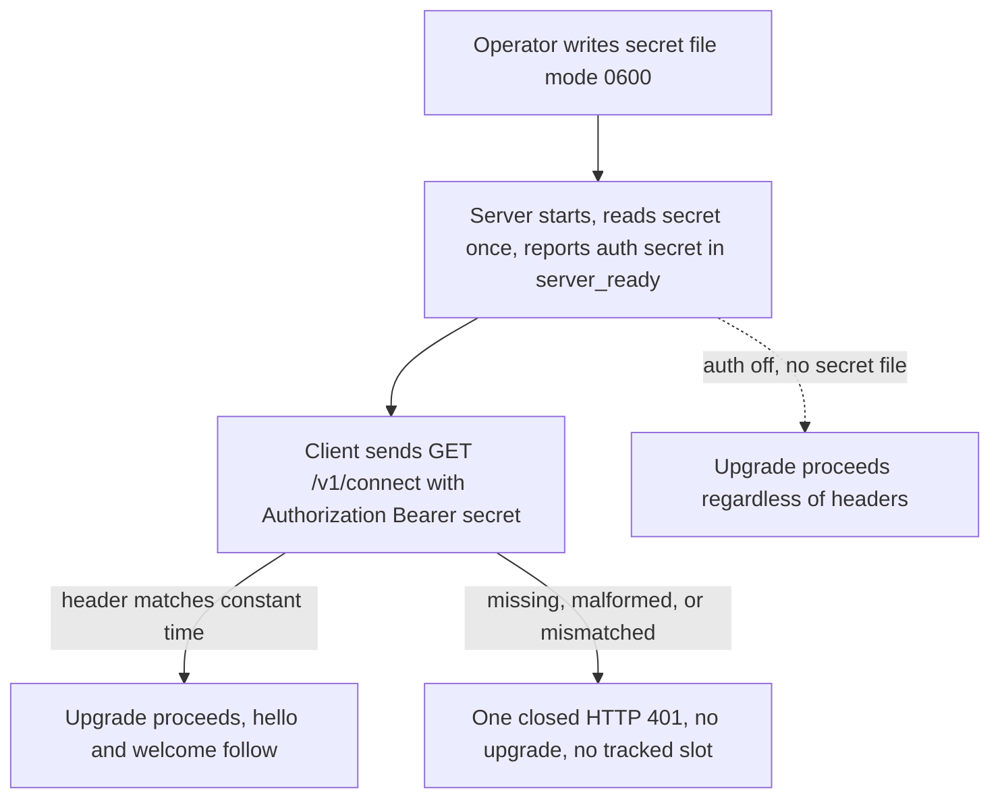

import { Aside, Tabs, TabItem } from '@astrojs/starlight/components';
import Decision from '../../../../components/Decision.astro';

This page is the accepted authentication contract for protocol v2. It replaces the v1 trust bootstrap — one-time pairing codes, the Ed25519 installation key, the persisted allowlist, the nonce challenge, the signed hello transcript, and `cli_` identities — with one optional static shared secret, exactly like a password, checked at the HTTP WebSocket upgrade. The [installation pairing seam](../../relay/pairing/) and the v1 [session authentication seam](../../relay/session-authentication/) are superseded and retained as history.

Everything else stays v1: the [online relay API v1](../online-relay-api-v1/) remains authoritative for the WebSocket envelope, roster, delivery, replies, lifecycle settlement, and framing ceilings, and [automatic session reconnect](../../relay/automatic-reconnect/) keeps its bounded policy. The scope is one user on one machine; the relay still binds loopback only, which remains the primary deployment boundary.

<Aside type="caution" title="Breaking change">
Protocol v2 deliberately breaks v1 clients. A v1 client cannot authenticate to a v2 server and a v2 client cannot authenticate to a v1 server. Mismatched deployments fail closed at the boundary in both directions; there is no compatibility mode.
</Aside>

## Scope of supersession

Removed in v2:

- The `/relay-pair` Pi command and `POST /v1/pair` HTTP endpoint. The server answers `POST /v1/pair` with the ordinary not-found path; no compatibility shim exists.
- Startup pairing codes and the `--pairing-code-file` operator channel.
- Ed25519 installation keys, `installation-ed25519.pem`, and the persisted `allowlist.json`.
- The 32-byte nonce challenge and the length-prefixed signed hello transcript.
- `cli_` client identities and per-installation authorization. All authenticated sessions are the same single trust level.
- The post-upgrade `not_authorized` error frame occurrence: v2 rejects unauthenticated requests before any WebSocket exists.

Unchanged in v2: the envelope `v` field stays `1`, route IDs stay canonical lowercase UUIDv7, cwd and hostname stay display metadata, welcome limits stay `heartbeat_ms` 30000 and `max_body_bytes` 262144, roster, delivery, reply, dedupe, and reconnect semantics are untouched, and every existing frame and transport ceiling applies as written.

<Decision title="Replace per-installation cryptography with one optional shared secret" status="accepted">
The v1 chain — env endpoint, `/relay-pair` command, key persistence, allowlist, challenge/signature — failed a real single-user deployment on setup complexity while the loopback bind already provided the primary boundary. One static secret defends the remaining exposure (other local processes and users reaching the loopback port) without any bootstrap protocol.
</Decision>

## Server secret file

`--secret-file PATH` selects one secret file. The cleaned absolute path must be a direct child of the active state directory; the state root itself, external parents, and parent traversal fail before readiness. The file must be a current-user-owned regular non-symlink file with mode exactly `0600` — group and other bits fail startup. The server opens it nonblocking through the retained state-directory handle without following symlinks, reads at most 4,096 bytes, and requires valid UTF-8 with no NUL byte. Surrounding ASCII whitespace is trimmed; the trimmed value is the secret and must be 1 through 512 UTF-8 bytes. The secret is retained only in process memory, is never logged, and structured events keep any authentication field name with the `<redacted>` value.

When the flag is unset, the server starts with authentication off: it accepts every upgrade attempt regardless of headers, and the bind address remains loopback-only. When the flag is set, an invalid path, unsafe file form, wrong mode, unreadable content, empty trimmed value, or over-limit value fails startup before `server_ready`. A set-but-broken secret never silently degrades to authentication off.

The secret file is operator-owned input, unlike the v1 pairing code: the operator generates the secret, writes it with mode `0600`, and restarts or reactivates the service to reload it. There is no runtime secret rotation endpoint; changing the secret is one restart.

<Decision title="Keep authentication off unless an operator writes a secret file" status="accepted">
Auth-off is the single-user default: no secret to lose, no config to get wrong, loopback-only exposure. File presence is the only activation switch, so a lost flag or empty state directory cannot strand the operator, while any broken file form fails startup instead of downgrading to no protection.
</Decision>

<Decision title="Read the secret only through the guarded state-directory child" status="accepted">
Descriptor-relative open through the retained state handle, symlink refusal, exact `0600`, effective-user ownership, and the bounded 4,096-byte read reuse the v1 file trust machinery. This keeps the secret out of argv, environment, and logs. Ponytail: the 512-byte secret ceiling and 4,096-byte read ceiling are fixed; make them configurable when a second deployment profile exists.
</Decision>

Readiness gains one field: `server_ready` carries `auth` with the closed value set `"off"` or `"secret"`. The event never contains the secret itself. Operators verify the active mode from this field instead of from connection probes.

## Upgrade authentication



When the secret is set, every `GET /v1/connect` upgrade request must carry `Authorization: Bearer <secret>`. The scheme token comparison is case-insensitive; the secret bytes compare exactly. Comparison is constant-time over the submitted value, so only value length is observable. A missing header, a non-Bearer scheme, an over-limit value above 4,096 bytes, and a wrong secret all receive the identical closed rejection: HTTP `401` with `Content-Type: application/json`, `WWW-Authenticate: Bearer`, the constant body below, and no upgrade. The response write shares the two-second HTTP response deadline. There is exactly one rejection spelling, so the endpoint cannot be used to distinguish an unset secret from a wrong one.

Authorization runs before capacity accounting: a rejected request consumes none of the 1,024 tracked upgrade slots, and the bounded HTTP `503` capacity rejection applies only after a request is authorized. After upgrade, the session registry, route and address uniqueness, and collision handling are unchanged: one route UUID and one complete address remain unique across all authenticated sessions, and a collision closes without a welcome exactly as v1 documents.

When the secret is unset, headers are not validated and never inspected. A client that sends no header and a client that sends a correct or incorrect Bearer value all proceed.

<Decision title="Authenticate at the HTTP upgrade boundary" status="accepted">
Checking Bearer credentials before the upgrade keeps the WebSocket free of authentication state: no challenge deadline on the socket, no tracked slot for rejected probes, and reconnect code sees one ordinary failed HTTP upgrade. Collapsing every failure variant into one 401 removes the oracle v1 collapsed for stale codes.
</Decision>

### I/O examples

<Tabs>
  <TabItem label="Authorized upgrade and session">
    ```http
    GET /v1/connect HTTP/1.1
    Host: 127.0.0.1:8080
    Upgrade: websocket
    Connection: Upgrade
    Sec-WebSocket-Key: dGhlIHNhbXBsZSBub25jZQ==
    Sec-WebSocket-Version: 13
    Authorization: Bearer <REDACTED>
    ```

    The server upgrades the socket (HTTP `101`), then the unchanged unsigned hello and welcome complete the session:

    ```json
    {"v":1,"type":"hello","request_id":"01993c79-8ad7-79fa-83e3-9789dcaca168","payload":{"route_id":"01993ca1-1111-7aaa-8aaa-111111111111","hostname":"workstation-a","cwd":"/srv/frontend"}}
    ```

    ```json
    {"v":1,"type":"welcome","request_id":"01993c79-8ad7-79fa-83e3-9789dcaca168","payload":{"self_address":"/srv/frontend@workstation-a#01993ca1-1111-7aaa-8aaa-111111111111","heartbeat_ms":30000,"max_body_bytes":262144}}
    ```
  </TabItem>
  <TabItem label="Missing or wrong secret">
    ```http
    HTTP/1.1 401 Unauthorized
    WWW-Authenticate: Bearer
    Content-Type: application/json

    {"error":"not_authorized","message":"Authentication is required"}
    ```

    The identical response covers missing header, wrong scheme, wrong secret, and over-limit header. The relay does not upgrade and does not count the attempt against capacity.
  </TabItem>
  <TabItem label="Auth-off server">
    ```http
    GET /v1/connect HTTP/1.1
    Host: 127.0.0.1:8080
    Upgrade: websocket
    Connection: Upgrade
    Sec-WebSocket-Key: dGhlIHNhbXBsZSBub25jZQ==
    Sec-WebSocket-Version: 13
    ```

    ```http
    HTTP/1.1 101 Switching Protocols
    ```

    No `Authorization` header is required or inspected when no secret file is configured.
  </TabItem>
</Tabs>

## Post-upgrade hello

The hello survives as session establishment, not authentication. Its payload is a closed object with exactly `route_id`, `hostname`, and `cwd` — the signed hello's `client_public_key` and `signature` fields are removed, and no nonce exists. The request ID stays a canonical lowercase UUIDv7 and correlates the welcome. Bounds are unchanged: non-empty `hostname` at most 255 UTF-8 bytes, non-empty `cwd` at most 4,096 UTF-8 bytes, and the hello read keeps the 16 KiB ceiling inside the 512 KiB transport ceiling. Hello read, validation, and welcome write share one five-second establishment deadline. Envelope, framing, duplicate-key, unknown-field, and terminal protocol-error rules are exactly the [WebSocket envelope boundary](../websocket-envelope-boundary/) rules.

<Decision title="Keep the hello as unsigned display metadata" status="accepted">
The server still needs route UUID, hostname, and cwd to compose the opaque self address, but nothing in the hello grants authority anymore: the secret at the upgrade is the only credential. Dropping the signature removes the cross-language transcript builder and the crypto dependency from both implementations while welcome, limits, and addressing stay byte-identical to v1.
</Decision>

## Client configuration file

The extension reads one configuration file at `~/.config/pi/pi-messaging-relay.json`. The path is fixed under the current user's home — `XDG_CONFIG_HOME` is not honored. The file must be a current-user-owned regular non-symlink file with mode exactly `0600`. Its content is valid UTF-8 of at most 4,096 bytes holding one closed JSON object with exactly these members:

```json
{
  "url": "http://127.0.0.1:8080",
  "secret": "<REDACTED>"
}
```

- `url` is required and must be an HTTP loopback origin, validated exactly like the v1 `PI_MESSAGING_RELAY_URL` value: credentials, paths, query strings, fragments, non-HTTP schemes, non-loopback hostnames and IPs are rejected.
- `secret` is optional, used verbatim with no trimming, and bounded to 1 through 512 UTF-8 bytes like the server secret.
- Duplicate keys, unknown keys, wrong types, trailing JSON, malformed UTF-8, and over-limit content reject the whole file.

`PI_MESSAGING_RELAY_URL` remains an optional override for the url only and is validated the same way. The effective configuration is the config file with the environment url substituted when present. There is deliberately no secret environment variable: environment values are readable through `/proc` by same-user processes, and the Nix guardrail below forbids shipping the secret any other way than the config file or the server's secret file.

An absent config file with no environment override leaves the relay disconnected with exactly the v1 behavior for a missing endpoint: no connection attempts, and the model tools reflect the disconnected state. An invalid file — unreadable, unsafe form, wrong mode, or rejected JSON — is equivalent to absent: the extension never falls back to an unauthenticated default origin, never treats a broken file as auth-off, and never crashes the Pi session over it.

<Decision title="Move client endpoint and secret into one closed config file" status="accepted">
One file with a closed shape replaces the v1 chain of environment plus paired key. Mode `0600` on a fixed user-owned path keeps the secret out of the world-readable Nix store and out of process environments. The url-only environment override preserves container and test ergonomics without adding a second secret channel.
</Decision>

### I/O examples

<Tabs>
  <TabItem label="Config file">
    ```text
    $ install -m 0600 /dev/null ~/.config/pi/pi-messaging-relay.json
    $ vi ~/.config/pi/pi-messaging-relay.json
    $ stat -c '%a %U' ~/.config/pi/pi-messaging-relay.json
    600 homeserver
    ```

    ```json
    {"url":"http://127.0.0.1:8080","secret":"<REDACTED>"}
    ```
  </TabItem>
  <TabItem label="Environment override">
    ```text
    $ PI_MESSAGING_RELAY_URL=http://127.0.0.1:9999 pi
    ```

    The extension connects to `http://127.0.0.1:9999` and still sends the config file's secret as the Bearer value. Removing the `secret` member while the server runs with a secret set produces the closed HTTP 401 above and the existing bounded reconnect policy.
  </TabItem>
  <TabItem label="Rejected file">
    ```json
    {"url":"http://127.0.0.1:8080","secret":"<REDACTED>","extra":true}
    ```

    Unknown member — the file is rejected whole. The relay stays disconnected exactly as when no configuration exists; no partial acceptance occurs.
  </TabItem>
</Tabs>

## Breaking changes and migration

- v1 extension against v2 server: the upgrade carries no `Authorization` header or a stale one, receives the closed HTTP 401, and retries under the unchanged bounded jitter policy until reconfigured. v2 extension against v1 server: the v1 server sends a nonce challenge the v2 client does not answer, and the hello without `client_public_key` and `signature` fails v1 validation — both directions fail closed.
- Operators migrating: start the server with `--secret-file` pointing at a mode-`0600` file inside the state directory, write the same secret into the client config file, and remove `installation-ed25519.pem`, `allowlist.json`, and any `/relay-pair` usage. No pairing step exists in v2; there is nothing to re-run after a restart beyond the secret files.
- The removal of `POST /v1/pair`, `--pairing-code-file`, and the allowlist is contractual, not incidental: implementations must not keep them behind flags.

## Nix and secrets guardrail

<Aside type="danger" title="Secrets never enter the Nix store">
The Nix store is world-readable. No Nix option, module default, launcher, or systemd unit may embed the secret value or place a secret-bearing file in the store. Server modules expose only a path option naming a runtime file outside the store, created with mode `0600` and read by the running service; client deployments deliver the config file the same way. A secret found in store output, module arguments, unit text, or logs is a defect.
</Aside>

## Fixed ceilings

| Ceiling | Value | Rationale |
| --- | --- | --- |
| Secret length | 1–512 UTF-8 bytes after trimming | Room for generated secrets far beyond memorization; bounds constant-time comparison work |
| Secret file read | 4,096 bytes | Matches the v1 request-body bound; rejects junk without unbounded reads |
| `Authorization` header value | 4,096 bytes, over-limit = same 401 | Legitimate values are under 520 bytes; indistinguishable rejection preserves the closed seam |
| Client config file | 4,096 bytes, mode exactly `0600` | Two members cannot need more; exact mode keeps the secret file-class consistent |
| Hello establishment deadline | 5 seconds | Carried from the v1 authentication deadline; one bounded value, no new knob |
| Hello read ceiling | 16 KiB inside 512 KiB transport | Unchanged v1 ceilings |
| Secret rotation | Restart only | One operator, one machine; no runtime rotation surface |

All values are policy choices fixed for the single-user scope: make any of them configurable only when a second deployment profile actually exists.
