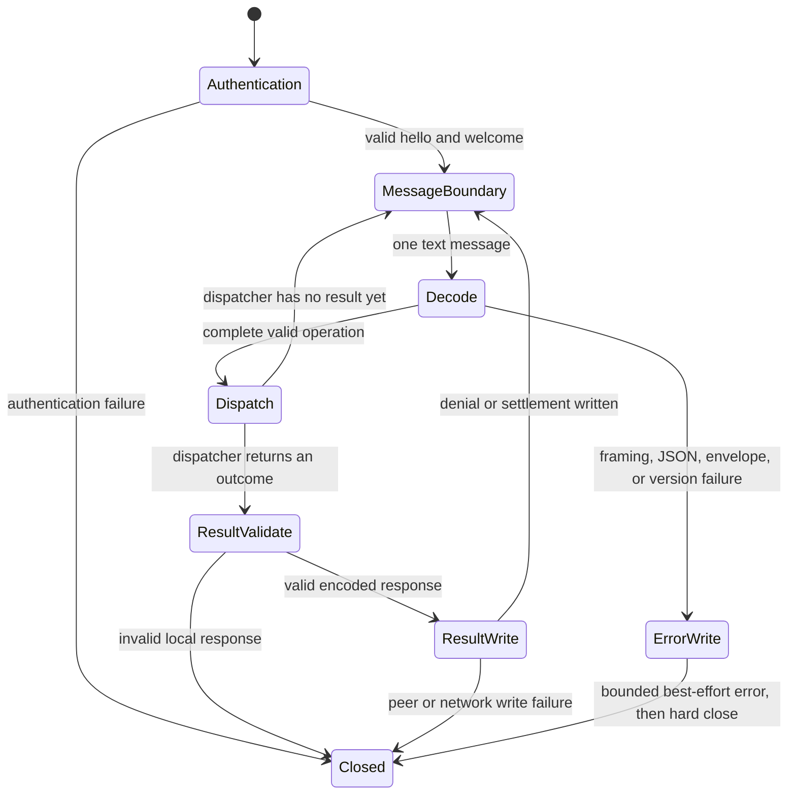

import { Aside, Tabs, TabItem } from '@astrojs/starlight/components';
import Decision from '../../../../components/Decision.astro';

This seam replaces the retained socket's one-read placeholder with a bounded post-authentication message loop. It validates the client operation language before any roster, routing, delivery, acknowledgment, or offline behavior can run.

<Aside type="note" title="Implementation boundary">
The production dispatcher intentionally emits no temporary public result. Ticket #36 adds only the accepted bounded `list` cursor transport; ticket #13 still owns live registry reads, page filling, `roster` responses, and model-tool WebSocket operations. Tickets #14 and #18 connect delivery, acknowledgment, and offline outcomes. Ticket #24 adds the separate 256 KiB serialized-body rejection. This seam defines and tests dispatch/result behavior with an injected handler without consuming those tickets.
</Aside>

## Parser states



Server authentication keeps its narrower 16 KiB client-hello limit and `not_authorized` behavior. The extension's receive transport uses a socket-wide 512 KiB pre-materialization ceiling and, during challenge and welcome, rejects complete authentication messages above a separate 16 KiB semantic ceiling. After welcome, each complete client-to-server WebSocket message must be one JSON object. Fragmentation does not create multiple application messages: the parser streams and accounts for all fragments as one message. The coder/websocket read limit and an application-side bounded reader cap keep input buffering to at most 512 KiB plus the single over-limit detection byte. Compression is disabled, so accounting is the reassembled text message's UTF-8 byte count.

The complete bytes must be valid UTF-8 and contain exactly one JSON value with no trailing JSON. A token pass detects duplicate object names before typed decoding. It descends through every object and array, including application-owned `body` objects, so decoding never normalizes duplicate names away. The pass accepts at most 64 nested object or array containers, counting the outer envelope as depth 1, and rejects before descending into depth 65. Duplicate-name checks still run in every object through depth 64. Arrays do not allocate object-key maps.

## Closed client language

| Type | Required payload fields | Optional fields | Additional constraints |
|---|---|---|---|
| `list` | none | `cursor` | Payload is exactly `{}` or `{"cursor":"..."}`; a present cursor must satisfy the canonical bounded encoding below. |
| `send` | `message_id`, `to`, `body` | `re` | IDs are UUIDv7; `to` is non-empty opaque UTF-8 and no larger than a server-issued v1 address; body is string or object. |
| `received` | `delivery_id`, `message_id` | none | Both IDs are UUIDv7. |

Envelope fields are exactly `v`, `type`, `request_id`, and `payload`. `v` is the JSON integer `1`, not a string, float, or exponent form. All request, message, correlation, and delivery IDs accepted by this boundary use canonical lowercase UUIDv7 text. Server-to-client types such as `message`, `roster`, `send_result`, `welcome`, and `error` are wrong-direction input and fail closed.

A list cursor is `cur_` plus canonical unpadded Base64url of the last returned opaque address's raw UTF-8 bytes. Absence means the first page. A present cursor must be nonempty, no more than 5,856 ASCII characters, decode to valid UTF-8 of 1 through 4,389 bytes, and match exact canonical re-encoding. The parser retains only the decoded whole address as the operation's future navigation value. It never parses that value or consults the active registry, and it never treats a cursor as authorization.

Application-owned body objects may contain arbitrary JSON field names and nested value types. They are not normalized here. Only duplicate object names are prohibited at every body depth. The general frame ceiling bounds string and object bodies in this seam; body-specific serialized-size enforcement remains ticket #24.

<Decision title="Keep pagination decoding inside the protocol boundary" status="accepted">
Malformed cursors fail terminally with other invalid typed payloads before ticket #13 can read presence state. Future roster logic receives a bounded opaque navigation value rather than attacker-controlled encoding.
</Decision>

<Decision title="Token-scan before typed decoding" status="accepted">
Duplicate keys are semantically ambiguous but ordinary map and struct decoding retain only one value. A bounded token pass rejects that ambiguity at every depth before typed operation decoding.
</Decision>

## Failure and result behavior

| Code | Covers | Connection |
|---|---|---|
| `invalid_frame` | Binary message, invalid UTF-8, malformed or trailing JSON, or message above 512 KiB | Best-effort error, then hard close |
| `invalid_envelope` | Non-object JSON, duplicate or unknown fields, missing or mistyped fields, invalid UUIDv7, malformed typed payload, or unknown/wrong-direction type | Best-effort error, then hard close |
| `unsupported_protocol` | Closed envelope shape with an integer major other than `1` | Best-effort error, then hard close |

Every protocol error response is a server-created bounded object with `close: true`. Stable messages are `Invalid WebSocket frame`, `Invalid protocol envelope`, and `Unsupported protocol version`; no decoder diagnostic or attacker-controlled value is reflected. A canonical, unique top-level `request_id` is included only after complete JSON parsing proves it safe. Malformed JSON, duplicate top-level request IDs, binary messages, invalid UTF-8, and over-limit messages omit it.

A valid operation crosses an injected dispatcher seam. A canonical operation denial or settlement is validated and encoded before its bounded network write. After a successful write, its structured event is emitted and the loop remains at `MessageBoundary`. The real-wire acceptance sends a denied operation and then another valid operation on the same authenticated socket. This distinguishes recoverable business outcomes from terminal parser state without giving the production no-op dispatcher an invented business reason.

An incomplete, non-object, or unencodable dispatcher response is a local contract failure, not a peer write failure. It reaches the fatal runtime owner once with only the validated operation type and request ID as correlation, then the socket closes without a result body or `operation_denied`/`operation_settled` event. Errors after successful validation and encoding remain bounded peer/network connection outcomes.

<Decision title="Keep parser ownership separate from business dispatch" status="accepted">
The boundary owns framing, syntax, shape, and stable terminal errors. Operation handlers own accepted response types and business reasons. That separation lets later tickets add behavior without weakening fail-closed parsing or turning ordinary denials into reconnects.
</Decision>

## Telemetry

`protocol_rejected` is a warning with `result: "rejected"`, stable `code` and `reason`, and validated request/type correlation when safe. Unknown submitted types, raw frames, parser diagnostics, addresses embedded in malformed operations, and bodies are omitted. Nesting beyond 64 containers is `invalid_frame`. `operation_denied` is a warning; `operation_settled` is informational. Both include only the validated client type, request ID, dispatcher-owned stable code, and outcome. Invalid dispatcher responses emit neither operation event; fatal diagnostics omit payload values and encoder details that could contain body data.

The event sink remains part of settlement correctness. A failed event write reaches the fatal runtime latch, closes the affected socket, prevents a successful `server_stopped` report, and causes non-zero process termination. No protocol event contains authentication secrets, nonce, signature, private key, or message body.

### I/O examples

<Tabs>
  <TabItem label="Invalid input">
    ```json
    {"v":1,"type":"send","request_id":"01993c84-5d38-7d75-8bc1-f945bfa42cdf","payload":{"message_id":"01993c84-fc2b-7e1c-af99-61b8118ac6df","to":"peer","body":{"priority":1,"priority":2}}}
    ```
  </TabItem>
  <TabItem label="Terminal response">
    ```json
    {"v":1,"type":"error","request_id":"01993c84-5d38-7d75-8bc1-f945bfa42cdf","payload":{"code":"invalid_envelope","message":"Invalid protocol envelope","close":true}}
    ```
  </TabItem>
  <TabItem label="Protocol event">
    ```json
    {"level":"warn","event":"protocol_rejected","result":"rejected","reason":"duplicate_field","code":"invalid_envelope","request_id":"01993c84-5d38-7d75-8bc1-f945bfa42cdf"}
    ```
  </TabItem>
</Tabs>

<Tabs>
  <TabItem label="Invalid cursor input">
    ```json
    {"v":1,"type":"list","request_id":"01993c7a-7d2c-7699-b159-851da079f09f","payload":{"cursor":"cur_cGVlcg=="}}
    ```
  </TabItem>
  <TabItem label="Terminal cursor response">
    ```json
    {"v":1,"type":"error","request_id":"01993c7a-7d2c-7699-b159-851da079f09f","payload":{"code":"invalid_envelope","message":"Invalid protocol envelope","close":true}}
    ```
  </TabItem>
  <TabItem label="Protocol event">
    ```json
    {"level":"warn","event":"protocol_rejected","result":"rejected","reason":"invalid_list_payload","code":"invalid_envelope","type":"list","request_id":"01993c7a-7d2c-7699-b159-851da079f09f"}
    ```
  </TabItem>
</Tabs>

<Tabs>
  <TabItem label="Valid operation">
    ```json
    {"v":1,"type":"send","request_id":"01993c84-5d38-7d75-8bc1-f945bfa42cdf","payload":{"message_id":"01993c84-fc2b-7e1c-af99-61b8118ac6df","to":"/srv/peer@host#01993ca2-2222-7bbb-9bbb-222222222222","body":"Review boundary"}}
    ```
  </TabItem>
  <TabItem label="Injected denial result">
    ```json
    {"v":1,"type":"send_result","request_id":"01993c84-5d38-7d75-8bc1-f945bfa42cdf","payload":{"message_id":"01993c84-fc2b-7e1c-af99-61b8118ac6df","status":"denied","reason":"not_authorized"}}
    ```
  </TabItem>
  <TabItem label="Denial event">
    ```json
    {"level":"warn","event":"operation_denied","result":"denied","reason":"not_authorized","code":"not_authorized","type":"send","request_id":"01993c84-5d38-7d75-8bc1-f945bfa42cdf"}
    ```
  </TabItem>
</Tabs>
