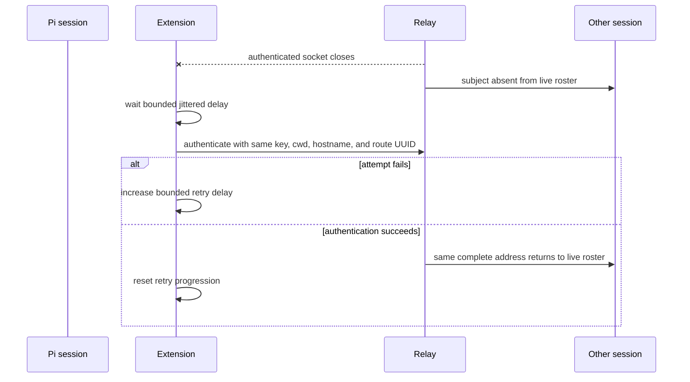

import { Aside, Tabs, TabItem } from '@astrojs/starlight/components';
import Decision from '../../../../components/Decision.astro';

The extension reconnects an interrupted authenticated session automatically. Reconnect restores only a live WebSocket and roster presence. It never transfers pending operation state, retains message bodies, creates an offline inbox, or replays a previous offer.

## Lifecycle and identity



One active lifecycle captures its route UUID, cwd, hostname, installation key, endpoint, and recipient idle predicate. Every automatic attempt uses that same identity snapshot, so successful reauthentication returns the exact original `<cwd>@<hostname>#<route_id>` address. The relay removes the old socket from live presence before any replacement is authenticated; failed and challenge-only attempts remain absent. Presence returns only after the relay accepts the signed hello.

A hidden Pi custom session entry stores only `{version: 1, route_id: <uuidv7>}` under `pi-messaging-relay-route-v1`. It is not model context. `startup`, `reload`, and `resume` restore a strictly shaped canonical UUIDv7 entry when present. Missing or malformed state generates and appends a fresh route. `new` and `fork` always ignore inherited route entries and append a fresh UUIDv7, preventing two live Pi sessions from sharing one route.

<Decision title="Keep route identity in Pi session state, separate from installation trust" status="accepted">
The installation Ed25519 key identifies the paired installation. One hidden custom entry identifies only the current Pi session route. Strict restoration keeps reloads stable, while explicit new and fork lifecycle reasons always create a fresh route without treating cwd, hostname, or entry content as authorization.
</Decision>

## Fixed retry policy

The first startup or post-pair connection attempt remains immediate. After an attempt fails, or after a retained authenticated socket closes, the reconnect scheduler waits before another attempt.

| Policy value | Fixed v1 value |
|---|---:|
| Nominal initial delay | 500 ms |
| Multiplier | 2 |
| Jitter | uniform factor from 0.75 inclusive to 1.25 exclusive |
| Final delay cap | 30,000 ms |
| Automatic retries per uninterrupted failure sequence | 10 |

For zero-based retry index `n`, nominal delay is `min(30000, 500 × 2ⁿ)`. One platform cryptographic 32-bit sample is converted to `[0, 1)`, then to the jitter factor. The scheduler rounds to the nearest millisecond and applies the 30-second cap again. For deterministic samples `0`, `0.5`, and `0.75`, the first three waits are exactly 375 ms, 1,000 ms, and 2,250 ms. Nominal delays reach the cap at index 6; positive jitter never exceeds 30 seconds. After ten unsuccessful automatic retries, the lifecycle stays safely disconnected until a new session lifecycle or a permitted pairing-owned connection path starts another sequence.

Successful authentication resets the retry index. A later interruption starts again from the initial delay. One lifecycle owns at most one scheduled deadline, one authentication attempt, and one retained socket. A timer cannot queue behind an active attempt, and a stale callback cannot install a socket for a replaced session.

<Decision title="Bound retry count, delay, and ownership" status="accepted">
Ponytail: v1 uses 500 ms initial delay, multiplier 2, ±25% jitter, a 30-second final cap, and ten automatic retries. Make these configurable only when a second measured deployment profile requires different values. The finite retry budget follows the repository rule against unbounded reconnect loops.
</Decision>

## Shutdown and operation boundary

`session_shutdown` invalidates the lifecycle first, cancels its pending reconnect deadline, closes any connecting socket, joins that attempt, and then closes and awaits the retained socket. No cancelled timer or stale disconnect callback can start another attempt after shutdown returns. Starting a replacement Pi session applies the same cancellation-and-join sequence before selecting its route identity.

An interrupted `list_peers` or `agent_send` still settles through the retained socket's existing disconnected path. Reconnect never resumes that operation and never reuses its request or message state. A caller starts a fresh tool operation only after authentication restores the connection. Across a normal server process restart, the same scheduler reconnects to the replacement listener and authenticates against the reloaded durable allowlist without another pairing command.

The accepted recipient delivery-stream seam now spans both lifecycle losses. It deliberately drops—not delays—a recipient ACK before terminating that exact socket, proves the sender receives `timeout/recipient_disconnected`, then authenticates the same recipient route and checks the live roster before bounded quiet turns. No settled or interrupted offer appears on the replacement socket; only a fresh send produces the next message frame and Pi injection. The same stream then drops another ACK before graceful server shutdown, starts a replacement child on the same address and allowlist state, reauthenticates both extensions, and again observes only welcome traffic until a fresh post-restart send. Exact message IDs, delivery IDs, bodies, socket generations, and injection order distinguish absence of replay from a mere timing delay.

<Aside type="note" title="Reconnect diagnostics are explicit">
The extension emits one `relay_reconnect_scheduled` event with one-based retry index and actual jittered delay, one `relay_reconnect_attempted` when that deadline fires, and either `relay_reconnect_succeeded` or the existing `relay_auth_rejected`. Ten failed retries end with one warning-level `relay_reconnect_exhausted`. Initial authentication remains `relay_auth_accepted`; reconnect success uses its reconnect event instead of duplicating the same extension-owned transition. See [Structured relay diagnostics](./structured-diagnostics/).
</Aside>

### I/O examples

<Tabs>
  <TabItem label="Disconnect">
    ```text
    t=0 ms: /srv/frontend@workstation-a#01993ca1-1111-7aaa-8aaa-111111111111 leaves list_peers
    ```
  </TabItem>
  <TabItem label="Deterministic retry input">
    ```json
    {"retry_index":0,"random_unit":0}
    ```
  </TabItem>
  <TabItem label="Scheduled output">
    ```json
    {"delay_ms":375,"route_id":"01993ca1-1111-7aaa-8aaa-111111111111"}
    ```
  </TabItem>
  <TabItem label="Authenticated restoration">
    ```json
    {"peers":[{"address":"/srv/frontend@workstation-a#01993ca1-1111-7aaa-8aaa-111111111111"}]}
    ```
  </TabItem>
</Tabs>
