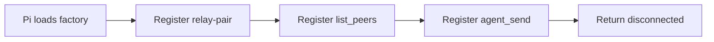

import { Aside, Tabs, TabItem } from '@astrojs/starlight/components';
import Decision from '../../../../components/Decision.astro';

The extension package in `extension/` establishes the Pi-facing surface without implementing a relay client. Loading its default factory registers one human command, `/relay-pair`, and exactly two model tools, `list_peers` and `agent_send`.

<Aside type="note" title="Disconnected slice only">
Pairing, keys, connection state, WebSockets, routing, delivery, reconnect, and persistence are not part of this shell. Loading or invoking it requires no relay server and no model call.
</Aside>

## Registration boundary



The synchronous factory performs registration only. It does not subscribe to lifecycle events, start timers, open sockets, call `fetch`, inspect a model, or inject session content.

<Decision title="Keep the initial factory inert" status="accepted">
The shell cannot start a resource that outlives a Pi invocation which only loads extensions. A later connection ticket must choose an explicit runtime lifecycle and shutdown owner rather than extending this load-time boundary implicitly.
</Decision>

The schemas preserve the accepted model intents:

| Surface | Input |
|---|---|
| `relay-pair` | Human command argument reserved for a future pairing code |
| `list_peers` | Closed empty object |
| `agent_send` | Closed object with required opaque `to`, required string-or-JSON-object `body`, and optional `re` |

The model cannot provide `message_id`, delivery policy, steering intent, or any other relay field. Addresses remain opaque strings. Schema validation rejects extra properties, an empty destination, array or null bodies, and missing required fields before a connected implementation can own those values.

<Decision title="Defer serialized body-size enforcement to ticket #24" status="accepted">
Ticket #8 shape-validates model-tool input and always returns the disconnected outcome before any connected wire work. This shell does not choose a serialized body representation, measure its byte length, or claim to enforce every connected trust-boundary limit. The exact compact/canonical wire representation and its UTF-8 262,144-byte ceiling are intentionally owned by ticket #24 and must land before any connected `agent_send` forwards a body. Leaving that enforcement out here avoids inventing serialization behavior and merging two independently testable seams.
</Decision>

## Disconnected outcomes

Tool handlers throw an `Error`. Throwing is Pi's tool-error mechanism and produces an error tool result; returning an object with an `isError` field would not. Both tools use the same stable actionable message:

```text
Relay is disconnected. /relay-pair is unavailable in this shell; install a relay-enabled release before retrying.
```

The command cannot pair yet. Its handler emits an error notification that states no pairing occurred and recommends a relay-enabled release. It never sends a user or custom message into the Pi session.

<Decision title="Fail closed instead of simulating relay success" status="accepted">
Every exposed operation reports the disconnected boundary. The shell does not return an empty peer roster, fabricate a message status, persist a key, or claim that pairing succeeded.
</Decision>

### I/O examples

<Tabs>
  <TabItem label="Pair command input">
    ```text
    /relay-pair <REDACTED>
    ```
  </TabItem>
  <TabItem label="Pair notification">
    ```text
    Pairing unavailable: no pairing occurred and the relay remains disconnected. Install a relay-enabled release before retrying.
    ```
  </TabItem>
</Tabs>

<Tabs>
  <TabItem label="Tool input">
    ```json
    {
      "to": "/srv/backend@workstation-b#01993ca2-2222-7bbb-9bbb-222222222222",
      "body": "Review the API contract"
    }
    ```
  </TabItem>
  <TabItem label="Pi tool error">
    ```text
    Relay is disconnected. /relay-pair is unavailable in this shell; install a relay-enabled release before retrying.
    ```
  </TabItem>
</Tabs>

## Fake Pi host seam

The focused Node test loads the real extension factory behind a strict fake Pi host. The fake records command and tool registrations, notifications, `sendMessage` attempts, and `sendUserMessage` attempts. Unknown Pi or context access fails the test, so model registry, session, and other live capabilities cannot be consulted silently.

Handlers execute directly through the recorded registrations. The acceptance assertions cover:

- exact registration order and names;
- closed input schemas, including invalid edge shapes;
- one command notification with no raw pairing code in telemetry;
- thrown errors from both disconnected model tools;
- no Pi message injection or live context access; and
- no timer, fetch, or WebSocket creation during factory execution.

## Runtime dependency and telemetry

<Decision title="Keep runtime dependencies beside the Nix-loaded extension" status="accepted">
The package declares TypeBox as an extension-local runtime dependency and pins it through `extension/package-lock.json`; `npm ci` installs it beside the extension. This avoids assuming that a Nix-installed Pi exposes its internal package tree to a user extension at runtime. Pi core remains a type-only import and is erased before runtime, so the extension does not resolve Pi internals at runtime.
</Decision>

Each attempted operation writes one structured warning with `event: "relay_operation_failed"`, its operation name, and stable reason `disconnected` or `not_implemented`. Pairing codes and message bodies are never included. The accepted v1 observability decision excludes traces and metrics for this small operator-run relay, so this shell adds neither spans nor counters.
