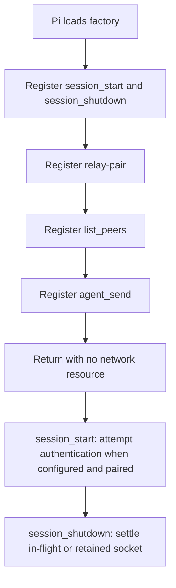

import { Aside, Tabs, TabItem } from '@astrojs/starlight/components';
import Decision from '../../../../components/Decision.astro';

The extension package in `extension/` establishes the Pi-facing surface. Loading its default factory registers one human command, `/relay-pair`, and exactly two model tools, `list_peers` and `agent_send`.

<Aside type="note" title="Authenticated transport, disconnected tools">
The command performs installation pairing and persists an extension-local Ed25519 private key. Session lifecycle handlers can authenticate and retain one WebSocket, and `list_peers` now publishes the bounded cursor schema, but roster reads, results, routing, delivery, and reconnect are not implemented. Loading the factory still requires no relay server and no model call, and both tools remain disconnected until their behavior tickets land.
</Aside>

## Registration and lifecycle boundary



The synchronous factory registers the command, both tools, and the two lifecycle handlers. Factory execution does not start timers, open sockets, call `fetch`, inspect a model, or inject session content. `session_start` makes one bounded authentication attempt when both endpoint and installation key exist. A successful `/relay-pair CODE` invocation performs bounded file and HTTP work and, when the session is already active, makes one pairing-owned authentication attempt. `session_shutdown` idempotently closes an in-flight or retained socket.

<Decision title="Keep factory loading inert and give session lifecycle socket ownership" status="accepted">
Loading only registers surfaces and lifecycle handlers, so it creates no resource that outlives a factory invocation. `session_start`, successful pairing during an active session, and `session_shutdown` explicitly own authentication attempts and transport settlement.
</Decision>

The schemas preserve the accepted model intents:

| Surface | Input |
|---|---|
| `relay-pair` | Human-supplied current startup pairing code |
| `list_peers` | Closed object with only optional opaque `cursor` |
| `agent_send` | Closed object with required opaque `to`, required string-or-JSON-object `body`, and optional `re` |

The `list_peers` cursor schema permits only `cur_` followed by one or more URL-safe Base64 characters and caps the string at 5,856 characters. It is an opaque `next_cursor` copied from a preceding page. The eventual result is `{ peers: [{ address: string }], next_cursor?: string }`; callers omit the cursor for a fresh first page and continue only while `next_cursor` is present. The server remains the final canonical decoder and authorization boundary.

The model cannot provide `message_id`, delivery policy, steering intent, or any other relay field. Addresses remain opaque strings. Schema validation rejects extra properties, an empty destination, array or null bodies, and missing required fields before a connected implementation can own those values.

<Decision title="Defer serialized body-size enforcement to ticket #24" status="accepted">
Ticket #8 shape-validates model-tool input and always returns the disconnected outcome before any connected wire work. This shell does not choose a serialized body representation, measure its byte length, or claim to enforce every connected trust-boundary limit. The exact compact/canonical wire representation and its UTF-8 262,144-byte ceiling are intentionally owned by ticket #24 and must land before any connected `agent_send` forwards a body. Leaving that enforcement out here avoids inventing serialization behavior and merging two independently testable seams.
</Decision>

## Disconnected outcomes

Tool handlers throw an `Error`. Throwing is Pi's tool-error mechanism and produces an error tool result; returning an object with an `isError` field would not. Both tools use the same stable actionable message:

```text
Relay is disconnected. Pair this installation with /relay-pair CODE, then wait for a relay-enabled connection release.
```

The command validates explicit loopback endpoint configuration, creates or loads the installation key, calls the real HTTP endpoint, and reports the accepted client identity. It never sends a user or custom message into the Pi session. Pairing during an active session may authenticate a live transport, but does not make either model tool available.

<Decision title="Keep model tools disconnected after authentication" status="accepted">
Authentication establishes a live session identity and retains its socket. The shell does not return an empty peer roster or fabricate a message status while roster behavior and delivery remain deferred.
</Decision>

### I/O examples

<Tabs>
  <TabItem label="Pair command input">
    ```text
    /relay-pair <REDACTED>
    ```
  </TabItem>
  <TabItem label="Pair notification">
    ```text
    Relay pairing accepted client identity cli_tkPj7VgbR2HdLQyH.
    ```
  </TabItem>
</Tabs>

<Tabs>
  <TabItem label="First-page list input">
    ```json
    {}
    ```
  </TabItem>
  <TabItem label="Next-page list input">
    ```json
    {"cursor":"cur_L3Nydi9iYWNrZW5kQHdvcmtzdGF0aW9uLWIjMDE5OTNjYTItMjIyMi03YmJiLTliYmItMjIyMjIyMjIyMjIy"}
    ```
  </TabItem>
  <TabItem label="Eventual page result (ticket #13)">
    ```json
    {"peers":[{"address":"/srv/backend@workstation-b#01993ca2-2222-7bbb-9bbb-222222222222"}],"next_cursor":"cur_L3Nydi9iYWNrZW5kQHdvcmtzdGF0aW9uLWIjMDE5OTNjYTItMjIyMi03YmJiLTliYmItMjIyMjIyMjIyMjIy"}
    ```
  </TabItem>
  <TabItem label="Current Pi tool error">
    ```text
    Relay is disconnected. Pair this installation with /relay-pair CODE, then wait for a relay-enabled connection release.
    ```
  </TabItem>
</Tabs>

<Tabs>
  <TabItem label="Send tool input">
    ```json
    {
      "to": "/srv/backend@workstation-b#01993ca2-2222-7bbb-9bbb-222222222222",
      "body": "Review the API contract"
    }
    ```
  </TabItem>
  <TabItem label="Pi tool error">
    ```text
    Relay is disconnected. Pair this installation with /relay-pair CODE, then wait for a relay-enabled connection release.
    ```
  </TabItem>
</Tabs>

## Fake Pi host seam

The focused Node test loads the real extension factory behind a strict fake Pi host. The fake records command and tool registrations, notifications, `sendMessage` attempts, and `sendUserMessage` attempts. Unknown Pi or context access fails the test, so model registry, session, and other live capabilities cannot be consulted silently.

Handlers execute directly through the recorded registrations. The acceptance assertions cover:

- exact registration order and names;
- closed input schemas, including invalid edge shapes;
- one command-to-real-HTTP success notification with no raw pairing code or private key in telemetry;
- thrown errors from both disconnected model tools;
- no Pi message injection or live context access;
- no timer, fetch, or WebSocket creation during factory execution or a keyless lifecycle startup; and
- one retained authenticated socket from either lifecycle ordering, followed by idempotent shutdown settlement.

The primary pairing acceptance additionally starts the real Go child, invokes the registered command, and inspects only observable permission, public metadata, persistence, notification, injection, and process-log boundaries.

## Runtime dependency and telemetry

<Decision title="Keep runtime dependencies beside the Nix-loaded extension" status="accepted">
The package declares TypeBox 1.3.7 and `ws` 8.21.3 as pinned extension-local runtime dependencies through `extension/package-lock.json`; `npm ci` installs both beside the extension. TypeBox owns tool schemas. The `ws` client enforces the 512 KiB socket-wide pre-materialization ceiling; the authentication handler separately enforces 16 KiB challenge and welcome semantics and supports bounded hard transport termination. This avoids assuming that a Nix-installed Pi exposes its internal package tree to a user extension at runtime. Pi core remains a type-only import and is erased before runtime, so the extension does not resolve Pi internals at runtime.
</Decision>

Disconnected model-tool attempts write one structured warning with `event: "relay_operation_failed"`. Pairing writes one settled `relay_pair_accepted` or `relay_pair_rejected` event with latency and stable result or reason. Session lifecycle emits `relay_auth_accepted`, `relay_auth_rejected`, and `relay_session_disconnected`; accepted and disconnected events carry available public client, route, and address correlation fields. Pairing-code, nonce, signature, and private-key field names contain `<redacted>`; message bodies remain absent. The accepted v1 observability decision excludes traces and metrics for this small operator-run relay, so this shell adds neither spans nor counters.
