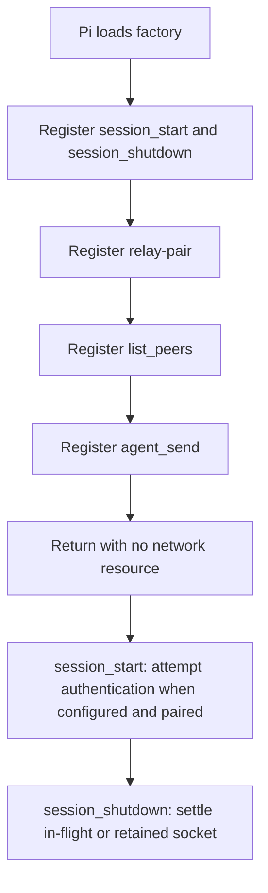

import { Aside, Tabs, TabItem } from '@astrojs/starlight/components';
import Decision from '../../../../components/Decision.astro';

The extension package in `extension/` establishes the Pi-facing surface. Loading its default factory registers one human command, `/relay-pair`, and exactly two model tools, `list_peers` and `agent_send`.

<Aside type="note" title="Authenticated roster and message delivery">
The command performs installation pairing and persists an extension-local Ed25519 private key. Session lifecycle handlers authenticate and retain one WebSocket shared by bounded `list_peers`, `agent_send`, and recipient delivery. Deterministic provenance formatting plus successful string/object idle injection and busy follow-up injection are connected; replies, failure results, and reconnect remain deferred. Loading the factory still requires no relay server and no model call.
</Aside>

## Registration and lifecycle boundary



The synchronous factory registers the command, both tools, and the two lifecycle handlers. Factory execution does not start timers, open sockets, call `fetch`, inspect a model, or inject session content. `session_start` makes one bounded authentication attempt when both endpoint and installation key exist. A successful `/relay-pair CODE` invocation performs bounded file and HTTP work and, when the session is already active, makes one pairing-owned authentication attempt. `session_shutdown` idempotently closes an in-flight or retained socket and rejects an in-flight list or send operation.

<Decision title="Keep factory loading inert and give session lifecycle socket ownership" status="accepted">
Loading only registers surfaces and lifecycle handlers, so it creates no resource that outlives a factory invocation. `session_start`, successful pairing during an active session, and `session_shutdown` explicitly own authentication attempts and transport settlement.
</Decision>

The schemas preserve the accepted model intents:

| Surface | Input |
|---|---|
| `relay-pair` | Human-supplied current startup pairing code |
| `list_peers` | Closed object with only optional opaque `cursor` |
| `agent_send` | Closed object with required opaque `to`, required string-or-JSON-object `body`, and optional `re` |

The `list_peers` cursor schema permits only `cur_` followed by one or more URL-safe Base64 characters and caps the string at 5,856 characters. It is an opaque `next_cursor` copied from a preceding page. The connected result is `{ peers: [{ address: string }], next_cursor?: string }`; callers omit the cursor for a fresh first page and continue only while `next_cursor` is present. Pi receives deterministic compact JSON text plus matching structured details. The server remains the final canonical decoder and authorization boundary.

The retained connection permits one in-flight outgoing list or send request. Concurrent calls fail locally without a send or queue, while one validated server-pushed message can be accepted during an outgoing operation. Complete roster frames are limited to 49,152 bytes and strictly validated for UTF-8, duplicate keys, exact envelope and payload fields, exact request correlation, opaque address bounds, and canonical cursor encoding. Abort, five-second timeout, malformed or unsolicited response, wrong correlation, and socket close all clean listeners and timers; every condition that could leave a late response force-settles the socket.

The model cannot provide `message_id`, delivery policy, steering intent, or any other relay field. Addresses remain opaque strings. Schema validation rejects extra properties, an empty destination, array or null bodies, invalid `re`, and missing required fields before a connected implementation can own those values. Safe JSON objects now cross the retained transport. The retained client rejects proxies and unsafe descriptors without invoking traps or getters, snapshots the validated graph with `structuredClone`, then canonically encodes the snapshot once within an explicit complete-frame byte budget before creating IDs or operation state. The recipient injects the deterministic one-line provenance rendering documented in [authenticated message delivery](/developer/relay/message-delivery/).

<Decision title="Reject oversized bodies before owning a send" status="accepted">
The connected transport canonically serializes the body within a fixed 262,144 UTF-8-byte budget before generating request or message IDs, installing abort/deadline/retry ownership, or allocating and writing a send frame. The count is the complete serialized JSON value: string quotes and escapes count, multibyte characters count by UTF-8 bytes, and objects use the extension's canonical compact serialization. Exactly 262,144 bytes proceeds; one byte more throws content-free `RosterRequestError` reason `body_too_large` with message `Relay agent_send body exceeds 256 KiB.` through Pi's existing tool-error path. The retained socket stays reusable. A separate final 512 KiB complete-frame guard remains defense in depth.
</Decision>

## Disconnected outcomes

When no authenticated socket is retained, tool handlers throw an `Error`. Throwing is Pi's tool-error mechanism and produces an error tool result; returning an object with an `isError` field would not. Both tools use the same stable actionable message in that disconnected state:

```text
Relay is disconnected. Pair this installation with /relay-pair CODE, then wait for a relay-enabled connection release.
```

The command validates explicit loopback endpoint configuration, creates or loads the installation key, calls the real HTTP endpoint, and reports the accepted client identity. It never sends a user or custom message into the Pi session. Pairing during an active session may authenticate a live transport and enable `list_peers`, successful online string/object `agent_send`, and recipient-local idle or busy delivery.

<Decision title="Share one retained socket without queuing operations" status="accepted">
Authentication establishes a live session identity. One retained-socket owner correlates either `list_peers` or `agent_send`, accepts validated recipient pushes, and serializes writes. It never queues a second outgoing operation.
</Decision>

### I/O examples

<Tabs>
  <TabItem label="Pair command input">
    ```text
    /relay-pair <REDACTED>
    ```
  </TabItem>
  <TabItem label="Pair notification">
    ```text
    Relay pairing accepted client identity cli_tkPj7VgbR2HdLQyH.
    ```
  </TabItem>
</Tabs>

<Tabs>
  <TabItem label="First-page list input">
    ```json
    {}
    ```
  </TabItem>
  <TabItem label="Next-page list input">
    ```json
    {"cursor":"cur_L3Nydi9iYWNrZW5kQHdvcmtzdGF0aW9uLWIjMDE5OTNjYTItMjIyMi03YmJiLTliYmItMjIyMjIyMjIyMjIy"}
    ```
  </TabItem>
  <TabItem label="Connected page result">
    ```json
    {"peers":[{"address":"/srv/backend@workstation-b#01993ca2-2222-7bbb-9bbb-222222222222"}],"next_cursor":"cur_L3Nydi9iYWNrZW5kQHdvcmtzdGF0aW9uLWIjMDE5OTNjYTItMjIyMi03YmJiLTliYmItMjIyMjIyMjIyMjIy"}
    ```
  </TabItem>
  <TabItem label="Disconnected Pi tool error">
    ```text
    Relay is disconnected. Pair this installation with /relay-pair CODE, then wait for a relay-enabled connection release.
    ```
  </TabItem>
</Tabs>

<Tabs>
  <TabItem label="Send tool input">
    ```json
    {
      "to": "/srv/backend@workstation-b#01993ca2-2222-7bbb-9bbb-222222222222",
      "body": "Review the API contract"
    }
    ```
  </TabItem>
  <TabItem label="Connected received result">
    ```json
    {"message_id":"01993c84-fc2b-7e1c-af99-61b8118ac6df","status":"received"}
    ```
  </TabItem>
  <TabItem label="Oversized local tool error">
    ```text
    input body: canonical serialized JSON value of 262,145 UTF-8 bytes
    thrown error: Relay agent_send body exceeds 256 KiB.
    telemetry reason: body_too_large; body content omitted
    ```
  </TabItem>
</Tabs>

## Fake Pi host seam

The focused Node test loads the real extension factory behind a strict fake Pi host. The fake records command and tool registrations, notifications, `sendMessage` attempts, and `sendUserMessage` attempts. It exposes only a controlled idle/busy predicate for delivery tests; unknown Pi or context access fails the test, so model registry, session, and other live capabilities cannot be consulted silently.

Handlers execute directly through the recorded registrations. The acceptance assertions cover:

- exact registration order and names;
- closed input schemas, including invalid edge shapes;
- one command-to-real-HTTP success notification with no raw pairing code or private key in telemetry;
- disconnected errors from both model tools;
- no Pi message injection or live context access while disconnected;
- no timer, fetch, or WebSocket creation during factory execution or a keyless lifecycle startup; and
- one retained authenticated socket from either lifecycle ordering, followed by idempotent shutdown settlement; and
- real-server address-only roster membership, strict continuation, disconnect removal, hostile-response closure, shared local single-flight rejection, and abort/timeout/close cleanup; and
- real-server string/object delivery through two extension instances, exact deterministic provenance and canonical object text, no-option idle injection and busy `{ deliverAs: "followUp" }` injection, stale-session and idle-predicate failure safety, thrown-Pi-call best-effort ACK, sender schema rejection of IDs/modes, no steering, unique IDs, exact ACK correlation, redacted logs, and deterministic `received` output.

The primary pairing acceptance additionally starts the real Go child, invokes the registered command, and inspects only observable permission, public metadata, persistence, notification, injection, and process-log boundaries.

## Runtime dependency and telemetry

<Decision title="Keep runtime dependencies beside the Nix-loaded extension" status="accepted">
The package declares TypeBox 1.3.7 and `ws` 8.21.3 as pinned extension-local runtime dependencies through `extension/package-lock.json`; `npm ci` installs both beside the extension. TypeBox owns tool schemas. The `ws` client enforces the 512 KiB socket-wide pre-materialization ceiling; the authentication handler separately enforces 16 KiB challenge and welcome semantics and supports bounded hard transport termination. This avoids assuming that a Nix-installed Pi exposes its internal package tree to a user extension at runtime. Pi core remains a type-only import and is erased before runtime, so the extension does not resolve Pi internals at runtime.
</Decision>

Successful sends are logged once by the server owner with correlation IDs, route addresses, latency, and `body: "<redacted>"`; the extension emits no duplicate success log. Failed model-tool attempts—including local `body_too_large`—write one structured warning with `event: "relay_operation_failed"` and a stable bounded reason, never a body, cursor, or roster. Pairing writes one settled `relay_pair_accepted` or `relay_pair_rejected` event with latency and stable result or reason. Session lifecycle emits `relay_auth_accepted`, `relay_auth_rejected`, and `relay_session_disconnected`; accepted and disconnected events carry available public client, route, and address correlation fields. Pairing-code, nonce, signature, and private-key field names contain `<redacted>`; message bodies remain absent. The accepted v1 observability decision excludes traces and metrics for this small operator-run relay, so this shell adds neither spans nor counters.
