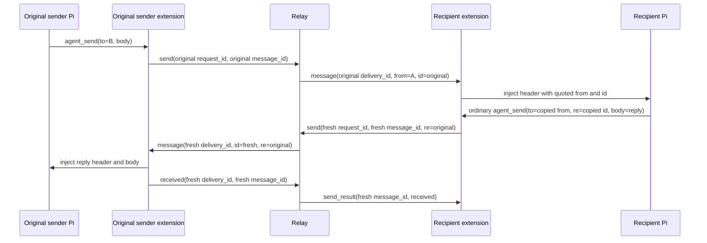

import { Aside, Tabs, TabItem } from '@astrojs/starlight/components';
import Decision from '../../../../components/Decision.astro';

This seam connects `agent_send` to one exact currently published authenticated destination. It implements successful string and JSON-object delivery for both idle and busy recipients. Addresses remain whole opaque registry keys; cwd, hostname, route formatting, model input, and message identifiers never grant routing authority.

## Successful flow

```mermaid
sequenceDiagram
    participant S as Sender Pi
    participant SE as Sender extension
    participant R as Relay
    participant RE as Recipient extension
    participant P as Recipient Pi
    S->>SE: agent_send(to, body, re?)
    SE->>SE: generate request_id and message_id
    SE->>R: send
    R->>R: find exact published address; generate delivery_id
    R->>RE: message
    RE->>RE: read current ctx.isIdle()
    alt recipient is idle
        RE->>P: sendUserMessage(rendered message)
    else recipient is busy
        RE->>P: sendUserMessage(rendered message, followUp)
    end
    RE->>R: received with fresh request_id
    R->>SE: correlated send_result(received)
    SE->>S: compact JSON result
```

The model supplies only `to`, `body`, and optional `re`; it cannot supply a request, message, or delivery ID. The extension generates fresh canonical lowercase UUIDv7 request and message IDs. The relay generates a fresh UUIDv7 delivery ID and retains only the minimum in-memory pending correlation: exact sender session, exact recipient session, sender request and message IDs, and delivery ID.

The recipient validates the closed `message` envelope, duplicate keys, nesting, types, UUIDs, opaque string bounds, string-or-non-array-object body, and exact equality between `to` and its authenticated address. Its parser retains delivery correlation for ACK ownership and passes `from`, `message_id`, optional valid `re`, and `body` to the pure renderer. Rendering must succeed before Pi injection or ACK. Immediately before Pi injection, the retained connection reads the active session context's current `ctx.isIdle()` value. Only a true idle observation bracketed by matching active-session identity checks preserves the exact one-argument `pi.sendUserMessage(rendered)` call. Busy delivery uses exactly `pi.sendUserMessage(rendered, { deliverAs: "followUp" })`, which queues the message until all active work finishes rather than steering the current run. A missing or replaced identity, an idle-predicate exception, or an identity change during idle observation fails safe as a follow-up. Session restart and shutdown clear the retained predicate before connection cleanup.

Delivery mode is recipient-local. Sender input remains the closed `to`, `body`, and optional UUIDv7 `re` shape; no wire field, body value, or sender-controlled option can select `followUp` or `steer`. The extension never calls `sendMessage`, never passes `deliverAs: "steer"`, and leaves prompt-template expansion disabled. After the exact Pi call is attempted—even if Pi throws—the extension sends a closed `received` operation with a fresh request ID and the matching delivery and message IDs.

<Decision title="Define received as an attempted Pi boundary call" status="accepted">
`received` means only that the intended recipient extension validated the offer and attempted `pi.sendUserMessage`. It does not claim that Pi queued or persisted anything, that a model read the message, that work completed, or that a reply will arrive.
</Decision>

Only an ACK from the exact recipient session with both exact IDs removes and settles pending work. Unknown, late, wrong-session, wrong-delivery, and wrong-message ACKs produce no response, do not settle a sender, and leave a healthy connection usable.

## Correlated reply flow and state



The recipient agent uses the same `agent_send` tool as any other sender. It copies the complete decoded opaque value displayed after `from` into `to`, and copies the displayed `id` into `re`. The model supplies no reply message ID, request ID, delivery ID, operation mode, or role. The extension validates `re` as a canonical lowercase UUIDv7 before creating IDs or consuming the socket, then generates a new request ID and message ID. The relay authorizes only against the authenticated sending session and exact currently published destination; it does not search retained history or verify that `re` names an earlier message.

| State owner | Original send | Reply send |
| --- | --- | --- |
| Extension request correlation | Original generated request ID | Fresh generated request ID |
| Logical message | Original generated message ID | Fresh generated message ID, with `re=original message ID` |
| Relay offer | Original generated delivery ID | Fresh generated delivery ID |
| Recipient ACK | Settles only original pending offer | Settles only reply pending offer |
| Model-visible result | Original call's result | Independent reply call's result |

<Decision title="Treat re as correlation metadata, never authorization or history proof" status="accepted">
`re` changes only the rendered correlation header and immutable send envelope. It grants no authority, triggers no automatic reply, and proves neither that an original message exists nor that any model completed work. A successful reply `received` result does not guarantee completion or a further reply.
</Decision>

Ticket #17 verifies only the successful independent `received` path. Final machine-readable reply outcomes for an offline destination, ACK expiry, or recipient disconnect remain deferred to tickets #18–#20.

## Deterministic provenance rendering

The exact injected form without correlation is:

```text
[pi-messaging-relay] message from "<opaque-address>" (id=<message-id>):
<body>
```

When a valid `re` value is supplied, `, re=<original-id>` appears after the fresh message ID. Ticket #17 verifies creation and independent settlement of that ordinary correlated reply.

<Decision title="Quote the complete opaque sender as one JSON string" status="accepted">
The renderer applies the platform's deterministic `JSON.stringify` string quoting to the complete sender address, then additionally escapes raw U+0085, U+2028, and U+2029 as `\\u0085`, `\\u2028`, and `\\u2029` before inserting the result after `from `. Ordinary addresses therefore appear inside double quotes. Embedded quote, backslash, control characters—including newline—and Unicode line separators cannot create another provenance line. No address component is parsed or rewritten.
</Decision>

Exactly one LF separates header and body. A string body follows that LF unchanged, including leading/trailing whitespace and embedded or final newlines. An object body is encoded by a dedicated deep encoder: every object's own enumerable string keys are sorted directly by ECMAScript lexical comparison of UTF-16 code units; keys and values are emitted directly in that order so integer-like names are not reordered by JavaScript property enumeration. Arrays preserve index order. Null, booleans, finite numbers, and strings use deterministic `JSON.stringify` primitive spelling. Output is compact with no added whitespace. This project-specific algorithm is not described as RFC 8785 or JCS.

<Decision title="Reject unsafe local object graphs before transport" status="accepted">
The local sender accepts only plain or null-prototype objects containing dense arrays and JSON primitives. It rejects proxies before invoking reflective operations, validates property descriptors without executing getters, and uses `structuredClone` as a non-cloneable gate and synchronous snapshot before encoding that snapshot once. Cycles, nonfinite numbers, `undefined`, bigint, symbols, functions, accessors, sparse or extended arrays, custom prototypes, symbol or non-enumerable properties, invalid Unicode, and excessive nesting fail with a content-free local error before request/message IDs or socket writes. Inbound wire JSON has already passed strict syntax, duplicate-key, and depth validation; any remaining renderer failure closes the retained socket without Pi injection or ACK.
</Decision>

## Bounds and socket ownership

One retained extension socket owns both `list_peers` and `agent_send` operations. At most one outgoing operation may be in flight; a second fails locally and is not queued. Server pushes remain acceptable while an operation is pending. One inbound offer is processed at a time, and all client and server WebSocket writes are serialized per connection.

Complete frames are bounded to 512 KiB, JSON nesting to 64 containers, addresses to 4,389 UTF-8 bytes, and the pending ACK wait to five seconds. Canonical encoding requires an explicit UTF-8 byte budget derived from the complete send-frame overhead, accounts tokens incrementally without building output beyond that budget, and rejects impossible array lengths before any length-sized work. The recipient uses the same general transport ceiling for canonical rendering; ticket #24 still owns a distinct 256 KiB body rule. Abort, timeout, malformed or wrongly correlated response, unsolicited response, and close settle extension listeners and timers; ambiguity force-settles the socket. The server has at most one actively dispatched send per connection under this seam and no more than 1,024 tracked connections, so pending memory and waiters remain bounded. Pending bodies are memory-only and are never persisted, replayed, or logged.

<Aside type="caution" title="Interim incomplete failures">
Ticket #18 owns the offline sender result, #19 owns the ACK-expiry result, #20 owns recipient-disconnected settlement, and #21 owns immediate sender-disconnect cleanup assertions. Until those tickets land, these paths may end without `send_result`; the extension's exact five-second response deadline then closes its socket. The relay still removes pending work at its exact five-second ACK ceiling, on recipient removal, or on shutdown, but ACK expiry itself returns no sender result. Retry and idempotence (#22), dedupe (#23), the distinct 256 KiB body rule (#24), 128-send pipelining (#25), reconnect (#26), restart authentication (#27), replay behavior (#28), and additional diagnostics (#29) are also deferred.
</Aside>

Busy follow-up routing is implemented by #15. Ticket #16 adds provenance and object rendering; #17 proves the existing ordinary send path carries a correlated reply with fresh IDs and independent settlement. A safe local object is encoded canonically before the send frame is created; the server forwards the accepted object body as the same JSON value without interpreting or rebuilding it; and the recipient canonicalizes it for Pi text injection. No string body, object content, or rendered provenance header enters an error or log.

## Telemetry

One successful send produces one server-owned `send_settled` JSON event after the correlated sender response is written. It includes request, message, delivery, sender and recipient routes, status, result/reason, and latency. The `body` field is always `<redacted>`; raw body text and stringified bodies never enter logs. The extension does not duplicate the successful settlement log. The accepted v1 decision adds no traces or metrics for this small operator-run relay.

### I/O examples

<Tabs>
  <TabItem label="Tool input">
    ```json
    {"to":"/srv/backend@workstation-b#01993ca2-2222-7bbb-9bbb-222222222222","body":"Review the API contract"}
    ```
  </TabItem>
  <TabItem label="Idle recipient Pi call">
    ```text
    pi.sendUserMessage("[pi-messaging-relay] message from \"/srv/frontend@workstation-a#01993ca1-1111-7aaa-8aaa-111111111111\" (id=01993c84-fc2b-7e1c-af99-61b8118ac6df):\nReview the API contract")
    ```
  </TabItem>
  <TabItem label="Busy recipient Pi call">
    ```text
    pi.sendUserMessage("[pi-messaging-relay] message from \"/srv/frontend@workstation-a#01993ca1-1111-7aaa-8aaa-111111111111\" (id=01993c84-fc2b-7e1c-af99-61b8118ac6df):\nReview the API contract", { deliverAs: "followUp" })
    ```
  </TabItem>
  <TabItem label="Object recipient body">
    ```text
    [pi-messaging-relay] message from "/srv/frontend@workstation-a#01993ca1-1111-7aaa-8aaa-111111111111" (id=01993c84-fc2b-7e1c-af99-61b8118ac6df, re=01993c80-40de-79d7-9b2c-1349f88bb408):
    {"10":"ten","2":"two","nested":{"a":[true,null],"z":1}}
    ```
  </TabItem>
  <TabItem label="Tool result">
    ```json
    {"message_id":"01993c84-fc2b-7e1c-af99-61b8118ac6df","status":"received"}
    ```
  </TabItem>
  <TabItem label="Reply tool input">
    ```json
    {"to":"/srv/frontend@workstation-a#01993ca1-1111-7aaa-8aaa-111111111111","body":{"answer":"Reviewed","ready":true},"re":"01993c84-fc2b-7e1c-af99-61b8118ac6df"}
    ```
  </TabItem>
  <TabItem label="Reply recipient body">
    ```text
    [pi-messaging-relay] message from "/srv/backend@workstation-b#01993ca2-2222-7bbb-9bbb-222222222222" (id=01993c88-2bc4-7432-87e8-16ca3c324a3f, re=01993c84-fc2b-7e1c-af99-61b8118ac6df):
    {"answer":"Reviewed","ready":true}
    ```
  </TabItem>
  <TabItem label="Independent reply result">
    ```json
    {"message_id":"01993c88-2bc4-7432-87e8-16ca3c324a3f","status":"received"}
    ```
  </TabItem>
  <TabItem label="Settlement log">
    ```json
    {"level":"info","event":"send_settled","result":"settled","reason":"received","code":"received","type":"send","request_id":"01993c7a-7d2c-7699-b159-851da079f09f","message_id":"01993c84-fc2b-7e1c-af99-61b8118ac6df","delivery_id":"01993c85-d827-7cd9-966c-07aa3ee42e47","sender_route":"/srv/frontend@workstation-a#01993ca1-1111-7aaa-8aaa-111111111111","recipient_route":"/srv/backend@workstation-b#01993ca2-2222-7bbb-9bbb-222222222222","status":"received","body":"<redacted>","latency_ms":12}
    ```
  </TabItem>
</Tabs>
