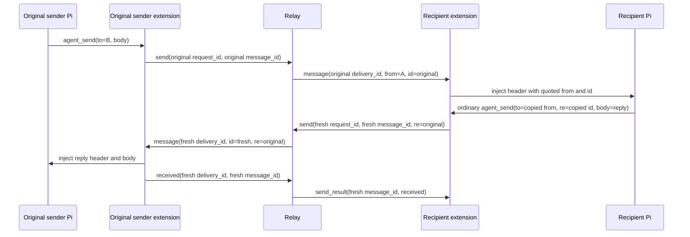

import { Aside, Tabs, TabItem } from '@astrojs/starlight/components';
import Decision from '../../../../components/Decision.astro';

This seam connects `agent_send` to one exact currently published authenticated destination and makes one current-socket transport retry idempotent. It rejects an oversized serialized body as `body_too_large`, settles an exact current-registry miss as `offline`, loss of the selected authenticated recipient session as `recipient_disconnected`, a written offer whose exact ACK misses its five-second deadline as `ack_timeout`, or conflicting message-ID reuse as `message_id_conflict`. If the authenticated sender session disappears while an offer is pending, the relay abandons that sender-owned work immediately without manufacturing a result for the unreachable sender. It implements successful string and JSON-object delivery for both idle and busy recipients. Addresses remain whole opaque registry keys; cwd, hostname, route formatting, model input, and message identifiers never grant routing authority.

## Successful flow

```mermaid
sequenceDiagram
    participant S as Sender Pi
    participant SE as Sender extension
    participant R as Relay
    participant RE as Recipient extension
    participant P as Recipient Pi
    S->>SE: agent_send(to, body, re?)
    SE->>SE: generate request_id and message_id
    SE->>R: send
    R->>R: find exact published address; generate delivery_id
    R->>RE: message
    RE->>RE: read current ctx.isIdle()
    alt recipient is idle
        RE->>P: sendUserMessage(rendered message)
    else recipient is busy
        RE->>P: sendUserMessage(rendered message, followUp)
    end
    RE->>R: received with fresh request_id
    R->>SE: correlated send_result(received)
    SE->>S: compact JSON result
```

The model supplies only `to`, `body`, and optional `re`; it cannot supply a request, message, or delivery ID. The extension generates fresh canonical lowercase UUIDv7 request and message IDs. The relay generates a fresh UUIDv7 delivery ID and retains only the minimum in-memory pending correlation: exact sender session, exact recipient session, message ID, delivery ID, and private exact outcome channels. The active operation remains the sole request-ID owner for wire response and telemetry correlation.

The recipient validates the closed `message` envelope, duplicate keys, nesting, types, UUIDs, opaque string bounds, string-or-non-array-object body, and exact equality between `to` and its authenticated address. Its parser retains delivery correlation for ACK ownership and passes `from`, `message_id`, optional valid `re`, and `body` to the pure renderer. Rendering must succeed before Pi injection or ACK. Immediately before Pi injection, the retained connection reads the active session context's current `ctx.isIdle()` value. Only a true idle observation bracketed by matching active-session identity checks preserves the exact one-argument `pi.sendUserMessage(rendered)` call. Busy delivery uses exactly `pi.sendUserMessage(rendered, { deliverAs: "followUp" })`, which queues the message until all active work finishes rather than steering the current run. A missing or replaced identity, an idle-predicate exception, or an identity change during idle observation fails safe as a follow-up. Session restart and shutdown clear the retained predicate before connection cleanup.

Delivery mode is recipient-local. Sender input remains the closed `to`, `body`, and optional UUIDv7 `re` shape; no wire field, body value, or sender-controlled option can select `followUp` or `steer`. The extension never calls `sendMessage`, never passes `deliverAs: "steer"`, and leaves prompt-template expansion disabled. After the exact Pi call is attempted—even if Pi throws—the extension sends a closed `received` operation with a fresh request ID and the matching delivery and message IDs.

<Decision title="Define received as an attempted Pi boundary call" status="accepted">
`received` means only that the intended recipient extension validated the offer and attempted `pi.sendUserMessage`. It does not claim that Pi queued or persisted anything, that a model read the message, that work completed, or that a reply will arrive.
</Decision>

Only an ACK from the exact recipient session with both exact IDs removes and settles pending work. Unknown, late, wrong-session, wrong-delivery, and wrong-message ACKs produce no response, do not settle a sender, and leave a healthy connection usable.

## Serialized body boundary

The fixed body ceiling is exactly 262,144 UTF-8 bytes for the serialized JSON `body` value, separate from the 524,288-byte complete WebSocket frame ceiling. The extension counts its canonical compact serialization. JSON string quotes and escapes count: `"abc"` is five bytes, and a newline inside a string is two serialized escape bytes. Multibyte characters count by their UTF-8 encoding. Object punctuation, canonical key order, keys, values, and nesting all count. The server independently counts the strictly validated raw body value after trimming only JSON whitespace around that value; internal object whitespace remains part of a raw client's count.

The extension validates and serializes within that budget before generating request or message IDs, installing retry/deadline/abort ownership, or allocating and writing the frame. Exactly 262,144 bytes follows ordinary delivery. At 262,145 bytes, `agent_send` throws a content-free `RosterRequestError` with reason `body_too_large` and message `Relay agent_send body exceeds 256 KiB.` This follows the existing local-validation convention: it is a thrown Pi tool error, not a model-visible denied result, because no wire operation or message ID exists. The socket remains reusable. The final complete-frame guard stays independent defense in depth.

A raw authenticated client can submit an over-limit body inside an otherwise valid frame. Strict decode preserves its validated request and message correlation while retaining no body copy. Before dedupe observation or fingerprinting, dedupe insertion, recipient lookup, delivery-ID generation, pending state, timer, or write, the relay returns exact `{message_id,status:"denied",reason:"body_too_large"}` through ordinary bounded admission and response ownership. The sender and recipient stay healthy. Because lookup never occurs, the denial event omits `recipient_route`.

Body denial has precedence over dedupe identity. An oversized unknown ID creates no record and cannot attach, conflict, or evict; a later legal body with that ID is new. An oversized changed body under an existing retained ID is still `body_too_large` and leaves the original record unchanged, so a later legal duplicate retains its original replay/conflict behavior.

<Decision title="Reject body bytes before identity and route work" status="accepted">
The same fixed serialized-value definition protects both trusted extension output and hostile raw clients without conflating body and frame limits. Early local rejection avoids operation resources; early server denial avoids dedupe pollution and destination side effects while preserving exact safe correlation.
</Decision>

## One logical send, two possible request frames

The extension encodes the immutable payload once. Its original and optional retry frames have different generated request IDs but the same generated message ID, exact destination, exact `re` presence/value, and byte-identical body payload. One eight-second response deadline and one abort listener own the logical operation. A separate trigger starts at logical-operation start and fires at exactly four seconds. It sends one retry only when the first write has already completed successfully, no response settled, the same socket remains current/open, and no write is unresolved. An unresolved or failed first write is never retried; existing terminal failure or logical-deadline behavior owns it. The trigger never restarts, queues behind an ambiguous write, reconnects, or extends the logical deadline.

The client accepts a result only when both its request ID and shared message ID match. Either original or retry response settles the promise exactly once. If both responses arrive, one bounded paired-request drain verifies and discards the same late result, including while a later operation is active. Any mismatched payload remains terminal ambiguity.

The server ledger uses exact authenticated sender-session identity plus message ID as its primary key. It hashes a semantic fingerprint of `to`, `re` absence/value, and body without logging either body or fingerprint. String values compare after JSON decoding. Object order, insignificant whitespace, and equivalent escapes compare equal; arrays preserve order; and numeric spellings compare by exact decimal value. A pending identical repeat attaches one request ID to the existing record. It never creates another delivery ID, recipient offer, Pi call, or ACK timer. A pending conflict returns a denial immediately without changing original work. Exactly one pending repeat—identical or conflicting—is accepted; a third fails closed.

A settled identical repeat receives the retained result with its own request correlation. A settled conflict receives exact `{message_id,status:"denied",reason:"message_id_conflict"}` and leaves both sockets healthy. Sender-session identity is authoritative: equal client-supplied message IDs from another authenticated session are independent.

<Decision title="Keep repeat handling before ordinary send admission" status="accepted">
The sole reader classifies an already-owned message identity before the one-active-dispatch gate. One bounded four-slot response sequencer serializes correlated writes and audit events, while only a new message identity can claim ordinary dispatch. Four is the exact conforming maximum: a prior logical operation's original/retry pair can remain owned after its first response becomes peer-visible while the next operation reserves its own pair. This keeps close observation live without per-frame goroutines, an unbounded mailbox, or a second distinct pending send.
</Decision>

## Offline registry miss

The dispatcher performs one exact `publishedSession(to)` lookup before generating a delivery ID or constructing retained work. A miss immediately returns the request-correlated `send_result` payload `{message_id,status:"timeout",reason:"offline"}`. It performs no recipient write, emits no offer, and creates no delivery UUID, pending-map entry, channel, ACK timer, or retained body. This normal result clears the extension's one outgoing operation and leaves its authenticated socket reusable for `list_peers` or a later online `agent_send`.

At the sender extension boundary, the closed allowlist contains only exact `{message_id,status:"received"}`, `{message_id,status:"timeout",reason:"offline"}`, `{message_id,status:"timeout",reason:"recipient_disconnected"}`, `{message_id,status:"timeout",reason:"ack_timeout"}`, `{message_id,status:"denied",reason:"message_id_conflict"}`, and `{message_id,status:"denied",reason:"body_too_large"}` payloads with matching correlation. The last shape is accepted if received from a compatible server, although this extension rejects its own oversized model input locally before creating an operation. Other denied results, future timeout reasons, missing or extra fields, and any other pair fail content-free and terminally close the socket. The model result never exposes the server-only delivery ID.

A route that was published and then removed before lookup receives exactly the same result as a syntactically valid opaque route never published by this process. The server stores no route history, tombstone, existence bit, offline inbox, or replay state. The only `offline` boundary is the miss at that exact lookup.

<Decision title="Return current absence without creating delivery state" status="accepted">
`offline` describes only the current registry miss and reveals no historical existence. Keeping delivery-ID generation and all pending setup after a successful lookup makes the absence path immediate, non-retaining, and structurally unable to offer work.
</Decision>

## Recipient session loss

Once exact lookup finds a recipient, the relay generates a delivery ID and owns one pending offer before preparing the outbound frame. If an encoding, outbound-size, or write exit cannot remove that exact offer because another event claimed it, the exit consumes the ACK, recipient-cancellation, or shutdown owner instead of suppressing or relabeling it. If that exact authenticated recipient session becomes unavailable before its matching ACK, recipient cancellation deletes and claims every pending offer for that session under the dispatcher mutex, closes each waiter once, and returns each sender the exact correlated payload `{message_id,status:"timeout",reason:"recipient_disconnected"}`. A destination write failure after lookup claims the same result; if recipient cancellation already won, the writer consumes that winner rather than settling twice.

The response and one server-owned `send_settled` event retain the original request and message correlation, generated delivery ID, authenticated sender and recipient routes, `status: "timeout"`, and `reason`/`code: "recipient_disconnected"`. Bodies remain `body: "<redacted>"`. The sender socket returns to its next operation boundary after the result. Recipient reconnect authenticates as a new live session and receives no interrupted offer: stale ACKs for old delivery IDs are harmless, and only a fresh send creates a fresh offer and delivery ID.

ACK, deadline, and disconnect compete for exact pending ownership. An ACK winner remains `received`; an expiry winner remains `ack_timeout`; a recipient-disconnect winner remains `recipient_disconnected`. A stale event cannot relabel the winner. Global relay shutdown is separate: shutdown that claims pending work emits no recipient-disconnect result. If recipient cancellation already claimed first, its result remains the winner, although shutdown may prevent its sender write or settlement log.

<Decision title="Describe observed recipient-session loss without promising delivery" status="accepted">
`recipient_disconnected` means the relay selected a currently published authenticated recipient but observed that exact session become unavailable, or could not write its offer. It says nothing about model read, work completion, Pi queue durability, message durability, or future route availability. The relay does not retain or replay the interrupted offer after reconnect.
</Decision>

## Sender session loss

Each authenticated serve owns one cancellable reader pump, one bounded response sequencer, completion channels, and one terminal close function. Every serve exit marks the exact session unavailable once, cancels its per-serve context, force-closes the socket, and joins both workers before returning. This applies to protocol, dispatcher, response-encoding, response-write, audit, client-close, and shutdown exits, so neither a background `Reader` nor response writer outlives the serve.

One mutex-protected admission state allows the first distinct `list` or `send` handoff. A completed distinct frame atomically claims either an already-published admission or terminal unsupported-concurrency ownership; it never waits for admission while retaining decoded content. Exact repeated-send classification happens first against bounded ledger state and bypasses ordinary admission without starting a dispatcher. The coordinator publishes the next distinct admission only after the prior dispatcher returns and response-sequencer ownership is reserved. A shared start gate prevents the original and attached retry responses from becoming peer-visible before publication. Publication and claim use the same lock, so their order—not scheduler timing across separate atomics and channels—determines the outcome.

Dispatcher completion is the chosen settlement point because a peer can observe a WebSocket response before the server's `Write` returns. A distinct frame claimed before publication closes the session and is never dispatched, queued, logged, or retained for later. A distinct frame claimed after publication receives the sole dispatcher immediately, even if the prior response sequencer is finishing a serialized write and audit. Exactly four total response ownership slots cover the prior original/retry pair plus the next original/retry pair; unsupported excess overlap is terminal. This ensures one connection never has two active delivery dispatches or distinct pending sends. Terminal failure and shutdown close admission under the same state lock. Existing extension clients emit only one outgoing logical list/send operation at a time; ticket #25 remains the sole owner of future 128-send pipelining and capacity results.

A validated `received` frame is different: it has no response and may come from the recipient role of a session whose own send is waiting. The sole reader therefore dispatches ACK candidates synchronously, one at a time, without consuming the list/send permit or retaining them. Exact recipient-session and delivery/message-ID checks still decide whether an ACK settles anything. This preserves self-send and other sender/recipient overlap, but does not promise concurrent list/send support or an ACK queue.

A close therefore unpublishes the exact authenticated sender even while that sender's send is waiting for recipient ACK. Under the dispatcher mutex, session-unavailable handling visits each pending offer once: sender identity is checked before recipient identity, so self-send loss is sender-owned; ordinary sender loss deletes and closes the private abandonment outcome; recipient loss deletes and closes the existing recipient-cancellation outcome. Exactly one owner can delete an offer and close one outcome channel.

Every post-install exit consumes whichever owner already deleted first. ACK remains `received`, recipient cancellation remains `recipient_disconnected`, deadline remains `ack_timeout`, and global shutdown remains no response. Sender abandonment also remains no response and emits no `send_settled`, because there is no authenticated sender to receive or correlate that result. A later exact recipient ACK finds no pending offer, changes no outcome, and leaves the recipient session usable. Other senders' pending offers are selected by exact session identity and remain unaffected.

Before pending insertion, the dispatcher holds its mutex and asks the registry whether the exact sender session pointer is still visible and authenticated. Matching address text is insufficient: a replacement session with the same address cannot keep old work alive. A vanished sender gets no insertion, offer, retained channels/body, ACK deadline, or result. Delivery-ID generation may already have occurred, but that unretained ID is neither offered nor logged.

Lock order is intentionally one-way at the boundary. Send installation holds the dispatcher mutex and briefly takes the registry mutex for the exact identity check. Registry clear/removal first marks the session unavailable and releases the registry mutex, then serializes the lifecycle callback and takes the dispatcher mutex. Shutdown likewise releases the registry mutex before calling the dispatcher. No path waits on the dispatcher while retaining the registry mutex, so sender cleanup, removal, and shutdown cannot form a registry/dispatcher lock cycle.

<Decision title="Abandon exact sender-owned pending work without a public result" status="accepted">
A disconnected sender cannot receive a trustworthy correlated result. Immediate exact-session deletion releases memory and ACK waiters without adding a new reason, replaying work, logging a misleading settlement, or disturbing recipient presence and other senders. The interim server single-flight closes a session when a second list/send claims before prior dispatcher completion rather than retaining that frame; publication-first claims receive the now-free dispatcher. Response-free ACK candidates stay serial and non-retained to preserve recipient-role overlap.
</Decision>

## Correlated reply flow and state



The recipient agent uses the same `agent_send` tool as any other sender. It copies the complete decoded opaque value displayed after `from` into `to`, and copies the displayed `id` into `re`. The model supplies no reply message ID, request ID, delivery ID, operation mode, or role. The extension validates `re` as a canonical lowercase UUIDv7 before creating IDs or consuming the socket, then generates a new request ID and message ID. The relay authorizes only against the authenticated sending session and exact currently published destination; it does not search retained history or verify that `re` names an earlier message.

| State owner | Original send | Reply send |
| --- | --- | --- |
| Extension request correlation | Original generated request ID | Fresh generated request ID |
| Logical message | Original generated message ID | Fresh generated message ID, with `re=original message ID` |
| Relay offer | Original generated delivery ID | Fresh generated delivery ID |
| Recipient ACK | Settles only original pending offer | Settles only reply pending offer |
| Model-visible result | Original call's result | Independent reply call's result |

<Decision title="Treat re as correlation metadata, never authorization or history proof" status="accepted">
`re` changes only the rendered correlation header and immutable send envelope. It grants no authority, triggers no automatic reply, and proves neither that an original message exists nor that any model completed work. A successful reply `received` result does not guarantee completion or a further reply.
</Decision>

Ticket #17 verifies the successful independent `received` path. Ticket #18 gives an offline reply destination the same immediate `timeout/offline` result as any ordinary send, without checking whether the original message or route ever existed. Ticket #19 gives an offered but unacknowledged reply its own independent `timeout/ack_timeout` result. Ticket #20 gives a reply whose selected recipient session disappears before ACK its own independent `timeout/recipient_disconnected` result.

## Deterministic provenance rendering

The exact injected form without correlation is:

```text
[pi-messaging-relay] message from "<opaque-address>" (id=<message-id>):
<body>
```

When a valid `re` value is supplied, `, re=<original-id>` appears after the fresh message ID. Ticket #17 verifies creation and independent settlement of that ordinary correlated reply.

<Decision title="Quote the complete opaque sender as one JSON string" status="accepted">
The renderer applies the platform's deterministic `JSON.stringify` string quoting to the complete sender address, then additionally escapes raw U+0085, U+2028, and U+2029 as `\\u0085`, `\\u2028`, and `\\u2029` before inserting the result after `from `. Ordinary addresses therefore appear inside double quotes. Embedded quote, backslash, control characters—including newline—and Unicode line separators cannot create another provenance line. No address component is parsed or rewritten.
</Decision>

Exactly one LF separates header and body. A string body follows that LF unchanged, including leading/trailing whitespace and embedded or final newlines. An object body is encoded by a dedicated deep encoder: every object's own enumerable string keys are sorted directly by ECMAScript lexical comparison of UTF-16 code units; keys and values are emitted directly in that order so integer-like names are not reordered by JavaScript property enumeration. Arrays preserve index order. Null, booleans, finite numbers, and strings use deterministic `JSON.stringify` primitive spelling. Output is compact with no added whitespace. This project-specific algorithm is not described as RFC 8785 or JCS.

<Decision title="Reject unsafe local object graphs before transport" status="accepted">
The local sender accepts only plain or null-prototype objects containing dense arrays and JSON primitives. It rejects proxies before invoking reflective operations, validates property descriptors without executing getters, and uses `structuredClone` as a non-cloneable gate and synchronous snapshot before encoding that snapshot once. Cycles, nonfinite numbers, `undefined`, bigint, symbols, functions, accessors, sparse or extended arrays, custom prototypes, symbol or non-enumerable properties, invalid Unicode, and excessive nesting fail with a content-free local error before request/message IDs or socket writes. Inbound wire JSON has already passed strict syntax, duplicate-key, and depth validation; any remaining renderer failure closes the retained socket without Pi injection or ACK.
</Decision>

## Bounds and socket ownership

One retained extension socket owns both `list_peers` and `agent_send` operations. At most one outgoing operation may be in flight; a second fails locally and is not queued. Server pushes remain acceptable while an operation is pending. One inbound offer is processed at a time, and all client and server WebSocket writes are serialized per connection.

Serialized bodies are bounded to 256 KiB and complete frames to 512 KiB; JSON nesting is bounded to 64 containers, addresses to 4,389 UTF-8 bytes, and the pending recipient ACK wait to exactly five seconds. The extension keeps a five-second `list_peers` response deadline, triggers its one eligible send retry at four seconds, and keeps eight seconds for the complete `agent_send`: send timing begins before the relay receives the request, so this fixed value covers the bounded one-second recipient write, full five-second ACK interval, bounded one-second sender-result write, and scheduling allowance. The explicit `responseTimeoutMS` option continues to override operation deadlines in tests; retry timing has its own deterministic injected deadline seam. Canonical encoding accounts tokens incrementally without building output beyond the body budget and rejects impossible array lengths before any length-sized work. The recipient uses the general transport ceiling for canonical rendering. Abort, local response timeout, malformed or wrongly correlated response, unsolicited response, and close settle extension listeners and deadlines; ambiguity force-settles the socket.

Each exact recipient session retains no more than 1,024 settled `received` or `ack_timeout` message records. Age is deterministic settled insertion order; entry 1,025 evicts entry 1. Pending entries do not count against retained settled capacity. They remain separately bounded by one distinct active dispatch per authenticated sender times the 1,024-session registry ceiling until #25 supplies the accepted 128-send policy.

A separate sender-current index owns at most one logical record per exact authenticated sender session. It preserves a selected `received`, `ack_timeout`, `offline`, or `recipient_disconnected` result across recipient cleanup only for the permitted already-emitted retry. Recipient loss clears its own window and prevents racing retention, but does not evict this sender-owned tombstone; recipient-window FIFO eviction also leaves it intact. The tombstone clears after repeat response ownership is reserved, when the reader admits the next distinct `list` or `send` operation, on sender loss, or on shutdown. Sender and recipient reverse indexes make lifecycle cleanup proportional to only the disappearing session's records rather than the global retained ceiling. Once no sender-current or recipient-window owner remains, a future frame is new. Pending bodies and dedupe state are memory-only and are never persisted, replayed, or logged.

<Decision title="Give the complete server ACK path room to answer" status="accepted">
Do not reduce the recipient's exact five-second ACK interval. The sender's fixed eight-second send response deadline sits beyond the relay's worst-case bounded recipient-write, ACK-wait, and sender-write path, while list operations retain their existing five-second deadline.
</Decision>

<Aside type="caution" title="Remaining deferred failures">
The 128-send pipelining (#25), automatic reconnect (#26), restart authentication (#27), broader restart/reconnect replay assertions (#28), and additional diagnostics (#29) remain deferred. Body rejection, retry, and bounded dedupe add no reconnect, persistence, offline inbox, or replay mechanism.
</Aside>

Busy follow-up routing is implemented by #15. Ticket #16 adds provenance and object rendering; #17 proves the existing ordinary send path carries a correlated reply with fresh IDs and independent settlement. A safe local object is encoded canonically before the send frame is created; the server forwards the accepted object body as the same JSON value without interpreting or rebuilding it; and the recipient canonicalizes it for Pi text injection. No string body, object content, or rendered provenance header enters an error or log.

## Telemetry

Every finalized logical send produces one server-owned `send_settled` JSON event after its correlated sender response is written. A retained duplicate response produces `operation_settled` with `dedupe: "replayed"`; it is response evidence, not another logical offer or settlement. A conflict produces `operation_denied` with `dedupe: "conflict"` and exact `reason`/`code: "message_id_conflict"`. A raw-client body denial produces `operation_denied` with request/message correlation, authenticated sender route, `status: "denied"`, exact `reason`/`code: "body_too_large"`, and `body: "<redacted>"`; it omits recipient route and delivery ID because rejection precedes lookup. Successful delivery includes request, message, delivery, sender and recipient routes, status, result/reason, and latency. Offline settlement includes the exact request and message IDs, authenticated sender route, exact requested recipient route, `status: "timeout"`, `result: "settled"`, and `reason`/`code: "offline"`; it omits `delivery_id`. Recipient-disconnect and ACK-timeout settlements include the same correlation plus the generated delivery ID, `status: "timeout"`, and exact `reason`/`code: "recipient_disconnected"` or `"ack_timeout"`. Sender-abandoned work produces no result and no `send_settled`; the existing redacted `session_disconnected` event is the lifecycle evidence. A stale ACK, expiry, cancellation, or abandonment emits no second settlement. The `body` field is always `<redacted>`; raw body text and stringified bodies never enter logs. The extension logs local body failure only by stable reason and does not duplicate normal machine-result settlement. Structured logs remain sufficient for this small operator-run relay; this change adds no traces, metrics, or extra diagnostic event.

### I/O examples

<Tabs>
  <TabItem label="Tool input">
    ```json
    {"to":"/srv/backend@workstation-b#01993ca2-2222-7bbb-9bbb-222222222222","body":"Review the API contract"}
    ```
  </TabItem>
  <TabItem label="Idle recipient Pi call">
    ```text
    pi.sendUserMessage("[pi-messaging-relay] message from \"/srv/frontend@workstation-a#01993ca1-1111-7aaa-8aaa-111111111111\" (id=01993c84-fc2b-7e1c-af99-61b8118ac6df):\nReview the API contract")
    ```
  </TabItem>
  <TabItem label="Busy recipient Pi call">
    ```text
    pi.sendUserMessage("[pi-messaging-relay] message from \"/srv/frontend@workstation-a#01993ca1-1111-7aaa-8aaa-111111111111\" (id=01993c84-fc2b-7e1c-af99-61b8118ac6df):\nReview the API contract", { deliverAs: "followUp" })
    ```
  </TabItem>
  <TabItem label="Object recipient body">
    ```text
    [pi-messaging-relay] message from "/srv/frontend@workstation-a#01993ca1-1111-7aaa-8aaa-111111111111" (id=01993c84-fc2b-7e1c-af99-61b8118ac6df, re=01993c80-40de-79d7-9b2c-1349f88bb408):
    {"10":"ten","2":"two","nested":{"a":[true,null],"z":1}}
    ```
  </TabItem>
  <TabItem label="Tool result">
    ```json
    {"message_id":"01993c84-fc2b-7e1c-af99-61b8118ac6df","status":"received"}
    ```
  </TabItem>
  <TabItem label="Current-socket retry">
    ```text
    input: logical-operation clock reaches 4s with first write already successful, no settled response, and same open/current socket
    output: one fresh request_id frame with the same message_id and byte-identical payload; original eight-second deadline unchanged
    ```
  </TabItem>
  <TabItem label="Conflicting ID result">
    ```json
    {"message_id":"01993c84-fc2b-7e1c-af99-61b8118ac6df","status":"denied","reason":"message_id_conflict"}
    ```
  </TabItem>
  <TabItem label="Body byte examples">
    ```text
    JSON value "abc" = 5 UTF-8 bytes (quotes included)
    JSON value "a\n" = 5 UTF-8 bytes (escape backslash and n included)
    canonical JSON value {"💾":"\""} = 13 UTF-8 bytes
    ```
  </TabItem>
  <TabItem label="Oversized local tool error">
    ```text
    input: canonical serialized body = 262,145 UTF-8 bytes
    thrown RosterRequestError reason: body_too_large
    message: Relay agent_send body exceeds 256 KiB.
    ```
  </TabItem>
  <TabItem label="Oversized raw-client result">
    ```json
    {"v":1,"type":"send_result","request_id":"01993c84-7f50-7f97-acde-1b670c92aef3","payload":{"message_id":"01993c84-fc2b-7e1c-af99-61b8118ac6df","status":"denied","reason":"body_too_large"}}
    ```
  </TabItem>
  <TabItem label="Retention eviction">
    ```text
    input: settle message IDs 1 through 1,025 for one exact recipient session, then resend ID 1
    output: ID 1 creates one new delivery offer; IDs 2 through 1,025 remain retained
    ```
  </TabItem>
  <TabItem label="Delayed retry after recipient loss">
    ```text
    input: retry frame was emitted before recipient disconnect but reaches classification after the same address reauthenticates
    output: original recipient_disconnected payload under retry request_id; zero new delivery offer or injection
    ```
  </TabItem>
  <TabItem label="Offline input">
    ```json
    {"to":"/srv/absent@workstation-b#01993ca3-3333-7aaa-8aaa-333333333333","body":"Review the API contract"}
    ```
  </TabItem>
  <TabItem label="Immediate offline result">
    ```json
    {"message_id":"01993c88-2bc4-7432-87e8-16ca3c324a3f","status":"timeout","reason":"offline"}
    ```
  </TabItem>
  <TabItem label="Recipient-disconnected result">
    ```json
    {"message_id":"01993c8a-4de6-7654-a9fa-38ec5d546c51","status":"timeout","reason":"recipient_disconnected"}
    ```
  </TabItem>
  <TabItem label="Concurrent sender effect">
    ```text
    input: sender pipelines a second list/send with delivery 01993c85-d827-7cd9-966c-07aa3ee42e47 pending
    output: generic hard close; no second dispatch/result/log; first offer abandoned; later matching ACK ignored
    ```
  </TabItem>
  <TabItem label="ACK-timeout result">
    ```json
    {"message_id":"01993c89-3cd5-7543-98f9-27db4c435b40","status":"timeout","reason":"ack_timeout"}
    ```
  </TabItem>
  <TabItem label="Reply tool input">
    ```json
    {"to":"/srv/frontend@workstation-a#01993ca1-1111-7aaa-8aaa-111111111111","body":{"answer":"Reviewed","ready":true},"re":"01993c84-fc2b-7e1c-af99-61b8118ac6df"}
    ```
  </TabItem>
  <TabItem label="Reply recipient body">
    ```text
    [pi-messaging-relay] message from "/srv/backend@workstation-b#01993ca2-2222-7bbb-9bbb-222222222222" (id=01993c88-2bc4-7432-87e8-16ca3c324a3f, re=01993c84-fc2b-7e1c-af99-61b8118ac6df):
    {"answer":"Reviewed","ready":true}
    ```
  </TabItem>
  <TabItem label="Independent reply result">
    ```json
    {"message_id":"01993c88-2bc4-7432-87e8-16ca3c324a3f","status":"received"}
    ```
  </TabItem>
  <TabItem label="Settlement log">
    ```json
    {"level":"info","event":"send_settled","result":"settled","reason":"received","code":"received","type":"send","request_id":"01993c7a-7d2c-7699-b159-851da079f09f","message_id":"01993c84-fc2b-7e1c-af99-61b8118ac6df","delivery_id":"01993c85-d827-7cd9-966c-07aa3ee42e47","sender_route":"/srv/frontend@workstation-a#01993ca1-1111-7aaa-8aaa-111111111111","recipient_route":"/srv/backend@workstation-b#01993ca2-2222-7bbb-9bbb-222222222222","status":"received","body":"<redacted>","latency_ms":12}
    ```
  </TabItem>
  <TabItem label="Offline settlement log">
    ```json
    {"level":"info","event":"send_settled","result":"settled","reason":"offline","code":"offline","type":"send","request_id":"01993c88-1254-7e40-96d1-9d3ba315f711","message_id":"01993c88-2bc4-7432-87e8-16ca3c324a3f","sender_route":"/srv/frontend@workstation-a#01993ca1-1111-7aaa-8aaa-111111111111","recipient_route":"/srv/absent@workstation-b#01993ca3-3333-7aaa-8aaa-333333333333","status":"timeout","body":"<redacted>","latency_ms":0}
    ```
  </TabItem>
  <TabItem label="Recipient-disconnected settlement log">
    ```json
    {"level":"info","event":"send_settled","result":"settled","reason":"recipient_disconnected","code":"recipient_disconnected","type":"send","request_id":"01993c8a-3476-7012-b345-6789abcdef01","message_id":"01993c8a-4de6-7654-a9fa-38ec5d546c51","delivery_id":"01993c8a-5ef7-7765-ba0b-49fd6e657d62","sender_route":"/srv/frontend@workstation-a#01993ca1-1111-7aaa-8aaa-111111111111","recipient_route":"/srv/backend@workstation-b#01993ca2-2222-7bbb-9bbb-222222222222","status":"timeout","body":"<redacted>","latency_ms":14}
    ```
  </TabItem>
  <TabItem label="ACK-timeout settlement log">
    ```json
    {"level":"info","event":"send_settled","result":"settled","reason":"ack_timeout","code":"ack_timeout","type":"send","request_id":"01993c89-2365-7f51-a7e2-0ca3182b3319","message_id":"01993c89-3cd5-7543-98f9-27db4c435b40","delivery_id":"01993c89-4de6-7654-a9fa-38ec5d546c51","sender_route":"/srv/frontend@workstation-a#01993ca1-1111-7aaa-8aaa-111111111111","recipient_route":"/srv/backend@workstation-b#01993ca2-2222-7bbb-9bbb-222222222222","status":"timeout","body":"<redacted>","latency_ms":5000}
    ```
  </TabItem>
</Tabs>
