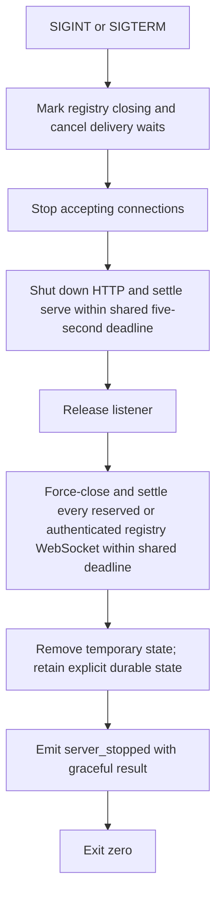

import { Aside, Tabs, TabItem } from '@astrojs/starlight/components';
import Decision from '../../../../components/Decision.astro';

The runnable server entry point is `cmd/pi-messaging-relay-server`. It owns the loopback process lifecycle and implements installation pairing, session authentication, connected live `list`/`roster` discovery, up to 128 concurrent distinct sends per exact authenticated sender session, recoverable sender-capacity denial, successful authenticated idle and busy string/object delivery, current-registry-miss settlement, recipient-disconnected and five-second missing-ACK settlement, and immediate sender-owned cleanup when that exact sender disconnects.

## Platform and filesystem boundary

The relay server is supported on Linux only. Durable authorization and pairing-code publication depend on Linux directory-relative `openat`, `renameat`, and `unlinkat` behavior, no-follow opens, descriptor-relative fsync, Unix owners, and Unix mode bits. The server pins `golang.org/x/sys` v0.36.0 (BSD-3-Clause) for those Linux syscall wrappers. Non-Linux builds contain only the same package plus an intentional startup refusal; they do not select a weaker persistence path. The TypeScript extension has no matching Linux build restriction and remains a separate Node runtime component.

For every server state path, each component from `/` downward is opened relative to the already validated parent without following symlinks. Every ancestor must be owned by root or the relay's effective user. A group- or other-writable ancestor is accepted only when it has the sticky bit, such as the normal root-owned `/tmp`; a writable non-sticky ancestor and every ancestor symlink fail before readiness. The final state directory must be owned by the effective user with exact mode `0700`.

<Decision title="Bind Linux authorization state to one validated directory handle" status="accepted">
The process retains the opened final directory and parent handles for its whole lifecycle. Allowlist opens, exclusive temporary creation, atomic replacement, cleanup, and fsync operate relative to those handles, so later pathname replacement cannot redirect authorization reads or writes. Linux is the smallest support contract that makes these semantics explicit instead of silently offering a weaker platform implementation.
</Decision>

## Startup boundary

The server accepts three flags:

| Flag | Default | Meaning |
|---|---|---|
| `--listen` | `127.0.0.1:0` | Loopback IP literal and TCP port. Port `0` asks the operating system for an ephemeral port. |
| `--state-dir` | empty | Explicit durable allowlist directory. Empty retains process-owned temporary state. |
| `--pairing-code-file` | empty | Operator-only mode-`0600` direct child of the retained state directory. Every external or escaping path is rejected. |

Both IPv4 and IPv6 loopback literals are valid, for example `127.0.0.1:8080` and `[::1]:8080`. Hostnames, wildcard addresses, and non-loopback IPs fail before a listener is created.

<Decision title="Require an explicit loopback IP literal" status="accepted">
The default is `127.0.0.1:0`, and operator overrides remain loopback-only. Rejecting hostnames and wildcard addresses keeps DNS resolution and accidental network exposure outside this lifecycle seam.
</Decision>

Before code generation or listener creation, a configured pairing-code path is cleaned and resolved to absolute form. It must contain no `..` parent component, its parent must exactly equal the retained state path, and its basename must be one valid direct child other than `allowlist.json`. This requires an explicit `--state-dir` whenever the raw startup code must be disclosed; the random default state path cannot be named in advance. Accepted code-file creation and removal use the retained directory handle only.

Once `net.Listen` succeeds, the process writes one structured JSON readiness event to stdout. `address` is the operating system-selected listener address, so an operator or harness can discover an ephemeral port without internal access. The listening socket already exists when this event is emitted. A deterministic `pairing_code_created` event follows readiness with authentication fields set to `<redacted>`; the raw code appears only in the explicitly requested direct-child private file.

<Decision title="Publish readiness as one structured process event" status="accepted">
The `server_ready` event is the narrow readiness contract for this slice. It includes the selected address and active state path without introducing a separate HTTP health endpoint.
</Decision>

## Temporary state

Without `--state-dir`, each process creates a unique directory beneath the operating system temporary directory through the same trusted Linux path walk. The path appears as `state_dir` in the readiness event and is removed during graceful shutdown relative to retained handles. With `--state-dir`, the operator explicitly selects a current-user-owned mode-`0700` directory; its closed allowlist remains after shutdown. If the durable directory is new, the server fsyncs its opened parent before creating the listener or reporting readiness. Existing allowlist state is opened nonblocking through the retained directory and must pass bounded strict validation before the listener exists. File type is checked before any read, so a FIFO or other non-regular entry fails promptly rather than waiting for a peer. Corrupt, ambiguous, oversized, duplicate, non-canonical, permissive, symlink, non-regular, or wrong-owner state fails closed without readiness.

<Decision title="Preserve temporary state as the default" status="accepted">
A default process never shares its temporary state directory and removes it during graceful shutdown. Durable allowlist retention requires the explicit `--state-dir` flag, and a new durable directory entry must reach its parent filesystem boundary before startup continues. Reusing that exact trusted directory is the only server-side input needed to restore paired authorization.
</Decision>

<Aside type="note" title="Crash boundary">
SIGINT and SIGTERM run cleanup. A forced kill or host crash cannot run in-process cleanup and may leave the temporary directory for operating-system housekeeping.
</Aside>

## Shutdown sequence



The shared five-second bound first marks the registry closing so in-memory delivery waits cancel immediately, then owns HTTP shutdown and serve settlement before force-closing and settling every reserved or authenticated registry-owned WebSocket. Registry shutdown that claims pending delivery work emits no `recipient_disconnected` result; only recipient cancellation that already won keeps that exact outcome. Exact sender removal releases sender-owned pending offers with no unreachable result or `send_settled`; sender identity wins for self-send. Recipient removal releases every matching pending offer once, and no pending body is persisted or replayed. A replacement process reloads authorization only: it has no pending, settled, dedupe, message-history, or recipient-stream state to emit during startup or reauthentication. Registry removal releases its mutex before the lifecycle callback takes the dispatcher mutex, while send installation briefly checks registry identity under the dispatcher mutex, preventing a registry/dispatcher lock cycle during removal or shutdown. It prevents graceful shutdown from waiting forever on either HTTP or registry-owned process resources. Every HTTP response has a two-second write deadline. Structured event delivery uses one worker per stdout or stderr sink, no queued buffer, and a one-second handoff/acknowledgement deadline. Logger close also waits at most one second. A stalled output therefore cannot retain request handlers or process exit indefinitely.

Each authenticated handler owns one sole reader, one response-sequencer worker, and at most 128 send workers independently of process shutdown. One terminal function marks the session unavailable once, cancels the per-serve context, force-closes the WebSocket, and joins every worker before return. Protocol ambiguity first takes a priority transition under response-admission ownership: normal producers stop and the exact session becomes ineligible for routing. Revocation then waits on the same per-entry write lease used by final destination authorization before delivery cleanup runs. A write already holding that lease may finish before the fence; queued or preselected writes fail revalidation afterward. Claimed response work still waiting on its start gate and all queued normal responses are discarded with slot release, while a revocation-caused normal write error continues to the one terminal response/audit attempt. An already-written claimed response whose audit fails after terminal admission likewise preserves fatal ownership and continues to that terminal attempt; if the normal failure wins first, immediate fatal termination retains precedence. Thus dispatcher, response-write, audit, protocol, client-close, and shutdown failures cannot leave session-owned goroutines behind or route work after the revocation fence.

The sequencer has exactly 256 normal-response ownership slots and performs every authenticated response write and matching audit serially. An admitted logical send can require its original plus one attached retry response. Their exact one- or two-slot batch is reserved before either response is encoded, published, or the send's capacity slot is released; a shared start gate prevents either response becoming visible before release. Immediate responses reserve one slot before encoding and block the sole reader on bounded sequencing instead of spawning work. At most 256 encoded unanswered normal responses therefore exist, plus one separately bounded terminal protocol error. Exact repeats are classified before nonblocking 128-slot admission. Response-free ACK candidates and lists execute serially in the reader; lists may overlap sends but consume no SEND slot and have no queue. Ledger and registry locks protect only state decisions: no socket write, log write, blocking channel send, or other I/O occurs while either is held.

<Decision title="Join every authenticated dispatch and settlement owner before handler return" status="accepted">
Socket close plus context cancellation makes the reader, send dispatch, and response write interruptible. At most 128 send workers and 256 encoded, unanswered normal responses exist per exact authenticated session. Reservation-before-encoding-and-release prevents fast outcomes or replacement workers from creating serialized work outside that ceiling; synchronous list, ACK, and immediate-result handling applies bounded backpressure without another application queue.
</Decision>

A relay audit failure is stored in a queryable first-error latch and enters the bounded HTTP drain. Main checks that latch again after drain and before any successful stop event, so concurrent SIGINT, SIGTERM, or injected cancellation cannot mask it. Main then attempts `server_failed` through the separately bounded stderr worker and exits non-zero. For a pairing audit failure, explicit durable state is retained and an accepted handler still returns its already-persisted identity.

<Aside type="note" title="Blocked writer boundary">
Go cannot cancel an arbitrary `io.Writer` call. If an external writer never returns, process shutdown records the logger-close timeout but does not wait beyond it. That single worker remains blocked only until operating-system process exit. Tests release their fake writer and verify worker completion.
</Aside>

<Decision title="Bound localhost response writes to two seconds" status="accepted">
Pair responses are tiny and local. A two-second write deadline leaves operational margin while releasing a non-reading client well before the five-second process drain ceiling.
</Decision>

<Decision title="Bound event sinks and latch relay audit failures" status="accepted">
One writer worker per sink preserves event order without an unbounded queue. One-second write acknowledgement and close deadlines bound handlers and shutdown. The first fatal relay audit error remains queryable after notification, so termination races cannot produce `server_stopped` or exit zero.
</Decision>

Ponytail: event writes and logger close are fixed to one second, response writes to two seconds, and shutdown drain to five seconds; make them configurable when operational evidence requires different deadlines.

### I/O examples

<Tabs>
  <TabItem label="Ephemeral input">
    ```console
    $ ./pi-messaging-relay-server
    ```
  </TabItem>
  <TabItem label="Ready stdout">
    ```json
    {"level":"info","event":"server_ready","address":"127.0.0.1:43127","state_dir":"/tmp/pi-messaging-relay-2486170958","result":"ready"}
    {"level":"info","event":"pairing_code_created","result":"created","pairing_code":"<redacted>","private_key":"<redacted>","expires_at":"2026-09-10T14:10:00Z"}
    ```
  </TabItem>
  <TabItem label="SIGTERM stdout and exit">
    ```text
    {"level":"info","event":"server_stopped","address":"127.0.0.1:43127","result":"graceful"}
    exit code: 0
    ```
  </TabItem>
  <TabItem label="Non-loopback stderr and exit">
    ```text
    {"level":"error","event":"server_failed","reason":"listen address must use a loopback IP literal"}
    exit code: 1
    ```
  </TabItem>
  <TabItem label="Blocked audit sink stderr">
    ```text
    {"level":"error","event":"server_failed","reason":"fatal relay runtime failure: write pair_accepted pairing audit event: write pair_accepted event within 1s: context deadline exceeded\nclose stdout event logger: stop event logger worker within 1s: context deadline exceeded"}
    exit code: 1
    ```
  </TabItem>
</Tabs>

## Acceptance seam

`TestRelayProcessLifecycle` builds the real command into a test-owned directory and starts it as a child process. At the public process boundary it:

1. decodes the stdout readiness event;
2. proves the selected address is loopback and accepts a TCP connection;
3. verifies the reported temporary state directory exists and differs between process runs;
4. verifies the startup pairing lifecycle event preserves redacted authentication fields;
5. exercises graceful SIGINT and SIGTERM separately;
6. verifies the process exits successfully, state disappears, and the exact listener address can be rebound; and
7. verifies a wildcard listener request fails without reporting readiness.

All process-event waits are bounded. Real-child cleanup gives SIGTERM and SIGKILL independent deadlines instead of hanging the test worker.

`restart.acceptance.test.ts` owns one recipient delivery-stream seam spanning both reconnect and restart rather than separate lifecycle harnesses. It builds one real Linux binary, runs it twice against one explicit state directory and one operating-system-selected loopback address, and drives real sender and recipient extensions behind fake Pi hosts. Before process replacement it settles one message, drops a second message's recipient ACK and terminates that exact recipient socket, verifies `timeout/recipient_disconnected`, proves no old message appears after fake-clock reauthentication, and settles one fresh send. It then drops another ACK, gracefully stops the child, starts the replacement, reauthenticates both exact routes, proves no startup or historical message appears, and settles another fresh send.

The seam records exact body markers, message and delivery IDs, recipient socket generation, message-frame order, and Pi injection order. Authentication events, live roster synchronization, and bounded quiet turns establish each no-replay checkpoint; a suppressed ACK is never queued to leak later. Existing log fields retain body redaction, the pending shutdown send produces no fabricated settlement, and an independently keyed extension remains rejected. Subordinate exact disk inspection confirms only allowlist version, client ID, public key, and pairing time survive—never message or route state.

Focused Linux tests reject ancestor symlinks and writable non-sticky ancestors before readiness. A deterministic substitution test renames the final directory after preparation and places an injected-key symlink at the configured path; allowlist load, direct-child pairing-code publication, and later persistence continue through the retained original handle, never the injected directory. Additional tests reject a valid external parent, a symlinked substitutable external ancestor, every `..` parent traversal (including one that cleans back inside state), a lexical parent escape, and the filesystem root before readiness without creating or deleting the named entry. Linux and intentional non-Linux-refusal compile targets are checked separately.
