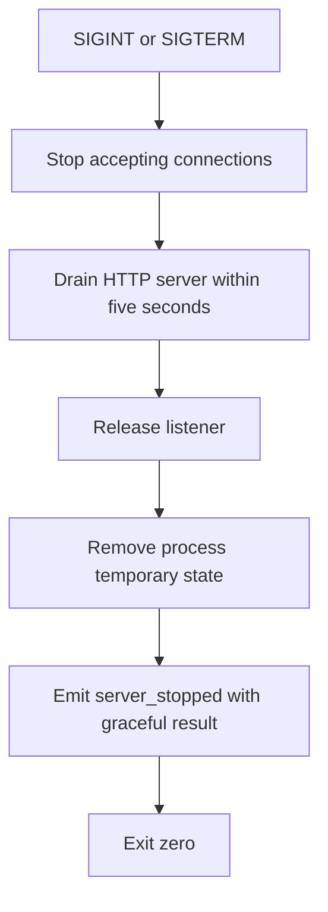

import { Aside, Tabs, TabItem } from '@astrojs/starlight/components';
import Decision from '../../../../components/Decision.astro';

The runnable server entry point is `cmd/pi-messaging-relay-server`. This first process slice establishes the boundary later protocol work will use; it does not implement pairing, WebSocket messaging, authentication, or routing.

## Startup boundary

The server accepts one flag:

| Flag | Default | Meaning |
|---|---|---|
| `--listen` | `127.0.0.1:0` | Loopback IP literal and TCP port. Port `0` asks the operating system for an ephemeral port. |

Both IPv4 and IPv6 loopback literals are valid, for example `127.0.0.1:8080` and `[::1]:8080`. Hostnames, wildcard addresses, and non-loopback IPs fail before a listener is created.

<Decision title="Require an explicit loopback IP literal" status="accepted">
The default is `127.0.0.1:0`, and operator overrides remain loopback-only. Rejecting hostnames and wildcard addresses keeps DNS resolution and accidental network exposure outside this lifecycle seam.
</Decision>

Once `net.Listen` succeeds, the process writes one structured JSON readiness event to stdout. `address` is the operating system-selected listener address, so an operator or harness can discover an ephemeral port without internal access. The listening socket already exists when this event is emitted.

<Decision title="Publish readiness as one structured process event" status="accepted">
The `server_ready` event is the narrow readiness contract for this slice. It includes the selected address and temporary state path without introducing an HTTP health endpoint ahead of the accepted relay API.
</Decision>

## Temporary state

Each process creates a unique directory beneath the operating system temporary directory. The path appears as `state_dir` in the readiness event so acceptance tests and operators can inspect lifecycle ownership. This slice stores no durable relay data.

<Decision title="Own ephemeral state for exactly one process lifetime" status="accepted">
A process never shares its temporary state directory and removes it during graceful shutdown. Durable allowlists and other future protocol state remain decisions for later tickets.
</Decision>

<Aside type="note" title="Crash boundary">
SIGINT and SIGTERM run cleanup. A forced kill or host crash cannot run in-process cleanup and may leave the temporary directory for operating-system housekeeping.
</Aside>

## Shutdown sequence



The five-second bound prevents graceful shutdown from waiting forever on a process resource. Cleanup failures produce a structured `server_failed` event on stderr and a non-zero exit.

Ponytail: shutdown drain is fixed to five seconds; make it configurable when a real protocol handler needs a different operational deadline.

### I/O examples

<Tabs>
  <TabItem label="Ephemeral input">
    ```console
    $ ./pi-messaging-relay-server
    ```
  </TabItem>
  <TabItem label="Ready stdout">
    ```json
    {"level":"info","event":"server_ready","address":"127.0.0.1:43127","state_dir":"/tmp/pi-messaging-relay-2486170958"}
    ```
  </TabItem>
  <TabItem label="SIGTERM stdout and exit">
    ```text
    {"level":"info","event":"server_stopped","address":"127.0.0.1:43127","result":"graceful"}
    exit code: 0
    ```
  </TabItem>
  <TabItem label="Non-loopback stderr and exit">
    ```text
    {"level":"error","event":"server_failed","reason":"listen address must use a loopback IP literal"}
    exit code: 1
    ```
  </TabItem>
</Tabs>

## Acceptance seam

`TestRelayProcessLifecycle` builds the real command into a test-owned directory and starts it as a child process. At the public process boundary it:

1. decodes the stdout readiness event;
2. proves the selected address is loopback and accepts a TCP connection;
3. verifies the reported temporary state directory exists and differs between process runs;
4. exercises graceful SIGINT and SIGTERM separately;
5. verifies the process exits successfully, state disappears, and the exact listener address can be rebound; and
6. verifies a wildcard listener request fails without reporting readiness.

All process-event waits are bounded, and test cleanup kills and reaps a child if an assertion interrupts normal shutdown.
