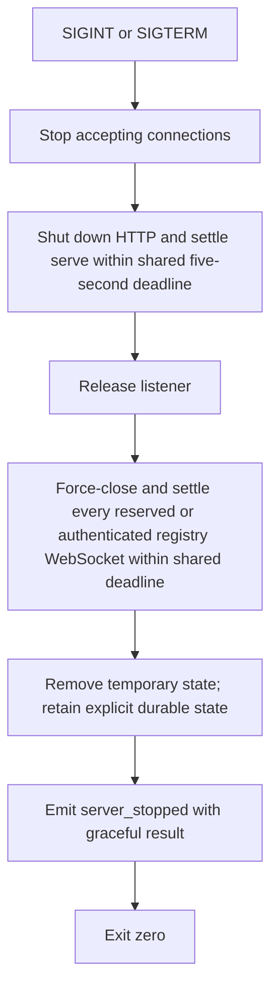

import { Aside, Tabs, TabItem } from '@astrojs/starlight/components';
import Decision from '../../../../components/Decision.astro';

The runnable server entry point is `cmd/pi-messaging-relay-server`. It owns the loopback process lifecycle and implements installation pairing and session authentication. Roster responses, routing, and delivery remain deferred.

## Startup boundary

The server accepts three flags:

| Flag | Default | Meaning |
|---|---|---|
| `--listen` | `127.0.0.1:0` | Loopback IP literal and TCP port. Port `0` asks the operating system for an ephemeral port. |
| `--state-dir` | empty | Explicit durable allowlist directory. Empty retains process-owned temporary state. |
| `--pairing-code-file` | empty | Operator-only path created exclusively with mode `0600` for the raw startup code. |

Both IPv4 and IPv6 loopback literals are valid, for example `127.0.0.1:8080` and `[::1]:8080`. Hostnames, wildcard addresses, and non-loopback IPs fail before a listener is created.

<Decision title="Require an explicit loopback IP literal" status="accepted">
The default is `127.0.0.1:0`, and operator overrides remain loopback-only. Rejecting hostnames and wildcard addresses keeps DNS resolution and accidental network exposure outside this lifecycle seam.
</Decision>

Once `net.Listen` succeeds, the process writes one structured JSON readiness event to stdout. `address` is the operating system-selected listener address, so an operator or harness can discover an ephemeral port without internal access. The listening socket already exists when this event is emitted. A deterministic `pairing_code_created` event follows readiness with authentication fields set to `<redacted>`; the raw code appears only in the explicitly requested private file.

<Decision title="Publish readiness as one structured process event" status="accepted">
The `server_ready` event is the narrow readiness contract for this slice. It includes the selected address and active state path without introducing a separate HTTP health endpoint.
</Decision>

## Temporary state

Without `--state-dir`, each process creates a unique directory beneath the operating system temporary directory. The path appears as `state_dir` in the readiness event and is removed during graceful shutdown. With `--state-dir`, the operator explicitly selects a mode-`0700` directory; its allowlist remains after shutdown. If the durable directory is new, the server fsyncs its parent before creating the listener or reporting readiness.

<Decision title="Preserve temporary state as the default" status="accepted">
A default process never shares its temporary state directory and removes it during graceful shutdown. Durable allowlist retention requires the explicit `--state-dir` flag, and a new durable directory entry must reach its parent filesystem boundary before startup continues.
</Decision>

<Aside type="note" title="Crash boundary">
SIGINT and SIGTERM run cleanup. A forced kill or host crash cannot run in-process cleanup and may leave the temporary directory for operating-system housekeeping.
</Aside>

## Shutdown sequence



The shared five-second bound owns HTTP shutdown and serve settlement, then force-closing and settling every reserved or authenticated registry-owned WebSocket. It prevents graceful shutdown from waiting forever on either HTTP or registry-owned process resources. Every HTTP response has a two-second write deadline. Structured event delivery uses one worker per stdout or stderr sink, no queued buffer, and a one-second handoff/acknowledgement deadline. Logger close also waits at most one second. A stalled output therefore cannot retain request handlers or process exit indefinitely.

A relay audit failure is stored in a queryable first-error latch and enters the bounded HTTP drain. Main checks that latch again after drain and before any successful stop event, so concurrent SIGINT, SIGTERM, or injected cancellation cannot mask it. Main then attempts `server_failed` through the separately bounded stderr worker and exits non-zero. For a pairing audit failure, explicit durable state is retained and an accepted handler still returns its already-persisted identity.

<Aside type="note" title="Blocked writer boundary">
Go cannot cancel an arbitrary `io.Writer` call. If an external writer never returns, process shutdown records the logger-close timeout but does not wait beyond it. That single worker remains blocked only until operating-system process exit. Tests release their fake writer and verify worker completion.
</Aside>

<Decision title="Bound localhost response writes to two seconds" status="accepted">
Pair responses are tiny and local. A two-second write deadline leaves operational margin while releasing a non-reading client well before the five-second process drain ceiling.
</Decision>

<Decision title="Bound event sinks and latch relay audit failures" status="accepted">
One writer worker per sink preserves event order without an unbounded queue. One-second write acknowledgement and close deadlines bound handlers and shutdown. The first fatal relay audit error remains queryable after notification, so termination races cannot produce `server_stopped` or exit zero.
</Decision>

Ponytail: event writes and logger close are fixed to one second, response writes to two seconds, and shutdown drain to five seconds; make them configurable when operational evidence requires different deadlines.

### I/O examples

<Tabs>
  <TabItem label="Ephemeral input">
    ```console
    $ ./pi-messaging-relay-server
    ```
  </TabItem>
  <TabItem label="Ready stdout">
    ```json
    {"level":"info","event":"server_ready","address":"127.0.0.1:43127","state_dir":"/tmp/pi-messaging-relay-2486170958"}
    {"level":"info","event":"pairing_code_created","pairing_code":"<redacted>","private_key":"<redacted>","expires_at":"2026-09-10T14:10:00Z"}
    ```
  </TabItem>
  <TabItem label="SIGTERM stdout and exit">
    ```text
    {"level":"info","event":"server_stopped","address":"127.0.0.1:43127","result":"graceful"}
    exit code: 0
    ```
  </TabItem>
  <TabItem label="Non-loopback stderr and exit">
    ```text
    {"level":"error","event":"server_failed","reason":"listen address must use a loopback IP literal"}
    exit code: 1
    ```
  </TabItem>
  <TabItem label="Blocked audit sink stderr">
    ```text
    {"level":"error","event":"server_failed","reason":"fatal relay runtime failure: write pair_accepted pairing audit event: write pair_accepted event within 1s: context deadline exceeded\nclose stdout event logger: stop event logger worker within 1s: context deadline exceeded"}
    exit code: 1
    ```
  </TabItem>
</Tabs>

## Acceptance seam

`TestRelayProcessLifecycle` builds the real command into a test-owned directory and starts it as a child process. At the public process boundary it:

1. decodes the stdout readiness event;
2. proves the selected address is loopback and accepts a TCP connection;
3. verifies the reported temporary state directory exists and differs between process runs;
4. verifies the startup pairing lifecycle event preserves redacted authentication fields;
5. exercises graceful SIGINT and SIGTERM separately;
6. verifies the process exits successfully, state disappears, and the exact listener address can be rebound; and
7. verifies a wildcard listener request fails without reporting readiness.

All process-event waits are bounded. Real-child cleanup gives SIGTERM and SIGKILL independent three-second deadlines; if both expire, it destroys owned streams, detaches the child, and reports PID, signal state, and captured stdout/stderr tails instead of hanging the test worker.
