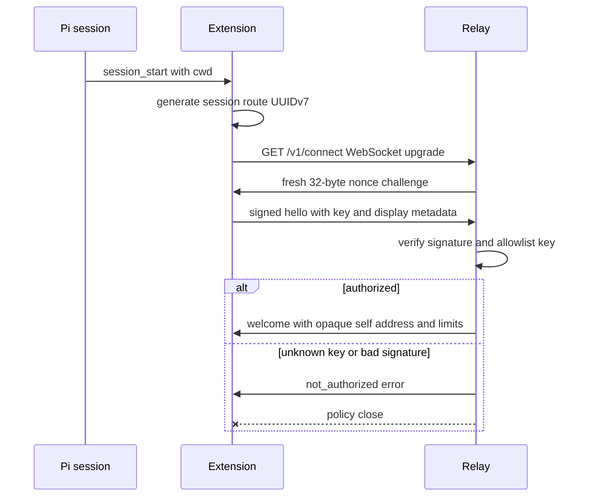

import { Aside, Tabs, TabItem } from '@astrojs/starlight/components';
import Decision from '../../../../components/Decision.astro';

This slice implements `/v1/connect` from challenge through welcome. After welcome, the [WebSocket envelope boundary](/developer/protocol/websocket-envelope-boundary/) owns the authenticated socket's bounded operation-message loop, and the [active peer roster](/developer/relay/active-peer-roster/) consumes authenticated presence. The [authenticated message delivery](/developer/relay/message-delivery/) seam consumes the same retained socket, renders string/object provenance, and selects recipient-local idle or busy injection; reconnect and restart acceptance remain separate.

<Aside type="note" title="Ticket boundaries">
Ticket #12 owns the complete post-authentication malformed, duplicate, unknown-field, frame-type, and protocol-major matrix. Tickets #36 and #13 own bounded live roster pagination, while #14–#16 own successful idle and busy string/object delivery with deterministic provenance. Ticket #26 owns reconnect and backoff. Ticket #27 owns restart acceptance. This authentication seam performs only the strict parsing and bounded reads needed to authenticate safely.
</Aside>

## Authentication flow



The server generates a fresh 32-byte cryptographic nonce for every upgraded connection and encodes it as 43-character unpadded URL-safe Base64. One five-second authentication deadline owns challenge write, hello read, verification, and welcome write. The server's general WebSocket read ceiling is 512 KiB; the initial client hello has a narrower 16 KiB ceiling. The extension independently applies a 512 KiB socket transport ceiling before message materialization and rejects complete challenge or welcome messages above 16 KiB after bounded materialization. Cwd is non-empty and at most 4,096 UTF-8 bytes. Hostname is non-empty and at most 255 UTF-8 bytes.

The extension creates no network resource in its factory. Two lifecycle paths each own exactly one attempt: `session_start` loads a previously paired mode-`0600` Ed25519 key without creating a missing state directory, generates one UUIDv7 route ID, and connects when the endpoint and key exist; a successful `/relay-pair` during an already-started session makes one pairing-owned attempt with the newly persisted key. Failure remains disconnected; ticket #26 adds retries later. `session_shutdown` closes an in-flight or retained socket and is idempotent.

<Decision title="Bind every hello field with one length-prefixed transcript" status="accepted">
The signature covers the fresh nonce, hello request ID, submitted public key, route UUID, hostname, and cwd in a fixed order. UTF-8 byte lengths prevent delimiter ambiguity. The signature field itself is excluded. Go and TypeScript construct the same bytes.
</Decision>

The exact transcript is:

```text
pi-messaging-relay-auth-v1\n
nonce:<UTF-8-byte-length>:<nonce>\n
request_id:<UTF-8-byte-length>:<request_id>\n
client_public_key:<UTF-8-byte-length>:<client_public_key>\n
route_id:<UTF-8-byte-length>:<route_id>\n
hostname:<UTF-8-byte-length>:<hostname>\n
cwd:<UTF-8-byte-length>:<cwd>\n
```

Angle-bracket terms above are substitutions, and every shown `\n` is one LF byte. The client signs these bytes with Ed25519 and sends the canonical standard-Base64 encoding of the 64-byte signature. Request and route IDs must be canonical lowercase UUIDv7 values.

## Identity and address boundary

Authorization has exactly two inputs: the submitted Ed25519 public key must be in the server allowlist, and its signature must verify over the server nonce plus the complete hello metadata. Cwd, hostname, route UUID, and composed address are display and routing metadata only. The server never parses a composite address to recover identity or permission.

After verification, welcome returns `<cwd>@<hostname>#<route_id>` verbatim as `self_address`, with `heartbeat_ms: 30000` and `max_body_bytes: 262144`. Separator characters inside display metadata remain data; later routing treats the complete address as opaque.

<Decision title="Separate authenticated installation identity from session display identity" status="accepted">
The allowlisted key identifies the installation. One UUIDv7 identifies this Pi session route. Display metadata can contain address separator characters and can change what humans see, but cannot grant authorization.
</Decision>

The connection registry atomically reserves one of 1,024 slots before `websocket.Accept`. Capacity exhaustion returns bounded HTTP `503` without upgrading and emits one `session_capacity_rejected` event. Accept failure releases the reservation; every successful upgrade attaches to its reservation immediately. Shutdown force-closes and settles reserved authentication or authenticated sockets within the existing five-second process deadline before reporting `server_stopped`.

Under the same registry lock, authentication rejects an active duplicate route UUID or complete opaque address. Each accepted entry stores the authenticated installation key and route UUID separately; no composite-address parsing participates in identity or authorization. The roster consumes only a copy of active opaque address strings and omits reserved or unauthenticated entries. Process-lifetime ownership and whether a route becomes reusable after disconnect remain explicitly blocked on reconnect semantics in ticket #26; this slice does not invent reuse or reconnect behavior.

## Dependency boundary

The Go server pins `github.com/coder/websocket` v1.8.15 under the ISC license. Its primary documentation describes a maintained, minimal API with first-class `context.Context`, explicit read limits, close handshakes, Autobahn coverage, and no transitive dependencies. Compression remains disabled.

The extension pins `ws` v8.21.3 under the MIT license as a direct runtime dependency, with no required transitive dependencies. The tagged primary API documents client-side `maxPayload` enforcement and `terminate()`, which destroys the transport. The socket configures `maxPayload: 524288` before connecting and disables compression. During both challenge and welcome phases, the handler measures the bounded complete message and applies the narrower 16 KiB authentication ceiling before parsing it. Normal cleanup requests a graceful close, waits at most one second, then terminates and awaits the terminal close event. This same owner covers connecting, authenticating, retained, and shutdown states. The package and lock sit beside the extension so Nix-installed Pi resolves `ws` from the extension package instead of assuming Pi internals or a global Node installation.

<Decision title="Separate the socket transport ceiling from authentication semantics" status="accepted">
The intentional bounded contract change raises the extension's pre-materialization limit from 16 KiB to the general 512 KiB socket ceiling required for bounded roster pages. Challenge and welcome remain semantically limited to 16 KiB after bounded materialization; larger transport input is rejected before message emission, and cleanup still hard-terminates an unresponsive peer.
</Decision>

## Telemetry

Server events are `auth_accepted`, `auth_rejected`, and `session_disconnected`; extension events use `relay_auth_accepted`, `relay_auth_rejected`, and `relay_session_disconnected`. Server `auth_accepted` carries address, route, public-key and client identity, display metadata, and latency. Server `auth_rejected` carries its rejection reason and latency plus any public key or route available at rejection. Both server authentication outcomes retain the `nonce`, `signature`, and `private_key` field names with `<redacted>` values.

Server `session_disconnected` carries address, route, public-key and client identity. It does not emit `nonce`, `signature`, `private_key`, `reason`, or `latency_ms`. Extension acceptance and rejection events retain the three redacted authentication fields; extension disconnect carries address, route, public-key identity, and those redacted fields, but no reason or latency. Rejection exposes one external `not_authorized` outcome for both unknown keys and invalid signatures. Raw nonce, signature, or private-key content never enters responses, notifications, logs, or committed fixtures. The existing one-worker, one-second structured logger deadline owns session audit failures; a failed audit reaches the process fatal latch.

### I/O examples

<Tabs>
  <TabItem label="Challenge">
    ```json
    {"v":1,"type":"challenge","payload":{"nonce":"<REDACTED>"}}
    ```
  </TabItem>
  <TabItem label="Signed hello">
    ```json
    {"v":1,"type":"hello","request_id":"01993c79-8ad7-79fa-83e3-9789dcaca168","payload":{"client_public_key":"ed25519:11qYAYdk9Jgqgfdm2r7wIfdHyE5gq5sI1sS0l7l2a9E=","route_id":"01993ca1-1111-7aaa-8aaa-111111111111","hostname":"workstation-a","cwd":"/srv/frontend","signature":"<REDACTED>"}}
    ```
  </TabItem>
  <TabItem label="Welcome">
    ```json
    {"v":1,"type":"welcome","request_id":"01993c79-8ad7-79fa-83e3-9789dcaca168","payload":{"self_address":"/srv/frontend@workstation-a#01993ca1-1111-7aaa-8aaa-111111111111","heartbeat_ms":30000,"max_body_bytes":262144}}
    ```
  </TabItem>
  <TabItem label="Unknown key or bad signature">
    ```json
    {"v":1,"type":"error","request_id":"01993c79-8ad7-79fa-83e3-9789dcaca168","payload":{"code":"not_authorized","message":"Client key is not authorized","close":true}}
    ```

    The relay then closes the socket with a policy-violation status.
  </TabItem>
</Tabs>

Real-boundary acceptance exercises both lifecycle paths separately. One scenario emits `session_start` before pairing and proves successful pairing owns exactly one accepted retained connection. Another invokes pairing before session lifecycle, then emits `session_start` and proves the pre-paired key owns exactly one accepted connection. Both correlate extension acceptance and disconnect events to the server route and address.

Independent WebSocket clients prove changed display metadata remains authorized when correctly signed, unknown keys and invalid signatures receive the same error and peer close, and fresh connections receive distinct nonces. Malicious actual endpoints send complete and fragmented valid-JSON challenge messages above 16 KiB, a valid-JSON welcome-phase message above 16 KiB, and a hard transport message above 512 KiB. Every attempt rejects and settles while the peer ignores close. Another endpoint authenticates and then ignores shutdown close. These tests prove separate semantic and pre-materialization ceilings plus bounded process-resource settlement. Server tests prove pre-upgrade capacity rejection, tracked nonresponsive-peer shutdown, and concurrent same-key and different-key active route collisions.
